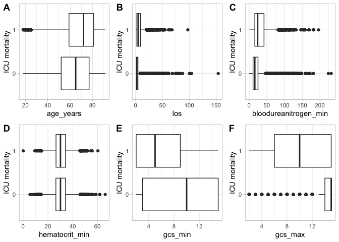
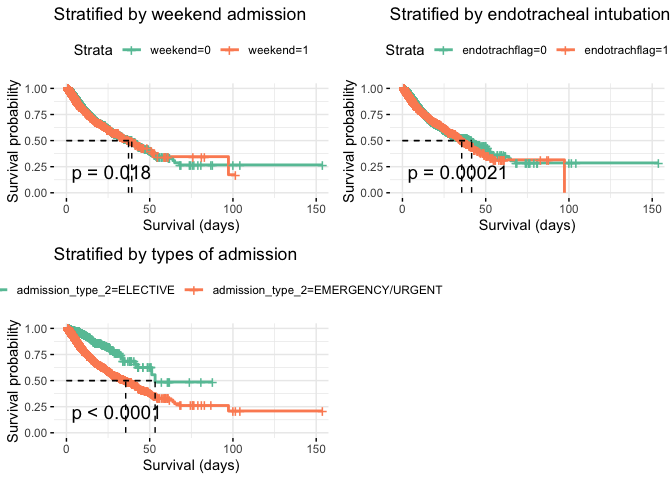

# Introduction

Patients admitted to hospitals are sent to the appropriate wards depending on their conditions. Patients with critical conditions in need of close monitoring and medical care will be admitted or transferred to intensive care units (ICUs). Because of the nature of their conditions, patients in ICUs often have a higher mortality rate than patients in regular wards.

MIMIC-III is a large database containing deidentified health-related data associated with over forty thousand patients who stayed in the intensive care units of the Beth Israel Deaconess Medical Center in Boston, Massachusetts, between 2001 and 2012. The data was gathered from the Philips CareVue Clinical Information System and iMDsoft MetaVision ICU. MIMIC-III is available to researchers worldwide for data study including performing various data science tasks.

This notebook aims to utilize data science procedures on the MIMIC-III data to 1) build a predictive algorithm based on data from the first 24 hours in the ICU and 2) to investigate whether admission to the ICU on weekends increases the risk of ICU mortality.

## Characteristic of the MIMIC-III data

The MIMIC-III database is a joint database from the CareVue and MetaVision systems. The data were collected during routine care, not for research purposes. The data were deidentified by removing personally identifiable information. Further deidentification was done by offsetting dates into the future (2100-2200) and shifting the ages of patients older than 89 years to 91.4. The data do not only include adult patients, but also newborns.

## Research questions

1.  Is it possible to accurately predict mortality based on data from the first 24 hours in ICU?

-   Study population: Adult patients older than 18 years old admitted to the ICU from January 2006 to December 2014. Only the first ICU admission for each patient is included. ICU stays with length of stay under 24 hours or unknown are not included.
-   Study outcome: ICU mortality

2.  Does admission to ICU over the weekend increase the risk of mortality?

-   Study population: Adult patients older than 18 years old admitted to the ICU from January 2006 to December 2014. Only the first ICU admission for each patient is included. ICU stays with length of stay under 24 hours or unknown are not included. Only data from the first 24 hours in ICU are included.
-   Intervention: Admission to ICU over the weekend
-   Comparison: Admission to ICU over the weekdays
-   Study outcome: ICU mortality

## Structure of the report

-   Data cleaning and exploration, and Research Question 2 are done using R. Unrendered and rendered versions of the report are in R markdown and HTML files.
-   Research Question 1 is done using Python. Unrendered and rendered versions of the report are in Jupyter Notebook and PDF files.

## Introduction

Patients admitted to hospitals are sent to the appropriate wards depending on their conditions. Patients with critical conditions in need of close monitoring and medical care will be admitted or transferred to intensive care units (ICUs). Because of the nature of their conditions, patients in ICUs often have a higher mortality rate than patients in regular wards.

MIMIC-III is a large database containing deidentified health-related data associated with over forty thousand patients who stayed in the intensive care units of the Beth Israel Deaconess Medical Center in Boston, Massachusetts, between 2001 and 2012. The data was gathered from the Philips CareVue Clinical Information System and iMDsoft MetaVision ICU. MIMIC-III is available to researchers worldwide for data study including performing various data science tasks.

This notebook aims to utilize data science procedures on the MIMIC-III data to 1) build a predictive algorithm based on data from the first 24 hours in the ICU and 2) to investigate whether admission to the ICU on weekends increases the risk of ICU mortality.

# Data Cleaning and Preparation

## Data dictionary

-   `var_ranges`: dataset containing variable ranges from the `variable_ranges.csv` file
-   `replace_out_of_range`: function for trimming out-of-range values
-   `replace_missing`: function for replacing missing values with 0, mean, or median
-   `cut_continuous`: function for categorizing continuous variables using predefined value ranges
-   `plot_boxplot`: function for plotting a boxplot
-   `pt_icu_outcome`: source data of the admission dates and outcome of the admissions
-   `pt_icu_outcome_clean`: cleaned version of `pt_icu_outcome`
-   `patients`: source data of patients' profile
-   `patients_2`: dataset subset from `patients` to the included patients and selected only the gender data
-   `admissions`: source data of the characteristics of admissions
-   `admissions_5`: `admissions` subset to the included patients and collapsed categories of the admission type and ethnicity
-   `icustays`: source data of characteristics of ICU stays
-   `icustays_2`: `icustays` subset to the included ICU stays and selected only the first care unit data
-   `vitals_hourly`: source data of the hourly bedside measurements
-   `vitals_hourly_24hr`: `vitals_hourly` subset to the included patients and subset to measurements in the first 24 hours
-   `vitals_hourly_24hr_minmax`: cleaned version of `vitals_hourly_24hr` and transformed from long format to one row per patient
-   `labs_hourly`: source data of the hourly laboratory tests
-   `labs_hourly_24hr`: `labs_hourly` subset to the included patients and subset to the tests in the first 24 hours
-   `labs_hourly_24hr_minmax`: cleaned version of `labs_hourly_24hr` and transformed from long format to one row per patient
-   `gcs_hourly`: source data of the hourly Glasgow Coma Scale score measurements
-   `gcs_hourly_24hr_minmax`: cleaned version of `gcs_hourly` and transformed from long format to one row per patient
-   `pt_weight`: source data containing repeated measurements of weight in kilograms
-   `pt_weight_summary`: cleaned version of `pt_weight` and transformed from long format to one row per patient
-   `output_hourly`: source data of the repeat measurements of uring output
-   `output_hourly_24hr_trimmed`: cleaned version of `output_hourly` and transformed from long format to one row per patient
-   `bloodculture`: source data of the blood culture data
-   `bloodculture_24hr_summary`: cleaned version of `bloodculture`, one row per ICU stay
-   `antibiotics`: source data of antibiotic administration
-   `antibiotics_24hr`: `antibiotics` data transformed into one row per patient and keeping only the antibiotic flag
-   `vasopressors`: source data of vasopressor administration
-   `vasopressors_24hr_flag`: `vasopressors` data transformed into one row per patient and keeping only the antibiotic flag
-   `pv_mechvent`: source data of mechanical ventilation
-   `pv_mechvent_24hr`: `pv_mechvent` data transformed into one row per patient and keeping only the mechanical ventilation flag
-   `icd9_diag`: source data of ICD-9 diagnoses
-   `icd9_diag_final_wide`: ICD-9 diagnoses categorized into 10 groups and present in wide format
-   `alldata_final`: analysis-ready dataset obtained by joining multiple datasets together
-   `alldata_q2`: analysis-ready dataset for Research Question 2 identical to `alldata_final`
-   `alldata_q1`: analysis-ready dataset for Research Question 1
-   `univariate`: univariate Cox proportional hazards models of all variables and ICU mortality
-   `multi_5`: the final multivariate Cox proportional hazards model of selected variables and ICU mortality with all Cox proportional hazards assumption violation addressed

## Setup

Source data come in multiple .csv files. The required files were read and imported into data frames.


## `pt_icu_outcome` data


This dataset contains age, death flag, length of ICU stay, and time of hospital and ICU admission and discharge. There are 61533 ICU stays of 46476 distinct patients. The ICU stay ID should be unique each row. However, there is a duplicate ID (`icustay_id` count = 61533; distinct count = 61532). The age of patients older than 89 years old has been shifted to 91.4 as indicated [here](https://mimic.mit.edu/docs/iii/tables/patients/).


```
##   row_id subject_id                 dob hadm_id           admittime
## 1   6668       5246 2111-10-19 00:00:00  199031 2185-11-14 08:36:00
## 2   6668       5246 2111-10-19 00:00:00  199031 2185-12-02 23:53:00
##             dischtime icustay_id age_years              intime
## 1 2185-12-21 18:15:00     229922        74 2185-12-02 23:53:53
## 2 2185-12-21 18:15:00     229922        74 2185-12-02 23:53:53
##               outtime    los hosp_deathtime icu_expire_flag
## 1 2185-12-10 01:58:40 7.0867           <NA>               0
## 2 2185-12-10 01:58:40 7.0867           <NA>               0
##   hospital_expire_flag                 dod expire_flag ttd_days
## 1                    0 2186-07-20 00:00:00           1      229
## 2                    0 2186-07-20 00:00:00           1      229
```

Patient No. 5246 has duplicated ICU stay ID 229922. Because the only difference between the two duplicated observations is the hospital admission time, and it is not possible to determine which one is correct, both of the entries were excluded.


Only the first ICU stay of each patient that lasted at least 24 hours was kept, and patients younger than 18 years old were excluded.


```r
# count patients died in the ICU
table(pt_icu_outcome_adult$icu_expire_flag)
```

```
## 
##     0     1 
## 38293   216
```

The ICU expire flag is "yes" to only 0.56% of patients, which is much lower than the [published ICU mortality rate](https://www.nature.com/articles/sdata201635/tables/2) of the data. A new ICU expire flag was created based on the original expire flag and the recorded death time. Patients with death date occurring during the ICU stay were considered "yes" to the expire flag. A new weekend flag telling whether ICU admissions occurred on weekends was also created.


```r
head(pt_icu_outcome_clean)
```

```
##   row_id subject_id                 dob hadm_id icustay_id age_years    los
## 1      2          3 2025-04-11 00:00:00  145834     211552        76 6.0646
## 2      3          4 2143-05-12 00:00:00  185777     294638        47 1.6785
## 3      5          6 2109-06-21 00:00:00  107064     228232        65 3.6729
## 4      9          9 2108-01-26 00:00:00  150750     220597        41 5.3231
## 5     11         11 2128-02-22 00:00:00  194540     229441        50 1.5844
## 6     12         12 2032-03-24 00:00:00  112213     232669        72 7.6348
##   hospital_expire_flag expire_flag         admittime_d         dischtime_d
## 1                    0           1 2101-10-20 19:08:00 2101-10-31 13:58:00
## 2                    0           0 2191-03-16 00:28:00 2191-03-23 18:41:00
## 3                    0           0 2175-05-30 07:15:00 2175-06-15 16:00:00
## 4                   NA           1                <NA>                <NA>
## 5                    0           1 2178-04-16 06:18:00 2178-05-11 19:00:00
## 6                    1           1 2104-08-07 10:15:00 2104-08-20 02:57:00
##              intime_d           outtime_d    hosp_deathtime_d      dod_d
## 1 2101-10-20 19:10:11 2101-10-26 20:43:09                <NA> 2102-06-14
## 2 2191-03-16 00:29:31 2191-03-17 16:46:31                <NA>       <NA>
## 3 2175-05-30 21:30:54 2175-06-03 13:39:54                <NA>       <NA>
## 4 2149-11-09 13:07:02 2149-11-14 20:52:14                <NA> 2149-11-14
## 5 2178-04-16 06:19:32 2178-04-17 20:21:05                <NA> 2178-11-14
## 6 2104-08-08 02:08:17 2104-08-15 17:22:25 2104-08-20 02:57:00 2104-08-20
##   icu_expire_flag_2 weekend
## 1                 0       0
## 2                 0       0
## 3                 0       0
## 4                 1       1
## 5                 0       0
## 6                 0       0
```

As a result, 32555 patient aged 18 years old and older with their first ICU stay lasting at least 24 hours were included. The ICU mortality rate is 7.87%, comparable to the published rate. The rate here is different to the published rate because this is a subset of the published population.

## `patients` data


```r
head(patients_2)
```

```
##   subject_id gender
## 1        249      F
## 2        250      F
## 3        251      M
## 4        252      M
## 5        253      F
## 6        255      M
```

I obtained gender of the included patients from this dataset. 56.8% of them were male.

## `admissions` data


```r
table(admissions_5$admission_type_2)
```

```
## 
##         ELECTIVE EMERGENCY/URGENT 
##             5317            27238
```

```r
table(admissions_5$ethnicity_2)
```

```
## 
##         BLACK OTHER/UNKNOWN         WHITE 
##          2451          6881         23223
```

I obtained the admission type and ethnicity from this dataset. The admission type was collapse to elective and emergency/urgent. The ethnicity was collapse to white, black, and other/unknown.

## `icustays` data


```r
table(icustays_2$first_careunit)
```

```
## 
##   CCU  CSRU  MICU  SICU TSICU 
##  4752  6963 11209  5346  4285
```

I obtained the first care unit data from this dataset. Of the included patients, the majority of them (34.4%) were initially admitted to the Medical Intensive Care Unit (MICU).

## `vitals_hourly` data


This dataset contains hourly data of the bedside measurements. The spO2, temperature, respiratory rate, heart rate, systolic blood pressure, diastolic blood pressure, glucose, and mean arterial blood pressure have unrealistic values. For example, glucose as low as 0.85 and as high as 999999 are not possible using the blood glucose monitor.


```r
summary(vitals_hourly_24hr$glucose)
```

```
##     Min.  1st Qu.   Median     Mean  3rd Qu.     Max.     NA's 
##      0.8    107.0    129.0    147.3    160.0 999999.0   576110
```


I trimmed variables containing unrealistic values with a predefined ranges. Values outside of outlier ranges were marked missing. Non-outlier values outside of physiologically valid ranges were replaced with the nearest valid values. I then obtained maximum and minimum values of each measurement within the first 24 hours and transformed the dataset from a long format into one row per patient.


```r
summary(vitals_hourly_24hr_minmax)
```

```
##    icustay_id        spo2_min         fio2_min      temperature_min
##  Min.   :200003   Min.   :  0.00   Min.   : 21.00   Min.   :26.00  
##  1st Qu.:225340   1st Qu.: 88.00   1st Qu.: 40.00   1st Qu.:35.72  
##  Median :250469   Median : 93.00   Median : 40.00   Median :36.17  
##  Mean   :250270   Mean   : 87.33   Mean   : 46.83   Mean   :36.12  
##  3rd Qu.:275228   3rd Qu.: 95.00   3rd Qu.: 50.00   3rd Qu.:36.61  
##  Max.   :299999   Max.   :100.00   Max.   :100.00   Max.   :39.60  
##                   NA's   :363      NA's   :25103    NA's   :967    
##   resprate_min   heartrate_min      sysbp_min        diasbp_min    
##  Min.   : 0.00   Min.   :  0.00   Min.   :  0.00   Min.   :  0.00  
##  1st Qu.:10.00   1st Qu.: 62.00   1st Qu.: 86.00   1st Qu.: 39.00  
##  Median :12.50   Median : 71.00   Median : 94.00   Median : 46.00  
##  Mean   :12.61   Mean   : 72.12   Mean   : 95.32   Mean   : 45.62  
##  3rd Qu.:15.00   3rd Qu.: 81.00   3rd Qu.:104.00   3rd Qu.: 52.00  
##  Max.   :36.00   Max.   :145.00   Max.   :180.00   Max.   :114.00  
##  NA's   :433     NA's   :391      NA's   :425      NA's   :425     
##   glucose_min    meanarterialpressure_min    spo2_max         fio2_max     
##  Min.   : 33.0   Min.   : 14.00           Min.   : 72.00   Min.   : 21.00  
##  1st Qu.: 87.0   1st Qu.: 55.00           1st Qu.:100.00   1st Qu.: 50.00  
##  Median :103.0   Median : 61.00           Median :100.00   Median :100.00  
##  Mean   :107.5   Mean   : 61.66           Mean   : 99.81   Mean   : 77.26  
##  3rd Qu.:123.0   3rd Qu.: 68.00           3rd Qu.:100.00   3rd Qu.:100.00  
##  Max.   :592.0   Max.   :125.00           Max.   :100.00   Max.   :100.00  
##  NA's   :649     NA's   :393              NA's   :363      NA's   :25103   
##  temperature_max  resprate_max    heartrate_max      sysbp_max    
##  Min.   :31.60   Min.   :  7.00   Min.   : 37.00   Min.   : 25.0  
##  1st Qu.:37.00   1st Qu.: 22.00   1st Qu.: 88.25   1st Qu.:129.0  
##  Median :37.50   Median : 25.00   Median :100.00   Median :142.3  
##  Mean   :37.55   Mean   : 26.22   Mean   :101.65   Mean   :144.6  
##  3rd Qu.:38.00   3rd Qu.: 29.00   3rd Qu.:114.00   3rd Qu.:158.0  
##  Max.   :42.22   Max.   :300.00   Max.   :280.00   Max.   :311.0  
##  NA's   :967     NA's   :433      NA's   :391      NA's   :425    
##    diasbp_max      glucose_max   meanarterialpressure_max
##  Min.   : 12.43   Min.   :  45   Min.   : 17.43          
##  1st Qu.: 68.00   1st Qu.: 129   1st Qu.: 87.00          
##  Median : 77.00   Median : 159   Median : 96.24          
##  Mean   : 79.25   Mean   : 177   Mean   : 99.72          
##  3rd Qu.: 88.00   3rd Qu.: 200   3rd Qu.:108.00          
##  Max.   :356.50   Max.   :1476   Max.   :330.00          
##  NA's   :425      NA's   :649    NA's   :393
```

## `labs_hourly` data


This dataset contains hourly measurement of laboratory tests. A large number of variables originally contained out-of-range values. For example, the minimum hemoglobin is 0, and the maximum hemoglobin is 108.


```r
summary(labs_hourly_24hr$hemoglobin)
```

```
##    Min. 1st Qu.  Median    Mean 3rd Qu.    Max.    NA's 
##    0.00    9.30   10.50   10.61   11.80  108.00   96115
```


After value trimming, the dataset was transformed from a long format to one row per patient, containing maximum and minimum values within the first 24 hours of each patient.


```r
summary(labs_hourly_24hr_minmax)
```

```
##    icustay_id     neutrophil_min  creactiveprotein_min whitebloodcell_min
##  Min.   :200003   Min.   : 0.00   Min.   :  0.12       Min.   :  0.10    
##  1st Qu.:225363   1st Qu.:74.00   1st Qu.:  7.05       1st Qu.:  7.50    
##  Median :250495   Median :82.40   Median : 36.10       Median : 10.10    
##  Mean   :250293   Mean   :78.51   Mean   : 71.68       Mean   : 11.15    
##  3rd Qu.:275246   3rd Qu.:88.30   3rd Qu.:118.30       3rd Qu.: 13.40    
##  Max.   :299999   Max.   :99.00   Max.   :299.90       Max.   :442.70    
##                   NA's   :24053   NA's   :31818        NA's   :566       
##  partialpressureo2_min bicarbonate_min  lactate_min      troponin_min   
##  Min.   : 32.0         Min.   : 5.00   Min.   : 0.400   Min.   : 0.010  
##  1st Qu.: 69.0         1st Qu.:20.00   1st Qu.: 1.100   1st Qu.: 0.030  
##  Median : 89.0         Median :23.00   Median : 1.500   Median : 0.110  
##  Mean   :102.5         Mean   :22.92   Mean   : 1.826   Mean   : 0.872  
##  3rd Qu.:123.0         3rd Qu.:25.00   3rd Qu.: 2.100   3rd Qu.: 0.505  
##  Max.   :609.0         Max.   :52.00   Max.   :24.600   Max.   :20.850  
##  NA's   :12242         NA's   :355     NA's   :17357    NA's   :25822   
##  bloodureanitrogen_min creatinine_min   alaninetransaminase_min
##  Min.   :  0.00        Min.   : 0.100   Min.   :    2          
##  1st Qu.: 11.00        1st Qu.: 0.700   1st Qu.:   18          
##  Median : 17.00        Median : 0.900   Median :   32          
##  Mean   : 22.49        Mean   : 1.207   Mean   :  142          
##  3rd Qu.: 26.00        3rd Qu.: 1.200   3rd Qu.:   71          
##  Max.   :232.00        Max.   :28.000   Max.   :10000          
##  NA's   :222           NA's   :213      NA's   :21033          
##  aspartatetransaminase_min hemoglobin_min  intnormalisedratio_min
##  Min.   :    6.0           Min.   : 0.00   Min.   : 0.00         
##  1st Qu.:   25.0           1st Qu.: 8.90   1st Qu.: 1.10         
##  Median :   45.0           Median :10.20   Median : 1.20         
##  Mean   :  187.9           Mean   :10.34   Mean   : 1.36         
##  3rd Qu.:  105.0           3rd Qu.:11.70   3rd Qu.: 1.40         
##  Max.   :13080.0           Max.   :20.50   Max.   :17.60         
##  NA's   :21042             NA's   :461     NA's   :5940          
##  platelets_min     albumin_min     chloride_min    glucose_min    
##  Min.   :   5.0   Min.   :1.000   Min.   : 50.0   Min.   :  33.0  
##  1st Qu.: 132.0   1st Qu.:2.600   1st Qu.:102.0   1st Qu.:  92.0  
##  Median : 185.0   Median :3.100   Median :105.0   Median : 109.0  
##  Mean   : 200.1   Mean   :3.043   Mean   :104.5   Mean   : 116.2  
##  3rd Qu.: 248.0   3rd Qu.:3.500   3rd Qu.:108.0   3rd Qu.: 131.0  
##  Max.   :1592.0   Max.   :6.000   Max.   :145.0   Max.   :1016.0  
##  NA's   :459      NA's   :23319   NA's   :309     NA's   :220     
##    sodium_min    bilirubin_min   hematocrit_min  neutrophil_max 
##  Min.   : 50.0   Min.   : 0.10   Min.   : 0.00   Min.   : 0.00  
##  1st Qu.:136.0   1st Qu.: 0.40   1st Qu.:26.30   1st Qu.:75.00  
##  Median :138.0   Median : 0.70   Median :30.10   Median :83.40  
##  Mean   :137.6   Mean   : 1.88   Mean   :30.49   Mean   :79.68  
##  3rd Qu.:140.0   3rd Qu.: 1.40   3rd Qu.:34.30   3rd Qu.:89.00  
##  Max.   :225.0   Max.   :55.60   Max.   :66.20   Max.   :99.00  
##  NA's   :578     NA's   :21162   NA's   :325     NA's   :24053  
##  creactiveprotein_max whitebloodcell_max partialpressureo2_max bicarbonate_max
##  Min.   :  0.12       Min.   :  0.10     Min.   : 32.0         Min.   : 6.00  
##  1st Qu.:  7.30       1st Qu.:  8.70     1st Qu.:127.0         1st Qu.:22.00  
##  Median : 37.80       Median : 11.80     Median :210.0         Median :24.00  
##  Mean   : 72.13       Mean   : 13.24     Mean   :237.8         Mean   :24.56  
##  3rd Qu.:119.45       3rd Qu.: 15.90     3rd Qu.:345.0         3rd Qu.:27.00  
##  Max.   :299.90       Max.   :528.00     Max.   :700.0         Max.   :52.00  
##  NA's   :31818        NA's   :566        NA's   :12242         NA's   :355    
##   lactate_max      troponin_max    bloodureanitrogen_max creatinine_max 
##  Min.   : 0.400   Min.   : 0.010   Min.   :  1.00        Min.   : 0.10  
##  1st Qu.: 1.400   1st Qu.: 0.040   1st Qu.: 13.00        1st Qu.: 0.70  
##  Median : 2.100   Median : 0.140   Median : 18.00        Median : 0.90  
##  Mean   : 2.778   Mean   : 1.186   Mean   : 25.16        Mean   : 1.36  
##  3rd Qu.: 3.300   3rd Qu.: 0.760   3rd Qu.: 29.00        3rd Qu.: 1.40  
##  Max.   :30.000   Max.   :20.850   Max.   :250.00        Max.   :33.20  
##  NA's   :17357    NA's   :25822    NA's   :222           NA's   :213    
##  alaninetransaminase_max aspartatetransaminase_max hemoglobin_max 
##  Min.   :    2.0         Min.   :    6.0           Min.   : 3.50  
##  1st Qu.:   18.0         1st Qu.:   25.5           1st Qu.:10.10  
##  Median :   33.0         Median :   48.0           Median :11.20  
##  Mean   :  193.9         Mean   :  299.6           Mean   :11.38  
##  3rd Qu.:   78.0         3rd Qu.:  119.0           3rd Qu.:12.50  
##  Max.   :10000.0         Max.   :20000.0           Max.   :22.10  
##  NA's   :21033           NA's   :21042             NA's   :461    
##  intnormalisedratio_max platelets_max     albumin_max     chloride_max  
##  Min.   : 0.600         Min.   :   6.0   Min.   :1.000   Min.   : 67.0  
##  1st Qu.: 1.200         1st Qu.: 155.0   1st Qu.:2.600   1st Qu.:104.0  
##  Median : 1.300         Median : 206.0   Median :3.100   Median :107.0  
##  Mean   : 1.551         Mean   : 223.9   Mean   :3.095   Mean   :107.1  
##  3rd Qu.: 1.600         3rd Qu.: 270.0   3rd Qu.:3.600   3rd Qu.:111.0  
##  Max.   :88.600         Max.   :2000.0   Max.   :6.000   Max.   :175.0  
##  NA's   :5940           NA's   :459      NA's   :23319   NA's   :309    
##   glucose_max       sodium_max     bilirubin_max    hematocrit_max 
##  Min.   :  33.0   Min.   : 72.05   Min.   : 0.100   Min.   :10.00  
##  1st Qu.: 119.0   1st Qu.:137.00   1st Qu.: 0.400   1st Qu.:30.00  
##  Median : 147.5   Median :140.00   Median : 0.700   Median :33.00  
##  Mean   : 163.9   Mean   :140.04   Mean   : 2.103   Mean   :33.48  
##  3rd Qu.: 185.0   3rd Qu.:142.00   3rd Qu.: 1.600   3rd Qu.:36.60  
##  Max.   :1638.0   Max.   :225.00   Max.   :55.600   Max.   :71.70  
##  NA's   :220      NA's   :578      NA's   :21162    NA's   :325
```

## `gcs_hourly` data


This dataset contains data of the Glasgow Coma Scale (GCS) score measured during the admission in a long format. The GCS score was corrected by taking into account the endotrachial intubation. The dataset was summarized into one row per patient, containing minimum and maximum values of the GCS score in the first 24 hours and endotrachial intubation status.


```r
summary(gcs_hourly_24hr_minmax)
```

```
##    icustay_id        gcs_min          gcs_max      endotrachflag   
##  Min.   :200003   Min.   : 2.000   Min.   : 2.00   Min.   :0.0000  
##  1st Qu.:225328   1st Qu.: 3.000   1st Qu.:14.00   1st Qu.:0.0000  
##  Median :250483   Median : 9.000   Median :15.00   Median :0.0000  
##  Mean   :250276   Mean   : 9.211   Mean   :13.37   Mean   :0.4921  
##  3rd Qu.:275240   3rd Qu.:15.000   3rd Qu.:15.00   3rd Qu.:1.0000  
##  Max.   :299999   Max.   :15.000   Max.   :15.00   Max.   :1.0000
```

## `pt_weight` file


This dataset contains repeated weight measurements in kilograms. The out-of-range values were trimmed, and the first recorded weight was included in the cleaned dataset.


```r
describe(pt_weight_summary$weight)
```

```
## pt_weight_summary$weight 
##        n  missing distinct     Info     Mean      Gmd      .05      .10 
##    30311     2244     5495        1    80.97    23.98    50.60    56.00 
##      .25      .50      .75      .90      .95 
##    65.81    78.10    92.30   108.25   120.00 
## 
## lowest :  30.00000  30.18655  30.30000  30.44533  30.67211
## highest: 241.74619 244.74304 246.00000 248.62466 250.00000
```

## `output_hourly` data


This dataset contains urine output measurements in a long format. The total 24-hour urine output was calculated from the available data, and the out-of-range values were trimmed. As a results, 11999 out of 31831 patients do not have a valid uring output measurement.


```r
summary(output_hourly_24hr_trimmed$totalurine24)
```

```
##    Min. 1st Qu.  Median    Mean 3rd Qu.    Max.    NA's 
##       0     990    1200    1044    1200    1200   11999
```

## `bloodculture` data


This dataset contains blood culter data and their results. 54 observations contains "virus", which is not a usual result of blood culture. I marked observations containing "virus" as missing.


```r
bloodculture_24hr %>% 
  select(org_name) %>%
  filter(str_detect(org_name, "VIRUS")) %>%
  describe()
```

```
## . 
## 
##  1  Variables      54  Observations
## --------------------------------------------------------------------------------
## org_name 
##        n  missing distinct 
##       54        0       14 
## 
## lowest : ADENOVIRUS                                     HERPES SIMPLEX VIRUS TYPE 1                    HERPES SIMPLEX VIRUS TYPE 2                    INFLUENZA A VIRUS                              INFLUENZA B VIRUS                             
## highest: POSITIVE FOR RESPIRATORY SYNCYTIAL VIRUS (RSV) RESPIRATORY SYNCYTIAL VIRUS (RSV)              RHINOVIRUS                                     VARICELLA-ZOSTER VIRUS                         VIRUS                                         
## --------------------------------------------------------------------------------
```


The final dataset summarizes each ICU stay, with one row per stay. Included data indicate whether the blood culture tested positive and whether there was antibiotic resistance.


```r
head(bloodculture_24hr_summary)
```

```
## # A tibble: 6 × 3
##   icustay_id positiveculture antibioticresistance_R
##        <int>           <dbl>                  <dbl>
## 1     200003               1                      0
## 2     200014               1                     NA
## 3     200019               1                     NA
## 4     200021               0                     NA
## 5     200028               0                     NA
## 6     200033               0                     NA
```

## `antibiotics` data


This dataset contains information on antibiotics administered during admissions in a long format. I extracted data solely on antibiotic administration within the first 24 hours and restructured it to one row per patient.


```r
head(antibiotics_24hr)
```

```
## # A tibble: 6 × 2
##   icustay_id antibiotics_24hr
##        <int>            <dbl>
## 1     200033                0
## 2     200035                1
## 3     200061                0
## 4     200063                1
## 5     200075                1
## 6     200087                1
```

## `vasopressors` data


This dataset contains information on vasopressors administered during admissions in a long format. I extracted data solely on vasopressor administration within the first 24 hours and restructured it to one row per patient.


```r
head(vasopressors_24hr_flag)
```

```
## # A tibble: 6 × 5
##   icustay_id norepinephrine_24hr epinephrine_24hr dopamine_24hr dobutamine_24hr
##        <int>               <dbl>            <dbl>         <dbl>           <dbl>
## 1     200028                   1               NA            NA              NA
## 2     200030                  NA               NA            NA               1
## 3     200075                   1               NA            NA              NA
## 4     200087                   1               NA            NA              NA
## 5     200119                   1               NA            NA               1
## 6     200182                  NA               NA            NA               1
```

## `pv_mechvent` data


This dataset contains details of mechanical ventilation in a long format. I extracted data solely on mechanical ventilation status within the first 24 hours and restructured it to one row per patient.


```r
head(pv_mechvent_24hr)
```

```
## # A tibble: 6 × 2
##   icustay_id mechvent_24hr
##        <int>         <dbl>
## 1     200003             1
## 2     200009             1
## 3     200014             0
## 4     200019             1
## 5     200021             1
## 6     200025             1
```

## `icd9_diag` data


This dataset contains ICD-9 diagnoses of each admission. I categorized them into 10 groups and transformed the dataset into the wide format.


```r
head(icd9_diag_final_wide)
```

```
## # A tibble: 6 × 13
##   subject…¹ row_id hadm_id Infec…² Other Genit…³ Circu…⁴ Endoc…⁵ Diges…⁶ Pulmo…⁷
##       <int>  <int>   <int>   <dbl> <dbl>   <dbl>   <dbl>   <dbl>   <dbl>   <dbl>
## 1         3     12  145834       1     1       1       1       1       0       0
## 2         4     21  185777       1     1       0       0       1       1       0
## 3         6     32  107064       0     1       0       1       1       0       0
## 4         9     47  150750       0     0       1       1       1       0       1
## 5        11     53  194540       0     0       0       0       0       0       0
## 6        12     62  112213       0     1       0       1       0       1       0
## # … with 3 more variables: Neoplasms <dbl>, Trauma <dbl>, Poisoning <dbl>, and
## #   abbreviated variable names ¹​subject_id, ²​Infectious, ³​Genitourinary,
## #   ⁴​Circulatory, ⁵​Endocrine, ⁶​Digestive, ⁷​Pulmonary
```

## Joining everything to a single data set

I joined all datasets above by either subject ID or ICU stay ID to create a single large dataset. I assigned 1 ("yes") to mechanical ventilation for patients who were on endotrachial tube. Percentages of missing values in each variable are shown below.


```r
# percentages of missing values in each variable
colSums(is.na(alldata_3))/nrow(alldata_3)*100
```

```
##                  row_id.x              subject_id.x                       dob 
##                  0.000000                  0.000000                  0.000000 
##                 hadm_id.x                icustay_id                 age_years 
##                  0.000000                  0.000000                  0.000000 
##                       los      hospital_expire_flag               expire_flag 
##                  0.000000                 15.152818                  0.000000 
##               admittime_d               dischtime_d                  intime_d 
##                 15.152818                 15.152818                  0.000000 
##                 outtime_d          hosp_deathtime_d                     dod_d 
##                  0.000000                 96.141914                 59.013976 
##         icu_expire_flag_2                   weekend                    gender 
##                  0.000000                  0.000000                  0.000000 
##                 hadm_id.y          admission_type_2               ethnicity_2 
##                  0.000000                  0.000000                  0.000000 
##                  row_id.y               hadm_id.x.x                Infectious 
##                  0.000000                  0.000000                  0.000000 
##                     Other             Genitourinary               Circulatory 
##                  0.000000                  0.000000                  0.000000 
##                 Endocrine                 Digestive                 Pulmonary 
##                  0.000000                  0.000000                  0.000000 
##                 Neoplasms                    Trauma                 Poisoning 
##                  0.000000                  0.000000                  0.000000 
##              subject_id.y               hadm_id.y.y            first_careunit 
##                  0.000000                  0.000000                  0.000000 
##                  spo2_min                  fio2_min           temperature_min 
##                  1.115036                 77.109507                  2.970358 
##              resprate_min             heartrate_min                 sysbp_min 
##                  1.330057                  1.201044                  1.305483 
##                diasbp_min             glucose_min.x  meanarterialpressure_min 
##                  1.305483                  1.360774                  1.207188 
##                  spo2_max                  fio2_max           temperature_max 
##                  1.115036                 77.109507                  2.970358 
##              resprate_max             heartrate_max                 sysbp_max 
##                  1.330057                  1.201044                  1.305483 
##                diasbp_max             glucose_max.x  meanarterialpressure_max 
##                  1.305483                  1.360774                  1.207188 
##            neutrophil_min      creactiveprotein_min        whitebloodcell_min 
##                 75.278759                 99.130702                  3.133159 
##     partialpressureo2_min           bicarbonate_min               lactate_min 
##                 38.998618                  2.485025                 54.710490 
##              troponin_min     bloodureanitrogen_min            creatinine_min 
##                 80.712640                  2.076486                  2.048840 
##   alaninetransaminase_min aspartatetransaminase_min            hemoglobin_min 
##                 66.002150                 66.029796                  2.810628 
##    intnormalisedratio_min             platelets_min               albumin_min 
##                 19.640608                  2.804485                 73.024113 
##              chloride_min             glucose_min.y                sodium_min 
##                  2.343726                  2.070342                  3.170020 
##             bilirubin_min            hematocrit_min            neutrophil_max 
##                 66.398403                  2.392874                 75.278759 
##      creactiveprotein_max        whitebloodcell_max     partialpressureo2_max 
##                 99.130702                  3.133159                 38.998618 
##           bicarbonate_max               lactate_max              troponin_max 
##                  2.485025                 54.710490                 80.712640 
##     bloodureanitrogen_max            creatinine_max   alaninetransaminase_max 
##                  2.076486                  2.048840                 66.002150 
## aspartatetransaminase_max            hemoglobin_max    intnormalisedratio_max 
##                 66.029796                  2.810628                 19.640608 
##             platelets_max               albumin_max              chloride_max 
##                  2.804485                 73.024113                  2.343726 
##             glucose_max.y                sodium_max             bilirubin_max 
##                  2.070342                  3.170020                 66.398403 
##            hematocrit_max                   gcs_min                   gcs_max 
##                  2.392874                  1.231762                  1.231762 
##             endotrachflag                    weight              totalurine24 
##                  0.000000                  6.892950                 39.081554 
##           positiveculture    antibioticresistance_R          antibiotics_24hr 
##                 39.665182                 93.368146                 73.097834 
##       norepinephrine_24hr          epinephrine_24hr             dopamine_24hr 
##                 95.309476                 96.292428                 94.993089 
##           dobutamine_24hr             mechvent_24hr 
##                 98.617724                 71.190293
```

I excluded variables with more than 10% missing values, replaced missing values of continuous variables with the median, and replaced missing values of binary variables with 0 ("No"). After excluding time variables and ID variables, all remaining variables were included in an analysis-ready dataset for Question 2. Meanwhile, the dataset for Question 1 was one-hot encoded and lacks variables that could not be obtained within the first 24 hours of ICU admission, including the length of stay, blood culture, and antibiotic resistance. Additionally, variables indicating diagnoses were also removed from the Question 1 dataset because it is difficult to distinguish between known diagnoses and those obtained at discharge. A rough idea of the reason for admission can be obtained from the type of admission and the first care unit. The dataset for Question 1 was exported as a .csv file for use with Google Colab.


------------------------------------------------------------------------

# Exploratory Data Analysis

The dataset provides data on 32555 patients aged 18 years or older who were admitted to stayed in ICU 24 hours or longer. The dataset contains only the first ICU admission of each patient. As shown in Table 1, the age ranged from 18 to 91.4 years, with a median of 66 years (interquartile range (IQR): 52-77 years), and 56.8% of patients were men. Most patients (71.3%) were white. 6,897 patients (21.2%) were admitted to ICU on weekends. Most admissions (83.7%) were either emergency or urgent. Most patients were first admitted to medical ICUs (MICU) (34.4%) and cardiac surgery recovery units (CSRU) (21.4%). Most common groups of diagnoses were other (92.8%) and circulatory disorders (83.7%). 26.5% of patients were intubated within the first 24 hours. Length of stay ranged from 1 to 153.9 days with a median of 2.5 days (IQR: 1.6-4.8 days). 2,561 patients (7.87%) died in their first ICU admissions. Patients who died in their ICU stays tended to be older, stayed longer, be admitted to ICU for emergency or urgent conditions, and undergo endotracheal intubation compared to those those who did not die.


```{=html}
<div id="joxzawwpej" style="overflow-x:auto;overflow-y:auto;width:auto;height:auto;">
<style>html {
  font-family: -apple-system, BlinkMacSystemFont, 'Segoe UI', Roboto, Oxygen, Ubuntu, Cantarell, 'Helvetica Neue', 'Fira Sans', 'Droid Sans', Arial, sans-serif;
}

#joxzawwpej .gt_table {
  display: table;
  border-collapse: collapse;
  margin-left: auto;
  margin-right: auto;
  color: #333333;
  font-size: 16px;
  font-weight: normal;
  font-style: normal;
  background-color: #FFFFFF;
  width: auto;
  border-top-style: solid;
  border-top-width: 2px;
  border-top-color: #A8A8A8;
  border-right-style: none;
  border-right-width: 2px;
  border-right-color: #D3D3D3;
  border-bottom-style: solid;
  border-bottom-width: 2px;
  border-bottom-color: #A8A8A8;
  border-left-style: none;
  border-left-width: 2px;
  border-left-color: #D3D3D3;
}

#joxzawwpej .gt_heading {
  background-color: #FFFFFF;
  text-align: center;
  border-bottom-color: #FFFFFF;
  border-left-style: none;
  border-left-width: 1px;
  border-left-color: #D3D3D3;
  border-right-style: none;
  border-right-width: 1px;
  border-right-color: #D3D3D3;
}

#joxzawwpej .gt_title {
  color: #333333;
  font-size: 125%;
  font-weight: initial;
  padding-top: 4px;
  padding-bottom: 4px;
  padding-left: 5px;
  padding-right: 5px;
  border-bottom-color: #FFFFFF;
  border-bottom-width: 0;
}

#joxzawwpej .gt_subtitle {
  color: #333333;
  font-size: 85%;
  font-weight: initial;
  padding-top: 0;
  padding-bottom: 6px;
  padding-left: 5px;
  padding-right: 5px;
  border-top-color: #FFFFFF;
  border-top-width: 0;
}

#joxzawwpej .gt_bottom_border {
  border-bottom-style: solid;
  border-bottom-width: 2px;
  border-bottom-color: #D3D3D3;
}

#joxzawwpej .gt_col_headings {
  border-top-style: solid;
  border-top-width: 2px;
  border-top-color: #D3D3D3;
  border-bottom-style: solid;
  border-bottom-width: 2px;
  border-bottom-color: #D3D3D3;
  border-left-style: none;
  border-left-width: 1px;
  border-left-color: #D3D3D3;
  border-right-style: none;
  border-right-width: 1px;
  border-right-color: #D3D3D3;
}

#joxzawwpej .gt_col_heading {
  color: #333333;
  background-color: #FFFFFF;
  font-size: 100%;
  font-weight: normal;
  text-transform: inherit;
  border-left-style: none;
  border-left-width: 1px;
  border-left-color: #D3D3D3;
  border-right-style: none;
  border-right-width: 1px;
  border-right-color: #D3D3D3;
  vertical-align: bottom;
  padding-top: 5px;
  padding-bottom: 6px;
  padding-left: 5px;
  padding-right: 5px;
  overflow-x: hidden;
}

#joxzawwpej .gt_column_spanner_outer {
  color: #333333;
  background-color: #FFFFFF;
  font-size: 100%;
  font-weight: normal;
  text-transform: inherit;
  padding-top: 0;
  padding-bottom: 0;
  padding-left: 4px;
  padding-right: 4px;
}

#joxzawwpej .gt_column_spanner_outer:first-child {
  padding-left: 0;
}

#joxzawwpej .gt_column_spanner_outer:last-child {
  padding-right: 0;
}

#joxzawwpej .gt_column_spanner {
  border-bottom-style: solid;
  border-bottom-width: 2px;
  border-bottom-color: #D3D3D3;
  vertical-align: bottom;
  padding-top: 5px;
  padding-bottom: 5px;
  overflow-x: hidden;
  display: inline-block;
  width: 100%;
}

#joxzawwpej .gt_group_heading {
  padding-top: 8px;
  padding-bottom: 8px;
  padding-left: 5px;
  padding-right: 5px;
  color: #333333;
  background-color: #FFFFFF;
  font-size: 100%;
  font-weight: initial;
  text-transform: inherit;
  border-top-style: solid;
  border-top-width: 2px;
  border-top-color: #D3D3D3;
  border-bottom-style: solid;
  border-bottom-width: 2px;
  border-bottom-color: #D3D3D3;
  border-left-style: none;
  border-left-width: 1px;
  border-left-color: #D3D3D3;
  border-right-style: none;
  border-right-width: 1px;
  border-right-color: #D3D3D3;
  vertical-align: middle;
}

#joxzawwpej .gt_empty_group_heading {
  padding: 0.5px;
  color: #333333;
  background-color: #FFFFFF;
  font-size: 100%;
  font-weight: initial;
  border-top-style: solid;
  border-top-width: 2px;
  border-top-color: #D3D3D3;
  border-bottom-style: solid;
  border-bottom-width: 2px;
  border-bottom-color: #D3D3D3;
  vertical-align: middle;
}

#joxzawwpej .gt_from_md > :first-child {
  margin-top: 0;
}

#joxzawwpej .gt_from_md > :last-child {
  margin-bottom: 0;
}

#joxzawwpej .gt_row {
  padding-top: 8px;
  padding-bottom: 8px;
  padding-left: 5px;
  padding-right: 5px;
  margin: 10px;
  border-top-style: solid;
  border-top-width: 1px;
  border-top-color: #D3D3D3;
  border-left-style: none;
  border-left-width: 1px;
  border-left-color: #D3D3D3;
  border-right-style: none;
  border-right-width: 1px;
  border-right-color: #D3D3D3;
  vertical-align: middle;
  overflow-x: hidden;
}

#joxzawwpej .gt_stub {
  color: #333333;
  background-color: #FFFFFF;
  font-size: 100%;
  font-weight: initial;
  text-transform: inherit;
  border-right-style: solid;
  border-right-width: 2px;
  border-right-color: #D3D3D3;
  padding-left: 5px;
  padding-right: 5px;
}

#joxzawwpej .gt_stub_row_group {
  color: #333333;
  background-color: #FFFFFF;
  font-size: 100%;
  font-weight: initial;
  text-transform: inherit;
  border-right-style: solid;
  border-right-width: 2px;
  border-right-color: #D3D3D3;
  padding-left: 5px;
  padding-right: 5px;
  vertical-align: top;
}

#joxzawwpej .gt_row_group_first td {
  border-top-width: 2px;
}

#joxzawwpej .gt_summary_row {
  color: #333333;
  background-color: #FFFFFF;
  text-transform: inherit;
  padding-top: 8px;
  padding-bottom: 8px;
  padding-left: 5px;
  padding-right: 5px;
}

#joxzawwpej .gt_first_summary_row {
  border-top-style: solid;
  border-top-color: #D3D3D3;
}

#joxzawwpej .gt_first_summary_row.thick {
  border-top-width: 2px;
}

#joxzawwpej .gt_last_summary_row {
  padding-top: 8px;
  padding-bottom: 8px;
  padding-left: 5px;
  padding-right: 5px;
  border-bottom-style: solid;
  border-bottom-width: 2px;
  border-bottom-color: #D3D3D3;
}

#joxzawwpej .gt_grand_summary_row {
  color: #333333;
  background-color: #FFFFFF;
  text-transform: inherit;
  padding-top: 8px;
  padding-bottom: 8px;
  padding-left: 5px;
  padding-right: 5px;
}

#joxzawwpej .gt_first_grand_summary_row {
  padding-top: 8px;
  padding-bottom: 8px;
  padding-left: 5px;
  padding-right: 5px;
  border-top-style: double;
  border-top-width: 6px;
  border-top-color: #D3D3D3;
}

#joxzawwpej .gt_striped {
  background-color: rgba(128, 128, 128, 0.05);
}

#joxzawwpej .gt_table_body {
  border-top-style: solid;
  border-top-width: 2px;
  border-top-color: #D3D3D3;
  border-bottom-style: solid;
  border-bottom-width: 2px;
  border-bottom-color: #D3D3D3;
}

#joxzawwpej .gt_footnotes {
  color: #333333;
  background-color: #FFFFFF;
  border-bottom-style: none;
  border-bottom-width: 2px;
  border-bottom-color: #D3D3D3;
  border-left-style: none;
  border-left-width: 2px;
  border-left-color: #D3D3D3;
  border-right-style: none;
  border-right-width: 2px;
  border-right-color: #D3D3D3;
}

#joxzawwpej .gt_footnote {
  margin: 0px;
  font-size: 90%;
  padding-left: 4px;
  padding-right: 4px;
  padding-left: 5px;
  padding-right: 5px;
}

#joxzawwpej .gt_sourcenotes {
  color: #333333;
  background-color: #FFFFFF;
  border-bottom-style: none;
  border-bottom-width: 2px;
  border-bottom-color: #D3D3D3;
  border-left-style: none;
  border-left-width: 2px;
  border-left-color: #D3D3D3;
  border-right-style: none;
  border-right-width: 2px;
  border-right-color: #D3D3D3;
}

#joxzawwpej .gt_sourcenote {
  font-size: 90%;
  padding-top: 4px;
  padding-bottom: 4px;
  padding-left: 5px;
  padding-right: 5px;
}

#joxzawwpej .gt_left {
  text-align: left;
}

#joxzawwpej .gt_center {
  text-align: center;
}

#joxzawwpej .gt_right {
  text-align: right;
  font-variant-numeric: tabular-nums;
}

#joxzawwpej .gt_font_normal {
  font-weight: normal;
}

#joxzawwpej .gt_font_bold {
  font-weight: bold;
}

#joxzawwpej .gt_font_italic {
  font-style: italic;
}

#joxzawwpej .gt_super {
  font-size: 65%;
}

#joxzawwpej .gt_two_val_uncert {
  display: inline-block;
  line-height: 1em;
  text-align: right;
  font-size: 60%;
  vertical-align: -0.25em;
  margin-left: 0.1em;
}

#joxzawwpej .gt_footnote_marks {
  font-style: italic;
  font-weight: normal;
  font-size: 75%;
  vertical-align: 0.4em;
}

#joxzawwpej .gt_asterisk {
  font-size: 100%;
  vertical-align: 0;
}

#joxzawwpej .gt_slash_mark {
  font-size: 0.7em;
  line-height: 0.7em;
  vertical-align: 0.15em;
}

#joxzawwpej .gt_fraction_numerator {
  font-size: 0.6em;
  line-height: 0.6em;
  vertical-align: 0.45em;
}

#joxzawwpej .gt_fraction_denominator {
  font-size: 0.6em;
  line-height: 0.6em;
  vertical-align: -0.05em;
}
</style>
<table class="gt_table">
  <caption><strong>Table 1. Characteristics of 32,555 ICU patients by ICU mortality</strong></caption>
  
  <thead class="gt_col_headings">
    <tr>
      <th class="gt_col_heading gt_columns_bottom_border gt_left" rowspan="2" colspan="1"><strong>Characteristic</strong></th>
      <th class="gt_col_heading gt_columns_bottom_border gt_center" rowspan="2" colspan="1"><strong>Overall</strong>, N = 32,555<sup class="gt_footnote_marks">1</sup></th>
      <th class="gt_center gt_columns_top_border gt_column_spanner_outer" rowspan="1" colspan="2">
        <span class="gt_column_spanner"><strong>ICU mortality</strong></span>
      </th>
      <th class="gt_col_heading gt_columns_bottom_border gt_center" rowspan="2" colspan="1"><strong>p-value</strong><sup class="gt_footnote_marks">2</sup></th>
    </tr>
    <tr>
      <th class="gt_col_heading gt_columns_bottom_border gt_center" rowspan="1" colspan="1"><strong>No</strong>, N = 29,994<sup class="gt_footnote_marks">1</sup></th>
      <th class="gt_col_heading gt_columns_bottom_border gt_center" rowspan="1" colspan="1"><strong>Yes</strong>, N = 2,561<sup class="gt_footnote_marks">1</sup></th>
    </tr>
  </thead>
  <tbody class="gt_table_body">
    <tr><td class="gt_row gt_left">Age (years)</td>
<td class="gt_row gt_center"></td>
<td class="gt_row gt_center"></td>
<td class="gt_row gt_center"></td>
<td class="gt_row gt_center"><0.001</td></tr>
    <tr><td class="gt_row gt_left" style="text-align: left; text-indent: 10px;">N</td>
<td class="gt_row gt_center">32,555.0</td>
<td class="gt_row gt_center">29,994.0</td>
<td class="gt_row gt_center">2,561.0</td>
<td class="gt_row gt_center"></td></tr>
    <tr><td class="gt_row gt_left" style="text-align: left; text-indent: 10px;">Median (25% to 75%)</td>
<td class="gt_row gt_center">66.0 (52.0 to 77.0)</td>
<td class="gt_row gt_center">65.0 (52.0 to 77.0)</td>
<td class="gt_row gt_center">72.0 (59.0 to 81.0)</td>
<td class="gt_row gt_center"></td></tr>
    <tr><td class="gt_row gt_left" style="text-align: left; text-indent: 10px;">Range</td>
<td class="gt_row gt_center">18.0 to 91.4</td>
<td class="gt_row gt_center">18.0 to 91.4</td>
<td class="gt_row gt_center">18.0 to 91.4</td>
<td class="gt_row gt_center"></td></tr>
    <tr><td class="gt_row gt_left">Length of stay (days)</td>
<td class="gt_row gt_center"></td>
<td class="gt_row gt_center"></td>
<td class="gt_row gt_center"></td>
<td class="gt_row gt_center"><0.001</td></tr>
    <tr><td class="gt_row gt_left" style="text-align: left; text-indent: 10px;">N</td>
<td class="gt_row gt_center">32,555.0</td>
<td class="gt_row gt_center">29,994.0</td>
<td class="gt_row gt_center">2,561.0</td>
<td class="gt_row gt_center"></td></tr>
    <tr><td class="gt_row gt_left" style="text-align: left; text-indent: 10px;">Median (25% to 75%)</td>
<td class="gt_row gt_center">2.5 (1.6 to 4.8)</td>
<td class="gt_row gt_center">2.4 (1.6 to 4.4)</td>
<td class="gt_row gt_center">4.7 (2.3 to 9.3)</td>
<td class="gt_row gt_center"></td></tr>
    <tr><td class="gt_row gt_left" style="text-align: left; text-indent: 10px;">Range</td>
<td class="gt_row gt_center">1.0 to 153.9</td>
<td class="gt_row gt_center">1.0 to 153.9</td>
<td class="gt_row gt_center">1.0 to 97.3</td>
<td class="gt_row gt_center"></td></tr>
    <tr><td class="gt_row gt_left">Weekend admission</td>
<td class="gt_row gt_center">6,897 (21.2%)</td>
<td class="gt_row gt_center">6,239 (20.8%)</td>
<td class="gt_row gt_center">658 (25.7%)</td>
<td class="gt_row gt_center"><0.001</td></tr>
    <tr><td class="gt_row gt_left">Gender</td>
<td class="gt_row gt_center"></td>
<td class="gt_row gt_center"></td>
<td class="gt_row gt_center"></td>
<td class="gt_row gt_center"><0.001</td></tr>
    <tr><td class="gt_row gt_left" style="text-align: left; text-indent: 10px;">Female</td>
<td class="gt_row gt_center">14,057 (43.2%)</td>
<td class="gt_row gt_center">12,850 (42.8%)</td>
<td class="gt_row gt_center">1,207 (47.1%)</td>
<td class="gt_row gt_center"></td></tr>
    <tr><td class="gt_row gt_left" style="text-align: left; text-indent: 10px;">Male</td>
<td class="gt_row gt_center">18,498 (56.8%)</td>
<td class="gt_row gt_center">17,144 (57.2%)</td>
<td class="gt_row gt_center">1,354 (52.9%)</td>
<td class="gt_row gt_center"></td></tr>
    <tr><td class="gt_row gt_left">Admission type</td>
<td class="gt_row gt_center"></td>
<td class="gt_row gt_center"></td>
<td class="gt_row gt_center"></td>
<td class="gt_row gt_center"><0.001</td></tr>
    <tr><td class="gt_row gt_left" style="text-align: left; text-indent: 10px;">ELECTIVE</td>
<td class="gt_row gt_center">5,317 (16.3%)</td>
<td class="gt_row gt_center">5,221 (17.4%)</td>
<td class="gt_row gt_center">96 (3.7%)</td>
<td class="gt_row gt_center"></td></tr>
    <tr><td class="gt_row gt_left" style="text-align: left; text-indent: 10px;">EMERGENCY/URGENT</td>
<td class="gt_row gt_center">27,238 (83.7%)</td>
<td class="gt_row gt_center">24,773 (82.6%)</td>
<td class="gt_row gt_center">2,465 (96.3%)</td>
<td class="gt_row gt_center"></td></tr>
    <tr><td class="gt_row gt_left">Ethnicity</td>
<td class="gt_row gt_center"></td>
<td class="gt_row gt_center"></td>
<td class="gt_row gt_center"></td>
<td class="gt_row gt_center"><0.001</td></tr>
    <tr><td class="gt_row gt_left" style="text-align: left; text-indent: 10px;">BLACK</td>
<td class="gt_row gt_center">2,451 (7.5%)</td>
<td class="gt_row gt_center">2,310 (7.7%)</td>
<td class="gt_row gt_center">141 (5.5%)</td>
<td class="gt_row gt_center"></td></tr>
    <tr><td class="gt_row gt_left" style="text-align: left; text-indent: 10px;">OTHER/UNKNOWN</td>
<td class="gt_row gt_center">6,881 (21.1%)</td>
<td class="gt_row gt_center">6,163 (20.5%)</td>
<td class="gt_row gt_center">718 (28.0%)</td>
<td class="gt_row gt_center"></td></tr>
    <tr><td class="gt_row gt_left" style="text-align: left; text-indent: 10px;">WHITE</td>
<td class="gt_row gt_center">23,223 (71.3%)</td>
<td class="gt_row gt_center">21,521 (71.8%)</td>
<td class="gt_row gt_center">1,702 (66.5%)</td>
<td class="gt_row gt_center"></td></tr>
    <tr><td class="gt_row gt_left">Diagnosis: Infectious diseases</td>
<td class="gt_row gt_center">8,565 (26.3%)</td>
<td class="gt_row gt_center">7,478 (24.9%)</td>
<td class="gt_row gt_center">1,087 (42.4%)</td>
<td class="gt_row gt_center"><0.001</td></tr>
    <tr><td class="gt_row gt_left">Diagnosis: Other</td>
<td class="gt_row gt_center">30,221 (92.8%)</td>
<td class="gt_row gt_center">27,800 (92.7%)</td>
<td class="gt_row gt_center">2,421 (94.5%)</td>
<td class="gt_row gt_center"><0.001</td></tr>
    <tr><td class="gt_row gt_left">Diagnosis: Genitourinary disorders</td>
<td class="gt_row gt_center">13,078 (40.2%)</td>
<td class="gt_row gt_center">11,634 (38.8%)</td>
<td class="gt_row gt_center">1,444 (56.4%)</td>
<td class="gt_row gt_center"><0.001</td></tr>
    <tr><td class="gt_row gt_left">Diagnosis: Circulatory disorders</td>
<td class="gt_row gt_center">27,246 (83.7%)</td>
<td class="gt_row gt_center">24,995 (83.3%)</td>
<td class="gt_row gt_center">2,251 (87.9%)</td>
<td class="gt_row gt_center"><0.001</td></tr>
    <tr><td class="gt_row gt_left">Diagnosis: Endocrine disorders</td>
<td class="gt_row gt_center">22,411 (68.8%)</td>
<td class="gt_row gt_center">20,598 (68.7%)</td>
<td class="gt_row gt_center">1,813 (70.8%)</td>
<td class="gt_row gt_center">0.026</td></tr>
    <tr><td class="gt_row gt_left">Diagnosis: Digestive disorders</td>
<td class="gt_row gt_center">12,722 (39.1%)</td>
<td class="gt_row gt_center">11,607 (38.7%)</td>
<td class="gt_row gt_center">1,115 (43.5%)</td>
<td class="gt_row gt_center"><0.001</td></tr>
    <tr><td class="gt_row gt_left">Diagnosis: Pulmonary disorders</td>
<td class="gt_row gt_center">16,234 (49.9%)</td>
<td class="gt_row gt_center">14,298 (47.7%)</td>
<td class="gt_row gt_center">1,936 (75.6%)</td>
<td class="gt_row gt_center"><0.001</td></tr>
    <tr><td class="gt_row gt_left">Diagnosis: Neoplasms</td>
<td class="gt_row gt_center">5,565 (17.1%)</td>
<td class="gt_row gt_center">4,975 (16.6%)</td>
<td class="gt_row gt_center">590 (23.0%)</td>
<td class="gt_row gt_center"><0.001</td></tr>
    <tr><td class="gt_row gt_left">Diagnosis: Trauma</td>
<td class="gt_row gt_center">4,747 (14.6%)</td>
<td class="gt_row gt_center">4,358 (14.5%)</td>
<td class="gt_row gt_center">389 (15.2%)</td>
<td class="gt_row gt_center">0.364</td></tr>
    <tr><td class="gt_row gt_left">Diagnosis: Poisoning</td>
<td class="gt_row gt_center">588 (1.8%)</td>
<td class="gt_row gt_center">565 (1.9%)</td>
<td class="gt_row gt_center">23 (0.9%)</td>
<td class="gt_row gt_center"><0.001</td></tr>
    <tr><td class="gt_row gt_left">First care unit</td>
<td class="gt_row gt_center"></td>
<td class="gt_row gt_center"></td>
<td class="gt_row gt_center"></td>
<td class="gt_row gt_center"><0.001</td></tr>
    <tr><td class="gt_row gt_left" style="text-align: left; text-indent: 10px;">CCU</td>
<td class="gt_row gt_center">4,752 (14.6%)</td>
<td class="gt_row gt_center">4,358 (14.5%)</td>
<td class="gt_row gt_center">394 (15.4%)</td>
<td class="gt_row gt_center"></td></tr>
    <tr><td class="gt_row gt_left" style="text-align: left; text-indent: 10px;">CSRU</td>
<td class="gt_row gt_center">6,963 (21.4%)</td>
<td class="gt_row gt_center">6,782 (22.6%)</td>
<td class="gt_row gt_center">181 (7.1%)</td>
<td class="gt_row gt_center"></td></tr>
    <tr><td class="gt_row gt_left" style="text-align: left; text-indent: 10px;">MICU</td>
<td class="gt_row gt_center">11,209 (34.4%)</td>
<td class="gt_row gt_center">10,038 (33.5%)</td>
<td class="gt_row gt_center">1,171 (45.7%)</td>
<td class="gt_row gt_center"></td></tr>
    <tr><td class="gt_row gt_left" style="text-align: left; text-indent: 10px;">SICU</td>
<td class="gt_row gt_center">5,346 (16.4%)</td>
<td class="gt_row gt_center">4,864 (16.2%)</td>
<td class="gt_row gt_center">482 (18.8%)</td>
<td class="gt_row gt_center"></td></tr>
    <tr><td class="gt_row gt_left" style="text-align: left; text-indent: 10px;">TSICU</td>
<td class="gt_row gt_center">4,285 (13.2%)</td>
<td class="gt_row gt_center">3,952 (13.2%)</td>
<td class="gt_row gt_center">333 (13.0%)</td>
<td class="gt_row gt_center"></td></tr>
    <tr><td class="gt_row gt_left">Endotrachial intubation in first 24 hr</td>
<td class="gt_row gt_center">8,624 (26.5%)</td>
<td class="gt_row gt_center">7,598 (25.3%)</td>
<td class="gt_row gt_center">1,026 (40.1%)</td>
<td class="gt_row gt_center"><0.001</td></tr>
    <tr><td class="gt_row gt_left">Weight (kg)</td>
<td class="gt_row gt_center"></td>
<td class="gt_row gt_center"></td>
<td class="gt_row gt_center"></td>
<td class="gt_row gt_center"><0.001</td></tr>
    <tr><td class="gt_row gt_left" style="text-align: left; text-indent: 10px;">N</td>
<td class="gt_row gt_center">32,555.0</td>
<td class="gt_row gt_center">29,994.0</td>
<td class="gt_row gt_center">2,561.0</td>
<td class="gt_row gt_center"></td></tr>
    <tr><td class="gt_row gt_left" style="text-align: left; text-indent: 10px;">Median (25% to 75%)</td>
<td class="gt_row gt_center">78.1 (66.8 to 90.9)</td>
<td class="gt_row gt_center">78.1 (67.0 to 91.0)</td>
<td class="gt_row gt_center">75.0 (61.8 to 88.9)</td>
<td class="gt_row gt_center"></td></tr>
    <tr><td class="gt_row gt_left" style="text-align: left; text-indent: 10px;">Range</td>
<td class="gt_row gt_center">30.0 to 250.0</td>
<td class="gt_row gt_center">30.0 to 250.0</td>
<td class="gt_row gt_center">30.2 to 210.0</td>
<td class="gt_row gt_center"></td></tr>
    <tr><td class="gt_row gt_left">Positive blood culture</td>
<td class="gt_row gt_center">4,474 (13.7%)</td>
<td class="gt_row gt_center">3,764 (12.5%)</td>
<td class="gt_row gt_center">710 (27.7%)</td>
<td class="gt_row gt_center"><0.001</td></tr>
    <tr><td class="gt_row gt_left">Antibiotic resistance</td>
<td class="gt_row gt_center">1,375 (4.2%)</td>
<td class="gt_row gt_center">1,142 (3.8%)</td>
<td class="gt_row gt_center">233 (9.1%)</td>
<td class="gt_row gt_center"><0.001</td></tr>
    <tr><td class="gt_row gt_left">Antibiotics in first 24 hr</td>
<td class="gt_row gt_center">7,405 (22.7%)</td>
<td class="gt_row gt_center">6,796 (22.7%)</td>
<td class="gt_row gt_center">609 (23.8%)</td>
<td class="gt_row gt_center">0.194</td></tr>
    <tr><td class="gt_row gt_left">Norepinephrine in first 24 hr</td>
<td class="gt_row gt_center">1,527 (4.7%)</td>
<td class="gt_row gt_center">1,176 (3.9%)</td>
<td class="gt_row gt_center">351 (13.7%)</td>
<td class="gt_row gt_center"><0.001</td></tr>
    <tr><td class="gt_row gt_left">Epinephrine in first 24 hr</td>
<td class="gt_row gt_center">1,199 (3.7%)</td>
<td class="gt_row gt_center">1,101 (3.7%)</td>
<td class="gt_row gt_center">98 (3.8%)</td>
<td class="gt_row gt_center">0.688</td></tr>
    <tr><td class="gt_row gt_left">Dopamine in first 24 hr</td>
<td class="gt_row gt_center">1,621 (5.0%)</td>
<td class="gt_row gt_center">1,256 (4.2%)</td>
<td class="gt_row gt_center">365 (14.3%)</td>
<td class="gt_row gt_center"><0.001</td></tr>
    <tr><td class="gt_row gt_left">Dobutamine in first 24 hr</td>
<td class="gt_row gt_center">448 (1.4%)</td>
<td class="gt_row gt_center">357 (1.2%)</td>
<td class="gt_row gt_center">91 (3.6%)</td>
<td class="gt_row gt_center"><0.001</td></tr>
    <tr><td class="gt_row gt_left">Mechanical ventilation in first 24 hr</td>
<td class="gt_row gt_center">7,090 (21.8%)</td>
<td class="gt_row gt_center">6,302 (21.0%)</td>
<td class="gt_row gt_center">788 (30.8%)</td>
<td class="gt_row gt_center"><0.001</td></tr>
  </tbody>
  
  <tfoot class="gt_footnotes">
    <tr>
      <td class="gt_footnote" colspan="5"><sup class="gt_footnote_marks">1</sup> n (%)</td>
    </tr>
    <tr>
      <td class="gt_footnote" colspan="5"><sup class="gt_footnote_marks">2</sup> Wilcoxon rank sum test; Pearson's Chi-squared test</td>
    </tr>
  </tfoot>
</table>
</div>
```


From the Figure 1 below, age, length of stay, minimum blood urea nitrogen, minimum GSC score, and maximum GCS score (Fig. 1A-1C, 1E, 1F) seem to differ between patients who died and did not died during their ICU stays. However, the minimum hematocrit (Fig. 1D) seems to not differ between the two categories.

*Figure 1. Box plots of selected variables stratified by ICU mortality*

<!-- -->

---
---
# Question 1: ICU mortality prediction

The solution to this question is demonstrated in the `HDAT9910_q1.ipynb` file.

---
# Question 2: Weekend effect in ICU

Task: To investigate whether admission to ICU at the weekend increases the risk of ICU mortality

Objective: To develop a statistical model to estimate the effect of weekend admission to ICU on the risk of ICU mortality.

Question: Does admission to ICU over the weekend increase the risk of ICU mortality?

Study Population: First ICU admissions of adults in the MIMIC-III dataset

## Solution

I have chosen specific variables for plotting survival curves. In Figure 2, the survival rates of ICU patients do not appear to differ between weekend and weekday admissions upon visual inspection. However, with a p-value of 0.018, there's a statistically significant distinction. In the same figure, patients admitted to the ICU electively evidently exhibited higher survival rates compared to those admitted on an emergency or urgent basis (p \< 0.0001). While the survival curves for ICU patients stratified by endotracheal intubation seem to overlap, a p-value of 0.00021 indicates a statistically significant difference

*Figure 2. Survival plots of ICU patients stratified by weekend admission, types of admission, and endotracheal intubation*

<!-- -->

To develop the best model explaining the effect of the weekend admission on the ICU survival, univariate Cox models for each variables in the dataset were fitted. A multivariable Cox model including all of the variables that were statistically significant in the univariable Cox models were consequently fitted. The univariate and multivariate models are shown in Table 2. Interestingly, patients admitted to ICU during weekends were 11% more likely to die in ICU (hazard ratio 1.11, 95% confidence interval 1.02-1.22). However, this association was not seen in the multivariate model (hazard ratio 0.96, 95% confidence interval 0.88-1.05).


```{=html}
<div id="exfrzthsig" style="overflow-x:auto;overflow-y:auto;width:auto;height:auto;">
<style>html {
  font-family: -apple-system, BlinkMacSystemFont, 'Segoe UI', Roboto, Oxygen, Ubuntu, Cantarell, 'Helvetica Neue', 'Fira Sans', 'Droid Sans', Arial, sans-serif;
}

#exfrzthsig .gt_table {
  display: table;
  border-collapse: collapse;
  margin-left: auto;
  margin-right: auto;
  color: #333333;
  font-size: 16px;
  font-weight: normal;
  font-style: normal;
  background-color: #FFFFFF;
  width: auto;
  border-top-style: solid;
  border-top-width: 2px;
  border-top-color: #A8A8A8;
  border-right-style: none;
  border-right-width: 2px;
  border-right-color: #D3D3D3;
  border-bottom-style: solid;
  border-bottom-width: 2px;
  border-bottom-color: #A8A8A8;
  border-left-style: none;
  border-left-width: 2px;
  border-left-color: #D3D3D3;
}

#exfrzthsig .gt_heading {
  background-color: #FFFFFF;
  text-align: center;
  border-bottom-color: #FFFFFF;
  border-left-style: none;
  border-left-width: 1px;
  border-left-color: #D3D3D3;
  border-right-style: none;
  border-right-width: 1px;
  border-right-color: #D3D3D3;
}

#exfrzthsig .gt_title {
  color: #333333;
  font-size: 125%;
  font-weight: initial;
  padding-top: 4px;
  padding-bottom: 4px;
  padding-left: 5px;
  padding-right: 5px;
  border-bottom-color: #FFFFFF;
  border-bottom-width: 0;
}

#exfrzthsig .gt_subtitle {
  color: #333333;
  font-size: 85%;
  font-weight: initial;
  padding-top: 0;
  padding-bottom: 6px;
  padding-left: 5px;
  padding-right: 5px;
  border-top-color: #FFFFFF;
  border-top-width: 0;
}

#exfrzthsig .gt_bottom_border {
  border-bottom-style: solid;
  border-bottom-width: 2px;
  border-bottom-color: #D3D3D3;
}

#exfrzthsig .gt_col_headings {
  border-top-style: solid;
  border-top-width: 2px;
  border-top-color: #D3D3D3;
  border-bottom-style: solid;
  border-bottom-width: 2px;
  border-bottom-color: #D3D3D3;
  border-left-style: none;
  border-left-width: 1px;
  border-left-color: #D3D3D3;
  border-right-style: none;
  border-right-width: 1px;
  border-right-color: #D3D3D3;
}

#exfrzthsig .gt_col_heading {
  color: #333333;
  background-color: #FFFFFF;
  font-size: 100%;
  font-weight: normal;
  text-transform: inherit;
  border-left-style: none;
  border-left-width: 1px;
  border-left-color: #D3D3D3;
  border-right-style: none;
  border-right-width: 1px;
  border-right-color: #D3D3D3;
  vertical-align: bottom;
  padding-top: 5px;
  padding-bottom: 6px;
  padding-left: 5px;
  padding-right: 5px;
  overflow-x: hidden;
}

#exfrzthsig .gt_column_spanner_outer {
  color: #333333;
  background-color: #FFFFFF;
  font-size: 100%;
  font-weight: normal;
  text-transform: inherit;
  padding-top: 0;
  padding-bottom: 0;
  padding-left: 4px;
  padding-right: 4px;
}

#exfrzthsig .gt_column_spanner_outer:first-child {
  padding-left: 0;
}

#exfrzthsig .gt_column_spanner_outer:last-child {
  padding-right: 0;
}

#exfrzthsig .gt_column_spanner {
  border-bottom-style: solid;
  border-bottom-width: 2px;
  border-bottom-color: #D3D3D3;
  vertical-align: bottom;
  padding-top: 5px;
  padding-bottom: 5px;
  overflow-x: hidden;
  display: inline-block;
  width: 100%;
}

#exfrzthsig .gt_group_heading {
  padding-top: 8px;
  padding-bottom: 8px;
  padding-left: 5px;
  padding-right: 5px;
  color: #333333;
  background-color: #FFFFFF;
  font-size: 100%;
  font-weight: initial;
  text-transform: inherit;
  border-top-style: solid;
  border-top-width: 2px;
  border-top-color: #D3D3D3;
  border-bottom-style: solid;
  border-bottom-width: 2px;
  border-bottom-color: #D3D3D3;
  border-left-style: none;
  border-left-width: 1px;
  border-left-color: #D3D3D3;
  border-right-style: none;
  border-right-width: 1px;
  border-right-color: #D3D3D3;
  vertical-align: middle;
}

#exfrzthsig .gt_empty_group_heading {
  padding: 0.5px;
  color: #333333;
  background-color: #FFFFFF;
  font-size: 100%;
  font-weight: initial;
  border-top-style: solid;
  border-top-width: 2px;
  border-top-color: #D3D3D3;
  border-bottom-style: solid;
  border-bottom-width: 2px;
  border-bottom-color: #D3D3D3;
  vertical-align: middle;
}

#exfrzthsig .gt_from_md > :first-child {
  margin-top: 0;
}

#exfrzthsig .gt_from_md > :last-child {
  margin-bottom: 0;
}

#exfrzthsig .gt_row {
  padding-top: 8px;
  padding-bottom: 8px;
  padding-left: 5px;
  padding-right: 5px;
  margin: 10px;
  border-top-style: solid;
  border-top-width: 1px;
  border-top-color: #D3D3D3;
  border-left-style: none;
  border-left-width: 1px;
  border-left-color: #D3D3D3;
  border-right-style: none;
  border-right-width: 1px;
  border-right-color: #D3D3D3;
  vertical-align: middle;
  overflow-x: hidden;
}

#exfrzthsig .gt_stub {
  color: #333333;
  background-color: #FFFFFF;
  font-size: 100%;
  font-weight: initial;
  text-transform: inherit;
  border-right-style: solid;
  border-right-width: 2px;
  border-right-color: #D3D3D3;
  padding-left: 5px;
  padding-right: 5px;
}

#exfrzthsig .gt_stub_row_group {
  color: #333333;
  background-color: #FFFFFF;
  font-size: 100%;
  font-weight: initial;
  text-transform: inherit;
  border-right-style: solid;
  border-right-width: 2px;
  border-right-color: #D3D3D3;
  padding-left: 5px;
  padding-right: 5px;
  vertical-align: top;
}

#exfrzthsig .gt_row_group_first td {
  border-top-width: 2px;
}

#exfrzthsig .gt_summary_row {
  color: #333333;
  background-color: #FFFFFF;
  text-transform: inherit;
  padding-top: 8px;
  padding-bottom: 8px;
  padding-left: 5px;
  padding-right: 5px;
}

#exfrzthsig .gt_first_summary_row {
  border-top-style: solid;
  border-top-color: #D3D3D3;
}

#exfrzthsig .gt_first_summary_row.thick {
  border-top-width: 2px;
}

#exfrzthsig .gt_last_summary_row {
  padding-top: 8px;
  padding-bottom: 8px;
  padding-left: 5px;
  padding-right: 5px;
  border-bottom-style: solid;
  border-bottom-width: 2px;
  border-bottom-color: #D3D3D3;
}

#exfrzthsig .gt_grand_summary_row {
  color: #333333;
  background-color: #FFFFFF;
  text-transform: inherit;
  padding-top: 8px;
  padding-bottom: 8px;
  padding-left: 5px;
  padding-right: 5px;
}

#exfrzthsig .gt_first_grand_summary_row {
  padding-top: 8px;
  padding-bottom: 8px;
  padding-left: 5px;
  padding-right: 5px;
  border-top-style: double;
  border-top-width: 6px;
  border-top-color: #D3D3D3;
}

#exfrzthsig .gt_striped {
  background-color: rgba(128, 128, 128, 0.05);
}

#exfrzthsig .gt_table_body {
  border-top-style: solid;
  border-top-width: 2px;
  border-top-color: #D3D3D3;
  border-bottom-style: solid;
  border-bottom-width: 2px;
  border-bottom-color: #D3D3D3;
}

#exfrzthsig .gt_footnotes {
  color: #333333;
  background-color: #FFFFFF;
  border-bottom-style: none;
  border-bottom-width: 2px;
  border-bottom-color: #D3D3D3;
  border-left-style: none;
  border-left-width: 2px;
  border-left-color: #D3D3D3;
  border-right-style: none;
  border-right-width: 2px;
  border-right-color: #D3D3D3;
}

#exfrzthsig .gt_footnote {
  margin: 0px;
  font-size: 90%;
  padding-left: 4px;
  padding-right: 4px;
  padding-left: 5px;
  padding-right: 5px;
}

#exfrzthsig .gt_sourcenotes {
  color: #333333;
  background-color: #FFFFFF;
  border-bottom-style: none;
  border-bottom-width: 2px;
  border-bottom-color: #D3D3D3;
  border-left-style: none;
  border-left-width: 2px;
  border-left-color: #D3D3D3;
  border-right-style: none;
  border-right-width: 2px;
  border-right-color: #D3D3D3;
}

#exfrzthsig .gt_sourcenote {
  font-size: 90%;
  padding-top: 4px;
  padding-bottom: 4px;
  padding-left: 5px;
  padding-right: 5px;
}

#exfrzthsig .gt_left {
  text-align: left;
}

#exfrzthsig .gt_center {
  text-align: center;
}

#exfrzthsig .gt_right {
  text-align: right;
  font-variant-numeric: tabular-nums;
}

#exfrzthsig .gt_font_normal {
  font-weight: normal;
}

#exfrzthsig .gt_font_bold {
  font-weight: bold;
}

#exfrzthsig .gt_font_italic {
  font-style: italic;
}

#exfrzthsig .gt_super {
  font-size: 65%;
}

#exfrzthsig .gt_two_val_uncert {
  display: inline-block;
  line-height: 1em;
  text-align: right;
  font-size: 60%;
  vertical-align: -0.25em;
  margin-left: 0.1em;
}

#exfrzthsig .gt_footnote_marks {
  font-style: italic;
  font-weight: normal;
  font-size: 75%;
  vertical-align: 0.4em;
}

#exfrzthsig .gt_asterisk {
  font-size: 100%;
  vertical-align: 0;
}

#exfrzthsig .gt_slash_mark {
  font-size: 0.7em;
  line-height: 0.7em;
  vertical-align: 0.15em;
}

#exfrzthsig .gt_fraction_numerator {
  font-size: 0.6em;
  line-height: 0.6em;
  vertical-align: 0.45em;
}

#exfrzthsig .gt_fraction_denominator {
  font-size: 0.6em;
  line-height: 0.6em;
  vertical-align: -0.05em;
}
</style>
<table class="gt_table">
  <caption><strong>Table 2. Univariate Cox proportional hazards regression of all variables and ICU mortality</strong></caption>
  
  <thead class="gt_col_headings">
    <tr>
      <th class="gt_col_heading gt_columns_bottom_border gt_left" rowspan="2" colspan="1"><strong>Characteristic</strong></th>
      <th class="gt_center gt_columns_top_border gt_column_spanner_outer" rowspan="1" colspan="4">
        <span class="gt_column_spanner"><strong>Univariate</strong></span>
      </th>
      <th class="gt_center gt_columns_top_border gt_column_spanner_outer" rowspan="1" colspan="3">
        <span class="gt_column_spanner"><strong>Multivariate</strong></span>
      </th>
    </tr>
    <tr>
      <th class="gt_col_heading gt_columns_bottom_border gt_center" rowspan="1" colspan="1"><strong>N</strong></th>
      <th class="gt_col_heading gt_columns_bottom_border gt_center" rowspan="1" colspan="1"><strong>HR</strong><sup class="gt_footnote_marks">1</sup></th>
      <th class="gt_col_heading gt_columns_bottom_border gt_center" rowspan="1" colspan="1"><strong>95% CI</strong><sup class="gt_footnote_marks">1</sup></th>
      <th class="gt_col_heading gt_columns_bottom_border gt_center" rowspan="1" colspan="1"><strong>p-value</strong></th>
      <th class="gt_col_heading gt_columns_bottom_border gt_center" rowspan="1" colspan="1"><strong>HR</strong><sup class="gt_footnote_marks">1</sup></th>
      <th class="gt_col_heading gt_columns_bottom_border gt_center" rowspan="1" colspan="1"><strong>95% CI</strong><sup class="gt_footnote_marks">1</sup></th>
      <th class="gt_col_heading gt_columns_bottom_border gt_center" rowspan="1" colspan="1"><strong>p-value</strong></th>
    </tr>
  </thead>
  <tbody class="gt_table_body">
    <tr><td class="gt_row gt_left">age_years</td>
<td class="gt_row gt_center">32,555</td>
<td class="gt_row gt_center">1.02</td>
<td class="gt_row gt_center">1.02, 1.02</td>
<td class="gt_row gt_center" style="font-weight: bold;"><0.001</td>
<td class="gt_row gt_center">1.02</td>
<td class="gt_row gt_center">1.02, 1.02</td>
<td class="gt_row gt_center" style="font-weight: bold;"><0.001</td></tr>
    <tr><td class="gt_row gt_left">weekend</td>
<td class="gt_row gt_center">32,555</td>
<td class="gt_row gt_center">1.11</td>
<td class="gt_row gt_center">1.02, 1.22</td>
<td class="gt_row gt_center" style="font-weight: bold;">0.018</td>
<td class="gt_row gt_center">0.96</td>
<td class="gt_row gt_center">0.88, 1.05</td>
<td class="gt_row gt_center">0.4</td></tr>
    <tr><td class="gt_row gt_left">gender</td>
<td class="gt_row gt_center">32,555</td>
<td class="gt_row gt_center"></td>
<td class="gt_row gt_center"></td>
<td class="gt_row gt_center"></td>
<td class="gt_row gt_center"></td>
<td class="gt_row gt_center"></td>
<td class="gt_row gt_center"></td></tr>
    <tr><td class="gt_row gt_left" style="text-align: left; text-indent: 10px;">F</td>
<td class="gt_row gt_center"></td>
<td class="gt_row gt_center">—</td>
<td class="gt_row gt_center">—</td>
<td class="gt_row gt_center"></td>
<td class="gt_row gt_center">—</td>
<td class="gt_row gt_center">—</td>
<td class="gt_row gt_center"></td></tr>
    <tr><td class="gt_row gt_left" style="text-align: left; text-indent: 10px;">M</td>
<td class="gt_row gt_center"></td>
<td class="gt_row gt_center">0.87</td>
<td class="gt_row gt_center">0.80, 0.94</td>
<td class="gt_row gt_center" style="font-weight: bold;"><0.001</td>
<td class="gt_row gt_center">1.01</td>
<td class="gt_row gt_center">0.93, 1.10</td>
<td class="gt_row gt_center">0.9</td></tr>
    <tr><td class="gt_row gt_left">admission_type_2</td>
<td class="gt_row gt_center">32,555</td>
<td class="gt_row gt_center"></td>
<td class="gt_row gt_center"></td>
<td class="gt_row gt_center"></td>
<td class="gt_row gt_center"></td>
<td class="gt_row gt_center"></td>
<td class="gt_row gt_center"></td></tr>
    <tr><td class="gt_row gt_left" style="text-align: left; text-indent: 10px;">ELECTIVE</td>
<td class="gt_row gt_center"></td>
<td class="gt_row gt_center">—</td>
<td class="gt_row gt_center">—</td>
<td class="gt_row gt_center"></td>
<td class="gt_row gt_center">—</td>
<td class="gt_row gt_center">—</td>
<td class="gt_row gt_center"></td></tr>
    <tr><td class="gt_row gt_left" style="text-align: left; text-indent: 10px;">EMERGENCY/URGENT</td>
<td class="gt_row gt_center"></td>
<td class="gt_row gt_center">3.43</td>
<td class="gt_row gt_center">2.79, 4.20</td>
<td class="gt_row gt_center" style="font-weight: bold;"><0.001</td>
<td class="gt_row gt_center">2.31</td>
<td class="gt_row gt_center">1.87, 2.85</td>
<td class="gt_row gt_center" style="font-weight: bold;"><0.001</td></tr>
    <tr><td class="gt_row gt_left">ethnicity_2</td>
<td class="gt_row gt_center">32,555</td>
<td class="gt_row gt_center"></td>
<td class="gt_row gt_center"></td>
<td class="gt_row gt_center"></td>
<td class="gt_row gt_center"></td>
<td class="gt_row gt_center"></td>
<td class="gt_row gt_center"></td></tr>
    <tr><td class="gt_row gt_left" style="text-align: left; text-indent: 10px;">BLACK</td>
<td class="gt_row gt_center"></td>
<td class="gt_row gt_center">—</td>
<td class="gt_row gt_center">—</td>
<td class="gt_row gt_center"></td>
<td class="gt_row gt_center">—</td>
<td class="gt_row gt_center">—</td>
<td class="gt_row gt_center"></td></tr>
    <tr><td class="gt_row gt_left" style="text-align: left; text-indent: 10px;">OTHER/UNKNOWN</td>
<td class="gt_row gt_center"></td>
<td class="gt_row gt_center">1.61</td>
<td class="gt_row gt_center">1.34, 1.93</td>
<td class="gt_row gt_center" style="font-weight: bold;"><0.001</td>
<td class="gt_row gt_center">1.45</td>
<td class="gt_row gt_center">1.20, 1.74</td>
<td class="gt_row gt_center" style="font-weight: bold;"><0.001</td></tr>
    <tr><td class="gt_row gt_left" style="text-align: left; text-indent: 10px;">WHITE</td>
<td class="gt_row gt_center"></td>
<td class="gt_row gt_center">1.21</td>
<td class="gt_row gt_center">1.02, 1.43</td>
<td class="gt_row gt_center" style="font-weight: bold;">0.031</td>
<td class="gt_row gt_center">1.15</td>
<td class="gt_row gt_center">0.96, 1.37</td>
<td class="gt_row gt_center">0.12</td></tr>
    <tr><td class="gt_row gt_left">Infectious</td>
<td class="gt_row gt_center">32,555</td>
<td class="gt_row gt_center">1.01</td>
<td class="gt_row gt_center">0.93, 1.09</td>
<td class="gt_row gt_center">0.85</td>
<td class="gt_row gt_center"></td>
<td class="gt_row gt_center"></td>
<td class="gt_row gt_center"></td></tr>
    <tr><td class="gt_row gt_left">Other</td>
<td class="gt_row gt_center">32,555</td>
<td class="gt_row gt_center">0.86</td>
<td class="gt_row gt_center">0.73, 1.02</td>
<td class="gt_row gt_center">0.093</td>
<td class="gt_row gt_center"></td>
<td class="gt_row gt_center"></td>
<td class="gt_row gt_center"></td></tr>
    <tr><td class="gt_row gt_left">Genitourinary</td>
<td class="gt_row gt_center">32,555</td>
<td class="gt_row gt_center">1.26</td>
<td class="gt_row gt_center">1.16, 1.36</td>
<td class="gt_row gt_center" style="font-weight: bold;"><0.001</td>
<td class="gt_row gt_center">0.82</td>
<td class="gt_row gt_center">0.75, 0.90</td>
<td class="gt_row gt_center" style="font-weight: bold;"><0.001</td></tr>
    <tr><td class="gt_row gt_left">Circulatory</td>
<td class="gt_row gt_center">32,555</td>
<td class="gt_row gt_center">1.20</td>
<td class="gt_row gt_center">1.07, 1.35</td>
<td class="gt_row gt_center" style="font-weight: bold;">0.003</td>
<td class="gt_row gt_center">0.94</td>
<td class="gt_row gt_center">0.83, 1.07</td>
<td class="gt_row gt_center">0.3</td></tr>
    <tr><td class="gt_row gt_left">Endocrine</td>
<td class="gt_row gt_center">32,555</td>
<td class="gt_row gt_center">1.08</td>
<td class="gt_row gt_center">0.99, 1.17</td>
<td class="gt_row gt_center">0.089</td>
<td class="gt_row gt_center"></td>
<td class="gt_row gt_center"></td>
<td class="gt_row gt_center"></td></tr>
    <tr><td class="gt_row gt_left">Digestive</td>
<td class="gt_row gt_center">32,555</td>
<td class="gt_row gt_center">0.96</td>
<td class="gt_row gt_center">0.89, 1.04</td>
<td class="gt_row gt_center">0.34</td>
<td class="gt_row gt_center"></td>
<td class="gt_row gt_center"></td>
<td class="gt_row gt_center"></td></tr>
    <tr><td class="gt_row gt_left">Pulmonary</td>
<td class="gt_row gt_center">32,555</td>
<td class="gt_row gt_center">1.08</td>
<td class="gt_row gt_center">0.98, 1.19</td>
<td class="gt_row gt_center">0.12</td>
<td class="gt_row gt_center"></td>
<td class="gt_row gt_center"></td>
<td class="gt_row gt_center"></td></tr>
    <tr><td class="gt_row gt_left">Neoplasms</td>
<td class="gt_row gt_center">32,555</td>
<td class="gt_row gt_center">1.57</td>
<td class="gt_row gt_center">1.44, 1.73</td>
<td class="gt_row gt_center" style="font-weight: bold;"><0.001</td>
<td class="gt_row gt_center">1.54</td>
<td class="gt_row gt_center">1.40, 1.70</td>
<td class="gt_row gt_center" style="font-weight: bold;"><0.001</td></tr>
    <tr><td class="gt_row gt_left">Trauma</td>
<td class="gt_row gt_center">32,555</td>
<td class="gt_row gt_center">0.82</td>
<td class="gt_row gt_center">0.74, 0.92</td>
<td class="gt_row gt_center" style="font-weight: bold;"><0.001</td>
<td class="gt_row gt_center">0.85</td>
<td class="gt_row gt_center">0.75, 0.96</td>
<td class="gt_row gt_center" style="font-weight: bold;">0.010</td></tr>
    <tr><td class="gt_row gt_left">Poisoning</td>
<td class="gt_row gt_center">32,555</td>
<td class="gt_row gt_center">0.71</td>
<td class="gt_row gt_center">0.47, 1.08</td>
<td class="gt_row gt_center">0.11</td>
<td class="gt_row gt_center"></td>
<td class="gt_row gt_center"></td>
<td class="gt_row gt_center"></td></tr>
    <tr><td class="gt_row gt_left">first_careunit</td>
<td class="gt_row gt_center">32,555</td>
<td class="gt_row gt_center"></td>
<td class="gt_row gt_center"></td>
<td class="gt_row gt_center"></td>
<td class="gt_row gt_center"></td>
<td class="gt_row gt_center"></td>
<td class="gt_row gt_center"></td></tr>
    <tr><td class="gt_row gt_left" style="text-align: left; text-indent: 10px;">CCU</td>
<td class="gt_row gt_center"></td>
<td class="gt_row gt_center">—</td>
<td class="gt_row gt_center">—</td>
<td class="gt_row gt_center"></td>
<td class="gt_row gt_center">—</td>
<td class="gt_row gt_center">—</td>
<td class="gt_row gt_center"></td></tr>
    <tr><td class="gt_row gt_left" style="text-align: left; text-indent: 10px;">CSRU</td>
<td class="gt_row gt_center"></td>
<td class="gt_row gt_center">0.36</td>
<td class="gt_row gt_center">0.30, 0.43</td>
<td class="gt_row gt_center" style="font-weight: bold;"><0.001</td>
<td class="gt_row gt_center">0.63</td>
<td class="gt_row gt_center">0.51, 0.77</td>
<td class="gt_row gt_center" style="font-weight: bold;"><0.001</td></tr>
    <tr><td class="gt_row gt_left" style="text-align: left; text-indent: 10px;">MICU</td>
<td class="gt_row gt_center"></td>
<td class="gt_row gt_center">1.17</td>
<td class="gt_row gt_center">1.04, 1.31</td>
<td class="gt_row gt_center" style="font-weight: bold;">0.007</td>
<td class="gt_row gt_center">1.25</td>
<td class="gt_row gt_center">1.11, 1.42</td>
<td class="gt_row gt_center" style="font-weight: bold;"><0.001</td></tr>
    <tr><td class="gt_row gt_left" style="text-align: left; text-indent: 10px;">SICU</td>
<td class="gt_row gt_center"></td>
<td class="gt_row gt_center">0.84</td>
<td class="gt_row gt_center">0.74, 0.96</td>
<td class="gt_row gt_center" style="font-weight: bold;">0.012</td>
<td class="gt_row gt_center">1.22</td>
<td class="gt_row gt_center">1.05, 1.41</td>
<td class="gt_row gt_center" style="font-weight: bold;">0.009</td></tr>
    <tr><td class="gt_row gt_left" style="text-align: left; text-indent: 10px;">TSICU</td>
<td class="gt_row gt_center"></td>
<td class="gt_row gt_center">0.74</td>
<td class="gt_row gt_center">0.64, 0.85</td>
<td class="gt_row gt_center" style="font-weight: bold;"><0.001</td>
<td class="gt_row gt_center">1.29</td>
<td class="gt_row gt_center">1.09, 1.53</td>
<td class="gt_row gt_center" style="font-weight: bold;">0.003</td></tr>
    <tr><td class="gt_row gt_left">spo2_min</td>
<td class="gt_row gt_center">32,555</td>
<td class="gt_row gt_center">0.99</td>
<td class="gt_row gt_center">0.99, 1.00</td>
<td class="gt_row gt_center" style="font-weight: bold;"><0.001</td>
<td class="gt_row gt_center">1.00</td>
<td class="gt_row gt_center">0.99, 1.00</td>
<td class="gt_row gt_center" style="font-weight: bold;"><0.001</td></tr>
    <tr><td class="gt_row gt_left">temperature_min</td>
<td class="gt_row gt_center">32,555</td>
<td class="gt_row gt_center">0.88</td>
<td class="gt_row gt_center">0.86, 0.90</td>
<td class="gt_row gt_center" style="font-weight: bold;"><0.001</td>
<td class="gt_row gt_center">0.93</td>
<td class="gt_row gt_center">0.90, 0.96</td>
<td class="gt_row gt_center" style="font-weight: bold;"><0.001</td></tr>
    <tr><td class="gt_row gt_left">resprate_min</td>
<td class="gt_row gt_center">32,555</td>
<td class="gt_row gt_center">1.03</td>
<td class="gt_row gt_center">1.02, 1.04</td>
<td class="gt_row gt_center" style="font-weight: bold;"><0.001</td>
<td class="gt_row gt_center">1.01</td>
<td class="gt_row gt_center">1.00, 1.02</td>
<td class="gt_row gt_center">0.058</td></tr>
    <tr><td class="gt_row gt_left">heartrate_min</td>
<td class="gt_row gt_center">32,555</td>
<td class="gt_row gt_center">1.00</td>
<td class="gt_row gt_center">1.00, 1.00</td>
<td class="gt_row gt_center">0.97</td>
<td class="gt_row gt_center"></td>
<td class="gt_row gt_center"></td>
<td class="gt_row gt_center"></td></tr>
    <tr><td class="gt_row gt_left">sysbp_min</td>
<td class="gt_row gt_center">32,555</td>
<td class="gt_row gt_center">0.98</td>
<td class="gt_row gt_center">0.98, 0.99</td>
<td class="gt_row gt_center" style="font-weight: bold;"><0.001</td>
<td class="gt_row gt_center">1.00</td>
<td class="gt_row gt_center">0.99, 1.00</td>
<td class="gt_row gt_center" style="font-weight: bold;">0.002</td></tr>
    <tr><td class="gt_row gt_left">diasbp_min</td>
<td class="gt_row gt_center">32,555</td>
<td class="gt_row gt_center">0.98</td>
<td class="gt_row gt_center">0.97, 0.98</td>
<td class="gt_row gt_center" style="font-weight: bold;"><0.001</td>
<td class="gt_row gt_center">0.99</td>
<td class="gt_row gt_center">0.99, 1.00</td>
<td class="gt_row gt_center" style="font-weight: bold;">0.022</td></tr>
    <tr><td class="gt_row gt_left">glucose_min.x</td>
<td class="gt_row gt_center">32,555</td>
<td class="gt_row gt_center">1.00</td>
<td class="gt_row gt_center">1.00, 1.01</td>
<td class="gt_row gt_center" style="font-weight: bold;"><0.001</td>
<td class="gt_row gt_center">1.00</td>
<td class="gt_row gt_center">1.00, 1.00</td>
<td class="gt_row gt_center" style="font-weight: bold;"><0.001</td></tr>
    <tr><td class="gt_row gt_left">meanarterialpressure_min</td>
<td class="gt_row gt_center">32,555</td>
<td class="gt_row gt_center">0.97</td>
<td class="gt_row gt_center">0.97, 0.98</td>
<td class="gt_row gt_center" style="font-weight: bold;"><0.001</td>
<td class="gt_row gt_center">0.99</td>
<td class="gt_row gt_center">0.99, 1.00</td>
<td class="gt_row gt_center" style="font-weight: bold;"><0.001</td></tr>
    <tr><td class="gt_row gt_left">spo2_max</td>
<td class="gt_row gt_center">32,555</td>
<td class="gt_row gt_center">0.89</td>
<td class="gt_row gt_center">0.84, 0.94</td>
<td class="gt_row gt_center" style="font-weight: bold;"><0.001</td>
<td class="gt_row gt_center">0.85</td>
<td class="gt_row gt_center">0.80, 0.89</td>
<td class="gt_row gt_center" style="font-weight: bold;"><0.001</td></tr>
    <tr><td class="gt_row gt_left">temperature_max</td>
<td class="gt_row gt_center">32,555</td>
<td class="gt_row gt_center">0.88</td>
<td class="gt_row gt_center">0.84, 0.92</td>
<td class="gt_row gt_center" style="font-weight: bold;"><0.001</td>
<td class="gt_row gt_center">0.89</td>
<td class="gt_row gt_center">0.85, 0.94</td>
<td class="gt_row gt_center" style="font-weight: bold;"><0.001</td></tr>
    <tr><td class="gt_row gt_left">resprate_max</td>
<td class="gt_row gt_center">32,555</td>
<td class="gt_row gt_center">1.01</td>
<td class="gt_row gt_center">1.01, 1.02</td>
<td class="gt_row gt_center" style="font-weight: bold;"><0.001</td>
<td class="gt_row gt_center">1.02</td>
<td class="gt_row gt_center">1.01, 1.02</td>
<td class="gt_row gt_center" style="font-weight: bold;"><0.001</td></tr>
    <tr><td class="gt_row gt_left">heartrate_max</td>
<td class="gt_row gt_center">32,555</td>
<td class="gt_row gt_center">1.01</td>
<td class="gt_row gt_center">1.01, 1.01</td>
<td class="gt_row gt_center" style="font-weight: bold;"><0.001</td>
<td class="gt_row gt_center">1.01</td>
<td class="gt_row gt_center">1.01, 1.01</td>
<td class="gt_row gt_center" style="font-weight: bold;"><0.001</td></tr>
    <tr><td class="gt_row gt_left">sysbp_max</td>
<td class="gt_row gt_center">32,555</td>
<td class="gt_row gt_center">1.00</td>
<td class="gt_row gt_center">0.99, 1.00</td>
<td class="gt_row gt_center" style="font-weight: bold;"><0.001</td>
<td class="gt_row gt_center">1.00</td>
<td class="gt_row gt_center">1.00, 1.00</td>
<td class="gt_row gt_center">0.2</td></tr>
    <tr><td class="gt_row gt_left">diasbp_max</td>
<td class="gt_row gt_center">32,555</td>
<td class="gt_row gt_center">1.00</td>
<td class="gt_row gt_center">0.99, 1.00</td>
<td class="gt_row gt_center" style="font-weight: bold;">0.037</td>
<td class="gt_row gt_center">1.00</td>
<td class="gt_row gt_center">1.00, 1.00</td>
<td class="gt_row gt_center">0.4</td></tr>
    <tr><td class="gt_row gt_left">glucose_max.x</td>
<td class="gt_row gt_center">32,555</td>
<td class="gt_row gt_center">1.00</td>
<td class="gt_row gt_center">1.00, 1.00</td>
<td class="gt_row gt_center" style="font-weight: bold;"><0.001</td>
<td class="gt_row gt_center">1.00</td>
<td class="gt_row gt_center">1.00, 1.00</td>
<td class="gt_row gt_center">0.5</td></tr>
    <tr><td class="gt_row gt_left">meanarterialpressure_max</td>
<td class="gt_row gt_center">32,555</td>
<td class="gt_row gt_center">1.00</td>
<td class="gt_row gt_center">1.00, 1.00</td>
<td class="gt_row gt_center">0.13</td>
<td class="gt_row gt_center"></td>
<td class="gt_row gt_center"></td>
<td class="gt_row gt_center"></td></tr>
    <tr><td class="gt_row gt_left">whitebloodcell_min</td>
<td class="gt_row gt_center">32,555</td>
<td class="gt_row gt_center">1.01</td>
<td class="gt_row gt_center">1.01, 1.01</td>
<td class="gt_row gt_center" style="font-weight: bold;"><0.001</td>
<td class="gt_row gt_center">1.01</td>
<td class="gt_row gt_center">1.00, 1.02</td>
<td class="gt_row gt_center" style="font-weight: bold;">0.005</td></tr>
    <tr><td class="gt_row gt_left">bicarbonate_min</td>
<td class="gt_row gt_center">32,555</td>
<td class="gt_row gt_center">0.94</td>
<td class="gt_row gt_center">0.93, 0.94</td>
<td class="gt_row gt_center" style="font-weight: bold;"><0.001</td>
<td class="gt_row gt_center">0.96</td>
<td class="gt_row gt_center">0.94, 0.98</td>
<td class="gt_row gt_center" style="font-weight: bold;"><0.001</td></tr>
    <tr><td class="gt_row gt_left">bloodureanitrogen_min</td>
<td class="gt_row gt_center">32,555</td>
<td class="gt_row gt_center">1.01</td>
<td class="gt_row gt_center">1.01, 1.01</td>
<td class="gt_row gt_center" style="font-weight: bold;"><0.001</td>
<td class="gt_row gt_center">1.02</td>
<td class="gt_row gt_center">1.01, 1.03</td>
<td class="gt_row gt_center" style="font-weight: bold;"><0.001</td></tr>
    <tr><td class="gt_row gt_left">creatinine_min</td>
<td class="gt_row gt_center">32,555</td>
<td class="gt_row gt_center">1.11</td>
<td class="gt_row gt_center">1.08, 1.13</td>
<td class="gt_row gt_center" style="font-weight: bold;"><0.001</td>
<td class="gt_row gt_center">0.96</td>
<td class="gt_row gt_center">0.83, 1.11</td>
<td class="gt_row gt_center">0.6</td></tr>
    <tr><td class="gt_row gt_left">hemoglobin_min</td>
<td class="gt_row gt_center">32,555</td>
<td class="gt_row gt_center">1.00</td>
<td class="gt_row gt_center">0.98, 1.02</td>
<td class="gt_row gt_center">0.80</td>
<td class="gt_row gt_center"></td>
<td class="gt_row gt_center"></td>
<td class="gt_row gt_center"></td></tr>
    <tr><td class="gt_row gt_left">platelets_min</td>
<td class="gt_row gt_center">32,555</td>
<td class="gt_row gt_center">1.00</td>
<td class="gt_row gt_center">1.00, 1.00</td>
<td class="gt_row gt_center">0.10</td>
<td class="gt_row gt_center"></td>
<td class="gt_row gt_center"></td>
<td class="gt_row gt_center"></td></tr>
    <tr><td class="gt_row gt_left">chloride_min</td>
<td class="gt_row gt_center">32,555</td>
<td class="gt_row gt_center">0.98</td>
<td class="gt_row gt_center">0.97, 0.99</td>
<td class="gt_row gt_center" style="font-weight: bold;"><0.001</td>
<td class="gt_row gt_center">0.96</td>
<td class="gt_row gt_center">0.95, 0.97</td>
<td class="gt_row gt_center" style="font-weight: bold;"><0.001</td></tr>
    <tr><td class="gt_row gt_left">sodium_min</td>
<td class="gt_row gt_center">32,555</td>
<td class="gt_row gt_center">1.00</td>
<td class="gt_row gt_center">0.99, 1.01</td>
<td class="gt_row gt_center">0.97</td>
<td class="gt_row gt_center"></td>
<td class="gt_row gt_center"></td>
<td class="gt_row gt_center"></td></tr>
    <tr><td class="gt_row gt_left">hematocrit_min</td>
<td class="gt_row gt_center">32,555</td>
<td class="gt_row gt_center">1.01</td>
<td class="gt_row gt_center">1.00, 1.02</td>
<td class="gt_row gt_center" style="font-weight: bold;">0.006</td>
<td class="gt_row gt_center">1.03</td>
<td class="gt_row gt_center">1.02, 1.04</td>
<td class="gt_row gt_center" style="font-weight: bold;"><0.001</td></tr>
    <tr><td class="gt_row gt_left">whitebloodcell_max</td>
<td class="gt_row gt_center">32,555</td>
<td class="gt_row gt_center">1.01</td>
<td class="gt_row gt_center">1.01, 1.01</td>
<td class="gt_row gt_center" style="font-weight: bold;"><0.001</td>
<td class="gt_row gt_center">0.99</td>
<td class="gt_row gt_center">0.99, 1.00</td>
<td class="gt_row gt_center">0.13</td></tr>
    <tr><td class="gt_row gt_left">bicarbonate_max</td>
<td class="gt_row gt_center">32,555</td>
<td class="gt_row gt_center">0.94</td>
<td class="gt_row gt_center">0.94, 0.95</td>
<td class="gt_row gt_center" style="font-weight: bold;"><0.001</td>
<td class="gt_row gt_center">0.99</td>
<td class="gt_row gt_center">0.97, 1.01</td>
<td class="gt_row gt_center">0.5</td></tr>
    <tr><td class="gt_row gt_left">bloodureanitrogen_max</td>
<td class="gt_row gt_center">32,555</td>
<td class="gt_row gt_center">1.01</td>
<td class="gt_row gt_center">1.01, 1.01</td>
<td class="gt_row gt_center" style="font-weight: bold;"><0.001</td>
<td class="gt_row gt_center">0.99</td>
<td class="gt_row gt_center">0.98, 1.00</td>
<td class="gt_row gt_center" style="font-weight: bold;">0.015</td></tr>
    <tr><td class="gt_row gt_left">creatinine_max</td>
<td class="gt_row gt_center">32,555</td>
<td class="gt_row gt_center">1.09</td>
<td class="gt_row gt_center">1.07, 1.11</td>
<td class="gt_row gt_center" style="font-weight: bold;"><0.001</td>
<td class="gt_row gt_center">1.03</td>
<td class="gt_row gt_center">0.91, 1.17</td>
<td class="gt_row gt_center">0.6</td></tr>
    <tr><td class="gt_row gt_left">hemoglobin_max</td>
<td class="gt_row gt_center">32,555</td>
<td class="gt_row gt_center">0.98</td>
<td class="gt_row gt_center">0.96, 1.00</td>
<td class="gt_row gt_center">0.070</td>
<td class="gt_row gt_center"></td>
<td class="gt_row gt_center"></td>
<td class="gt_row gt_center"></td></tr>
    <tr><td class="gt_row gt_left">platelets_max</td>
<td class="gt_row gt_center">32,555</td>
<td class="gt_row gt_center">1.00</td>
<td class="gt_row gt_center">1.00, 1.00</td>
<td class="gt_row gt_center">0.52</td>
<td class="gt_row gt_center"></td>
<td class="gt_row gt_center"></td>
<td class="gt_row gt_center"></td></tr>
    <tr><td class="gt_row gt_left">chloride_max</td>
<td class="gt_row gt_center">32,555</td>
<td class="gt_row gt_center">1.00</td>
<td class="gt_row gt_center">0.99, 1.00</td>
<td class="gt_row gt_center">0.36</td>
<td class="gt_row gt_center"></td>
<td class="gt_row gt_center"></td>
<td class="gt_row gt_center"></td></tr>
    <tr><td class="gt_row gt_left">sodium_max</td>
<td class="gt_row gt_center">32,555</td>
<td class="gt_row gt_center">1.01</td>
<td class="gt_row gt_center">1.00, 1.01</td>
<td class="gt_row gt_center" style="font-weight: bold;"><0.001</td>
<td class="gt_row gt_center">1.01</td>
<td class="gt_row gt_center">1.00, 1.01</td>
<td class="gt_row gt_center" style="font-weight: bold;"><0.001</td></tr>
    <tr><td class="gt_row gt_left">hematocrit_max</td>
<td class="gt_row gt_center">32,555</td>
<td class="gt_row gt_center">1.01</td>
<td class="gt_row gt_center">1.00, 1.02</td>
<td class="gt_row gt_center" style="font-weight: bold;">0.016</td>
<td class="gt_row gt_center">0.99</td>
<td class="gt_row gt_center">0.97, 1.00</td>
<td class="gt_row gt_center" style="font-weight: bold;">0.038</td></tr>
    <tr><td class="gt_row gt_left">gcs_min</td>
<td class="gt_row gt_center">32,555</td>
<td class="gt_row gt_center">0.95</td>
<td class="gt_row gt_center">0.94, 0.96</td>
<td class="gt_row gt_center" style="font-weight: bold;"><0.001</td>
<td class="gt_row gt_center">0.98</td>
<td class="gt_row gt_center">0.97, 0.99</td>
<td class="gt_row gt_center" style="font-weight: bold;">0.006</td></tr>
    <tr><td class="gt_row gt_left">gcs_max</td>
<td class="gt_row gt_center">32,555</td>
<td class="gt_row gt_center">0.89</td>
<td class="gt_row gt_center">0.88, 0.90</td>
<td class="gt_row gt_center" style="font-weight: bold;"><0.001</td>
<td class="gt_row gt_center">0.88</td>
<td class="gt_row gt_center">0.87, 0.89</td>
<td class="gt_row gt_center" style="font-weight: bold;"><0.001</td></tr>
    <tr><td class="gt_row gt_left">endotrachflag</td>
<td class="gt_row gt_center">32,555</td>
<td class="gt_row gt_center">1.16</td>
<td class="gt_row gt_center">1.07, 1.26</td>
<td class="gt_row gt_center" style="font-weight: bold;"><0.001</td>
<td class="gt_row gt_center">0.83</td>
<td class="gt_row gt_center">0.72, 0.96</td>
<td class="gt_row gt_center" style="font-weight: bold;">0.012</td></tr>
    <tr><td class="gt_row gt_left">weight</td>
<td class="gt_row gt_center">32,555</td>
<td class="gt_row gt_center">0.99</td>
<td class="gt_row gt_center">0.99, 0.99</td>
<td class="gt_row gt_center" style="font-weight: bold;"><0.001</td>
<td class="gt_row gt_center">0.99</td>
<td class="gt_row gt_center">0.99, 0.99</td>
<td class="gt_row gt_center" style="font-weight: bold;"><0.001</td></tr>
    <tr><td class="gt_row gt_left">positiveculture</td>
<td class="gt_row gt_center">32,555</td>
<td class="gt_row gt_center">1.37</td>
<td class="gt_row gt_center">1.26, 1.50</td>
<td class="gt_row gt_center" style="font-weight: bold;"><0.001</td>
<td class="gt_row gt_center">0.96</td>
<td class="gt_row gt_center">0.86, 1.07</td>
<td class="gt_row gt_center">0.4</td></tr>
    <tr><td class="gt_row gt_left">antibioticresistance_R</td>
<td class="gt_row gt_center">32,555</td>
<td class="gt_row gt_center">1.30</td>
<td class="gt_row gt_center">1.14, 1.49</td>
<td class="gt_row gt_center" style="font-weight: bold;"><0.001</td>
<td class="gt_row gt_center">1.00</td>
<td class="gt_row gt_center">0.86, 1.17</td>
<td class="gt_row gt_center">>0.9</td></tr>
    <tr><td class="gt_row gt_left">antibiotics_24hr</td>
<td class="gt_row gt_center">32,555</td>
<td class="gt_row gt_center">1.07</td>
<td class="gt_row gt_center">0.97, 1.17</td>
<td class="gt_row gt_center">0.17</td>
<td class="gt_row gt_center"></td>
<td class="gt_row gt_center"></td>
<td class="gt_row gt_center"></td></tr>
    <tr><td class="gt_row gt_left">norepinephrine_24hr</td>
<td class="gt_row gt_center">32,555</td>
<td class="gt_row gt_center">1.86</td>
<td class="gt_row gt_center">1.66, 2.08</td>
<td class="gt_row gt_center" style="font-weight: bold;"><0.001</td>
<td class="gt_row gt_center">1.05</td>
<td class="gt_row gt_center">0.93, 1.19</td>
<td class="gt_row gt_center">0.4</td></tr>
    <tr><td class="gt_row gt_left">epinephrine_24hr</td>
<td class="gt_row gt_center">32,555</td>
<td class="gt_row gt_center">0.72</td>
<td class="gt_row gt_center">0.58, 0.88</td>
<td class="gt_row gt_center" style="font-weight: bold;">0.001</td>
<td class="gt_row gt_center">0.84</td>
<td class="gt_row gt_center">0.67, 1.05</td>
<td class="gt_row gt_center">0.13</td></tr>
    <tr><td class="gt_row gt_left">dopamine_24hr</td>
<td class="gt_row gt_center">32,555</td>
<td class="gt_row gt_center">1.91</td>
<td class="gt_row gt_center">1.71, 2.13</td>
<td class="gt_row gt_center" style="font-weight: bold;"><0.001</td>
<td class="gt_row gt_center">1.00</td>
<td class="gt_row gt_center">0.89, 1.13</td>
<td class="gt_row gt_center">>0.9</td></tr>
    <tr><td class="gt_row gt_left">dobutamine_24hr</td>
<td class="gt_row gt_center">32,555</td>
<td class="gt_row gt_center">1.48</td>
<td class="gt_row gt_center">1.20, 1.82</td>
<td class="gt_row gt_center" style="font-weight: bold;"><0.001</td>
<td class="gt_row gt_center">0.91</td>
<td class="gt_row gt_center">0.73, 1.13</td>
<td class="gt_row gt_center">0.4</td></tr>
    <tr><td class="gt_row gt_left">mechvent_24hr</td>
<td class="gt_row gt_center">32,555</td>
<td class="gt_row gt_center">1.12</td>
<td class="gt_row gt_center">1.03, 1.22</td>
<td class="gt_row gt_center" style="font-weight: bold;">0.008</td>
<td class="gt_row gt_center">1.24</td>
<td class="gt_row gt_center">1.07, 1.45</td>
<td class="gt_row gt_center" style="font-weight: bold;">0.004</td></tr>
  </tbody>
  
  <tfoot class="gt_footnotes">
    <tr>
      <td class="gt_footnote" colspan="8"><sup class="gt_footnote_marks">1</sup> HR = Hazard Ratio, CI = Confidence Interval</td>
    </tr>
  </tfoot>
</table>
</div>
```

Variables with significant p-values in the `multi_1` model (Table 2) were included in the `multi_2` model (Table 3).


```{=html}
<div id="hghrskobid" style="overflow-x:auto;overflow-y:auto;width:auto;height:auto;">
<style>html {
  font-family: -apple-system, BlinkMacSystemFont, 'Segoe UI', Roboto, Oxygen, Ubuntu, Cantarell, 'Helvetica Neue', 'Fira Sans', 'Droid Sans', Arial, sans-serif;
}

#hghrskobid .gt_table {
  display: table;
  border-collapse: collapse;
  margin-left: auto;
  margin-right: auto;
  color: #333333;
  font-size: 16px;
  font-weight: normal;
  font-style: normal;
  background-color: #FFFFFF;
  width: auto;
  border-top-style: solid;
  border-top-width: 2px;
  border-top-color: #A8A8A8;
  border-right-style: none;
  border-right-width: 2px;
  border-right-color: #D3D3D3;
  border-bottom-style: solid;
  border-bottom-width: 2px;
  border-bottom-color: #A8A8A8;
  border-left-style: none;
  border-left-width: 2px;
  border-left-color: #D3D3D3;
}

#hghrskobid .gt_heading {
  background-color: #FFFFFF;
  text-align: center;
  border-bottom-color: #FFFFFF;
  border-left-style: none;
  border-left-width: 1px;
  border-left-color: #D3D3D3;
  border-right-style: none;
  border-right-width: 1px;
  border-right-color: #D3D3D3;
}

#hghrskobid .gt_title {
  color: #333333;
  font-size: 125%;
  font-weight: initial;
  padding-top: 4px;
  padding-bottom: 4px;
  padding-left: 5px;
  padding-right: 5px;
  border-bottom-color: #FFFFFF;
  border-bottom-width: 0;
}

#hghrskobid .gt_subtitle {
  color: #333333;
  font-size: 85%;
  font-weight: initial;
  padding-top: 0;
  padding-bottom: 6px;
  padding-left: 5px;
  padding-right: 5px;
  border-top-color: #FFFFFF;
  border-top-width: 0;
}

#hghrskobid .gt_bottom_border {
  border-bottom-style: solid;
  border-bottom-width: 2px;
  border-bottom-color: #D3D3D3;
}

#hghrskobid .gt_col_headings {
  border-top-style: solid;
  border-top-width: 2px;
  border-top-color: #D3D3D3;
  border-bottom-style: solid;
  border-bottom-width: 2px;
  border-bottom-color: #D3D3D3;
  border-left-style: none;
  border-left-width: 1px;
  border-left-color: #D3D3D3;
  border-right-style: none;
  border-right-width: 1px;
  border-right-color: #D3D3D3;
}

#hghrskobid .gt_col_heading {
  color: #333333;
  background-color: #FFFFFF;
  font-size: 100%;
  font-weight: normal;
  text-transform: inherit;
  border-left-style: none;
  border-left-width: 1px;
  border-left-color: #D3D3D3;
  border-right-style: none;
  border-right-width: 1px;
  border-right-color: #D3D3D3;
  vertical-align: bottom;
  padding-top: 5px;
  padding-bottom: 6px;
  padding-left: 5px;
  padding-right: 5px;
  overflow-x: hidden;
}

#hghrskobid .gt_column_spanner_outer {
  color: #333333;
  background-color: #FFFFFF;
  font-size: 100%;
  font-weight: normal;
  text-transform: inherit;
  padding-top: 0;
  padding-bottom: 0;
  padding-left: 4px;
  padding-right: 4px;
}

#hghrskobid .gt_column_spanner_outer:first-child {
  padding-left: 0;
}

#hghrskobid .gt_column_spanner_outer:last-child {
  padding-right: 0;
}

#hghrskobid .gt_column_spanner {
  border-bottom-style: solid;
  border-bottom-width: 2px;
  border-bottom-color: #D3D3D3;
  vertical-align: bottom;
  padding-top: 5px;
  padding-bottom: 5px;
  overflow-x: hidden;
  display: inline-block;
  width: 100%;
}

#hghrskobid .gt_group_heading {
  padding-top: 8px;
  padding-bottom: 8px;
  padding-left: 5px;
  padding-right: 5px;
  color: #333333;
  background-color: #FFFFFF;
  font-size: 100%;
  font-weight: initial;
  text-transform: inherit;
  border-top-style: solid;
  border-top-width: 2px;
  border-top-color: #D3D3D3;
  border-bottom-style: solid;
  border-bottom-width: 2px;
  border-bottom-color: #D3D3D3;
  border-left-style: none;
  border-left-width: 1px;
  border-left-color: #D3D3D3;
  border-right-style: none;
  border-right-width: 1px;
  border-right-color: #D3D3D3;
  vertical-align: middle;
}

#hghrskobid .gt_empty_group_heading {
  padding: 0.5px;
  color: #333333;
  background-color: #FFFFFF;
  font-size: 100%;
  font-weight: initial;
  border-top-style: solid;
  border-top-width: 2px;
  border-top-color: #D3D3D3;
  border-bottom-style: solid;
  border-bottom-width: 2px;
  border-bottom-color: #D3D3D3;
  vertical-align: middle;
}

#hghrskobid .gt_from_md > :first-child {
  margin-top: 0;
}

#hghrskobid .gt_from_md > :last-child {
  margin-bottom: 0;
}

#hghrskobid .gt_row {
  padding-top: 8px;
  padding-bottom: 8px;
  padding-left: 5px;
  padding-right: 5px;
  margin: 10px;
  border-top-style: solid;
  border-top-width: 1px;
  border-top-color: #D3D3D3;
  border-left-style: none;
  border-left-width: 1px;
  border-left-color: #D3D3D3;
  border-right-style: none;
  border-right-width: 1px;
  border-right-color: #D3D3D3;
  vertical-align: middle;
  overflow-x: hidden;
}

#hghrskobid .gt_stub {
  color: #333333;
  background-color: #FFFFFF;
  font-size: 100%;
  font-weight: initial;
  text-transform: inherit;
  border-right-style: solid;
  border-right-width: 2px;
  border-right-color: #D3D3D3;
  padding-left: 5px;
  padding-right: 5px;
}

#hghrskobid .gt_stub_row_group {
  color: #333333;
  background-color: #FFFFFF;
  font-size: 100%;
  font-weight: initial;
  text-transform: inherit;
  border-right-style: solid;
  border-right-width: 2px;
  border-right-color: #D3D3D3;
  padding-left: 5px;
  padding-right: 5px;
  vertical-align: top;
}

#hghrskobid .gt_row_group_first td {
  border-top-width: 2px;
}

#hghrskobid .gt_summary_row {
  color: #333333;
  background-color: #FFFFFF;
  text-transform: inherit;
  padding-top: 8px;
  padding-bottom: 8px;
  padding-left: 5px;
  padding-right: 5px;
}

#hghrskobid .gt_first_summary_row {
  border-top-style: solid;
  border-top-color: #D3D3D3;
}

#hghrskobid .gt_first_summary_row.thick {
  border-top-width: 2px;
}

#hghrskobid .gt_last_summary_row {
  padding-top: 8px;
  padding-bottom: 8px;
  padding-left: 5px;
  padding-right: 5px;
  border-bottom-style: solid;
  border-bottom-width: 2px;
  border-bottom-color: #D3D3D3;
}

#hghrskobid .gt_grand_summary_row {
  color: #333333;
  background-color: #FFFFFF;
  text-transform: inherit;
  padding-top: 8px;
  padding-bottom: 8px;
  padding-left: 5px;
  padding-right: 5px;
}

#hghrskobid .gt_first_grand_summary_row {
  padding-top: 8px;
  padding-bottom: 8px;
  padding-left: 5px;
  padding-right: 5px;
  border-top-style: double;
  border-top-width: 6px;
  border-top-color: #D3D3D3;
}

#hghrskobid .gt_striped {
  background-color: rgba(128, 128, 128, 0.05);
}

#hghrskobid .gt_table_body {
  border-top-style: solid;
  border-top-width: 2px;
  border-top-color: #D3D3D3;
  border-bottom-style: solid;
  border-bottom-width: 2px;
  border-bottom-color: #D3D3D3;
}

#hghrskobid .gt_footnotes {
  color: #333333;
  background-color: #FFFFFF;
  border-bottom-style: none;
  border-bottom-width: 2px;
  border-bottom-color: #D3D3D3;
  border-left-style: none;
  border-left-width: 2px;
  border-left-color: #D3D3D3;
  border-right-style: none;
  border-right-width: 2px;
  border-right-color: #D3D3D3;
}

#hghrskobid .gt_footnote {
  margin: 0px;
  font-size: 90%;
  padding-left: 4px;
  padding-right: 4px;
  padding-left: 5px;
  padding-right: 5px;
}

#hghrskobid .gt_sourcenotes {
  color: #333333;
  background-color: #FFFFFF;
  border-bottom-style: none;
  border-bottom-width: 2px;
  border-bottom-color: #D3D3D3;
  border-left-style: none;
  border-left-width: 2px;
  border-left-color: #D3D3D3;
  border-right-style: none;
  border-right-width: 2px;
  border-right-color: #D3D3D3;
}

#hghrskobid .gt_sourcenote {
  font-size: 90%;
  padding-top: 4px;
  padding-bottom: 4px;
  padding-left: 5px;
  padding-right: 5px;
}

#hghrskobid .gt_left {
  text-align: left;
}

#hghrskobid .gt_center {
  text-align: center;
}

#hghrskobid .gt_right {
  text-align: right;
  font-variant-numeric: tabular-nums;
}

#hghrskobid .gt_font_normal {
  font-weight: normal;
}

#hghrskobid .gt_font_bold {
  font-weight: bold;
}

#hghrskobid .gt_font_italic {
  font-style: italic;
}

#hghrskobid .gt_super {
  font-size: 65%;
}

#hghrskobid .gt_two_val_uncert {
  display: inline-block;
  line-height: 1em;
  text-align: right;
  font-size: 60%;
  vertical-align: -0.25em;
  margin-left: 0.1em;
}

#hghrskobid .gt_footnote_marks {
  font-style: italic;
  font-weight: normal;
  font-size: 75%;
  vertical-align: 0.4em;
}

#hghrskobid .gt_asterisk {
  font-size: 100%;
  vertical-align: 0;
}

#hghrskobid .gt_slash_mark {
  font-size: 0.7em;
  line-height: 0.7em;
  vertical-align: 0.15em;
}

#hghrskobid .gt_fraction_numerator {
  font-size: 0.6em;
  line-height: 0.6em;
  vertical-align: 0.45em;
}

#hghrskobid .gt_fraction_denominator {
  font-size: 0.6em;
  line-height: 0.6em;
  vertical-align: -0.05em;
}
</style>
<table class="gt_table">
  <caption><strong>Table 3. Multivariate Cox proportional hazards regression including variables with p &lt; 0.05 from Table 2 model</strong></caption>
  
  <thead class="gt_col_headings">
    <tr>
      <th class="gt_col_heading gt_columns_bottom_border gt_left" rowspan="1" colspan="1"><strong>Characteristic</strong></th>
      <th class="gt_col_heading gt_columns_bottom_border gt_center" rowspan="1" colspan="1"><strong>HR</strong><sup class="gt_footnote_marks">1</sup></th>
      <th class="gt_col_heading gt_columns_bottom_border gt_center" rowspan="1" colspan="1"><strong>95% CI</strong><sup class="gt_footnote_marks">1</sup></th>
      <th class="gt_col_heading gt_columns_bottom_border gt_center" rowspan="1" colspan="1"><strong>p-value</strong></th>
    </tr>
  </thead>
  <tbody class="gt_table_body">
    <tr><td class="gt_row gt_left">weekend</td>
<td class="gt_row gt_center">0.97</td>
<td class="gt_row gt_center">0.88, 1.06</td>
<td class="gt_row gt_center">0.4</td></tr>
    <tr><td class="gt_row gt_left">age_years</td>
<td class="gt_row gt_center">1.02</td>
<td class="gt_row gt_center">1.02, 1.02</td>
<td class="gt_row gt_center" style="font-weight: bold;"><0.001</td></tr>
    <tr><td class="gt_row gt_left">admission_type_2</td>
<td class="gt_row gt_center"></td>
<td class="gt_row gt_center"></td>
<td class="gt_row gt_center"></td></tr>
    <tr><td class="gt_row gt_left" style="text-align: left; text-indent: 10px;">ELECTIVE</td>
<td class="gt_row gt_center">—</td>
<td class="gt_row gt_center">—</td>
<td class="gt_row gt_center"></td></tr>
    <tr><td class="gt_row gt_left" style="text-align: left; text-indent: 10px;">EMERGENCY/URGENT</td>
<td class="gt_row gt_center">2.32</td>
<td class="gt_row gt_center">1.88, 2.87</td>
<td class="gt_row gt_center" style="font-weight: bold;"><0.001</td></tr>
    <tr><td class="gt_row gt_left">ethnicity_2</td>
<td class="gt_row gt_center"></td>
<td class="gt_row gt_center"></td>
<td class="gt_row gt_center"></td></tr>
    <tr><td class="gt_row gt_left" style="text-align: left; text-indent: 10px;">BLACK</td>
<td class="gt_row gt_center">—</td>
<td class="gt_row gt_center">—</td>
<td class="gt_row gt_center"></td></tr>
    <tr><td class="gt_row gt_left" style="text-align: left; text-indent: 10px;">OTHER/UNKNOWN</td>
<td class="gt_row gt_center">1.45</td>
<td class="gt_row gt_center">1.21, 1.74</td>
<td class="gt_row gt_center" style="font-weight: bold;"><0.001</td></tr>
    <tr><td class="gt_row gt_left" style="text-align: left; text-indent: 10px;">WHITE</td>
<td class="gt_row gt_center">1.16</td>
<td class="gt_row gt_center">0.97, 1.38</td>
<td class="gt_row gt_center">0.10</td></tr>
    <tr><td class="gt_row gt_left">Genitourinary</td>
<td class="gt_row gt_center">0.82</td>
<td class="gt_row gt_center">0.75, 0.89</td>
<td class="gt_row gt_center" style="font-weight: bold;"><0.001</td></tr>
    <tr><td class="gt_row gt_left">Neoplasms</td>
<td class="gt_row gt_center">1.55</td>
<td class="gt_row gt_center">1.40, 1.70</td>
<td class="gt_row gt_center" style="font-weight: bold;"><0.001</td></tr>
    <tr><td class="gt_row gt_left">Trauma</td>
<td class="gt_row gt_center">0.86</td>
<td class="gt_row gt_center">0.76, 0.97</td>
<td class="gt_row gt_center" style="font-weight: bold;">0.015</td></tr>
    <tr><td class="gt_row gt_left">first_careunit</td>
<td class="gt_row gt_center"></td>
<td class="gt_row gt_center"></td>
<td class="gt_row gt_center"></td></tr>
    <tr><td class="gt_row gt_left" style="text-align: left; text-indent: 10px;">CCU</td>
<td class="gt_row gt_center">—</td>
<td class="gt_row gt_center">—</td>
<td class="gt_row gt_center"></td></tr>
    <tr><td class="gt_row gt_left" style="text-align: left; text-indent: 10px;">CSRU</td>
<td class="gt_row gt_center">0.60</td>
<td class="gt_row gt_center">0.49, 0.72</td>
<td class="gt_row gt_center" style="font-weight: bold;"><0.001</td></tr>
    <tr><td class="gt_row gt_left" style="text-align: left; text-indent: 10px;">MICU</td>
<td class="gt_row gt_center">1.27</td>
<td class="gt_row gt_center">1.13, 1.43</td>
<td class="gt_row gt_center" style="font-weight: bold;"><0.001</td></tr>
    <tr><td class="gt_row gt_left" style="text-align: left; text-indent: 10px;">SICU</td>
<td class="gt_row gt_center">1.22</td>
<td class="gt_row gt_center">1.06, 1.41</td>
<td class="gt_row gt_center" style="font-weight: bold;">0.005</td></tr>
    <tr><td class="gt_row gt_left" style="text-align: left; text-indent: 10px;">TSICU</td>
<td class="gt_row gt_center">1.30</td>
<td class="gt_row gt_center">1.10, 1.53</td>
<td class="gt_row gt_center" style="font-weight: bold;">0.002</td></tr>
    <tr><td class="gt_row gt_left">spo2_min</td>
<td class="gt_row gt_center">1.00</td>
<td class="gt_row gt_center">0.99, 1.00</td>
<td class="gt_row gt_center" style="font-weight: bold;"><0.001</td></tr>
    <tr><td class="gt_row gt_left">temperature_min</td>
<td class="gt_row gt_center">0.93</td>
<td class="gt_row gt_center">0.91, 0.96</td>
<td class="gt_row gt_center" style="font-weight: bold;"><0.001</td></tr>
    <tr><td class="gt_row gt_left">sysbp_min</td>
<td class="gt_row gt_center">0.99</td>
<td class="gt_row gt_center">0.99, 1.00</td>
<td class="gt_row gt_center" style="font-weight: bold;"><0.001</td></tr>
    <tr><td class="gt_row gt_left">diasbp_min</td>
<td class="gt_row gt_center">0.99</td>
<td class="gt_row gt_center">0.99, 1.00</td>
<td class="gt_row gt_center" style="font-weight: bold;">0.033</td></tr>
    <tr><td class="gt_row gt_left">glucose_min.x</td>
<td class="gt_row gt_center">1.00</td>
<td class="gt_row gt_center">1.00, 1.00</td>
<td class="gt_row gt_center" style="font-weight: bold;"><0.001</td></tr>
    <tr><td class="gt_row gt_left">meanarterialpressure_min</td>
<td class="gt_row gt_center">0.99</td>
<td class="gt_row gt_center">0.99, 1.00</td>
<td class="gt_row gt_center" style="font-weight: bold;"><0.001</td></tr>
    <tr><td class="gt_row gt_left">spo2_max</td>
<td class="gt_row gt_center">0.84</td>
<td class="gt_row gt_center">0.80, 0.89</td>
<td class="gt_row gt_center" style="font-weight: bold;"><0.001</td></tr>
    <tr><td class="gt_row gt_left">temperature_max</td>
<td class="gt_row gt_center">0.90</td>
<td class="gt_row gt_center">0.86, 0.94</td>
<td class="gt_row gt_center" style="font-weight: bold;"><0.001</td></tr>
    <tr><td class="gt_row gt_left">resprate_max</td>
<td class="gt_row gt_center">1.02</td>
<td class="gt_row gt_center">1.01, 1.02</td>
<td class="gt_row gt_center" style="font-weight: bold;"><0.001</td></tr>
    <tr><td class="gt_row gt_left">heartrate_max</td>
<td class="gt_row gt_center">1.01</td>
<td class="gt_row gt_center">1.01, 1.01</td>
<td class="gt_row gt_center" style="font-weight: bold;"><0.001</td></tr>
    <tr><td class="gt_row gt_left">whitebloodcell_min</td>
<td class="gt_row gt_center">1.01</td>
<td class="gt_row gt_center">1.00, 1.01</td>
<td class="gt_row gt_center" style="font-weight: bold;"><0.001</td></tr>
    <tr><td class="gt_row gt_left">bicarbonate_min</td>
<td class="gt_row gt_center">0.96</td>
<td class="gt_row gt_center">0.95, 0.96</td>
<td class="gt_row gt_center" style="font-weight: bold;"><0.001</td></tr>
    <tr><td class="gt_row gt_left">bloodureanitrogen_min</td>
<td class="gt_row gt_center">1.02</td>
<td class="gt_row gt_center">1.01, 1.03</td>
<td class="gt_row gt_center" style="font-weight: bold;"><0.001</td></tr>
    <tr><td class="gt_row gt_left">chloride_min</td>
<td class="gt_row gt_center">0.96</td>
<td class="gt_row gt_center">0.96, 0.97</td>
<td class="gt_row gt_center" style="font-weight: bold;"><0.001</td></tr>
    <tr><td class="gt_row gt_left">hematocrit_min</td>
<td class="gt_row gt_center">1.03</td>
<td class="gt_row gt_center">1.02, 1.05</td>
<td class="gt_row gt_center" style="font-weight: bold;"><0.001</td></tr>
    <tr><td class="gt_row gt_left">bloodureanitrogen_max</td>
<td class="gt_row gt_center">0.99</td>
<td class="gt_row gt_center">0.98, 1.00</td>
<td class="gt_row gt_center" style="font-weight: bold;">0.004</td></tr>
    <tr><td class="gt_row gt_left">sodium_max</td>
<td class="gt_row gt_center">1.01</td>
<td class="gt_row gt_center">1.00, 1.01</td>
<td class="gt_row gt_center" style="font-weight: bold;"><0.001</td></tr>
    <tr><td class="gt_row gt_left">hematocrit_max</td>
<td class="gt_row gt_center">0.98</td>
<td class="gt_row gt_center">0.97, 0.99</td>
<td class="gt_row gt_center" style="font-weight: bold;">0.004</td></tr>
    <tr><td class="gt_row gt_left">gcs_min</td>
<td class="gt_row gt_center">0.99</td>
<td class="gt_row gt_center">0.97, 1.00</td>
<td class="gt_row gt_center" style="font-weight: bold;">0.023</td></tr>
    <tr><td class="gt_row gt_left">gcs_max</td>
<td class="gt_row gt_center">0.88</td>
<td class="gt_row gt_center">0.87, 0.89</td>
<td class="gt_row gt_center" style="font-weight: bold;"><0.001</td></tr>
    <tr><td class="gt_row gt_left">endotrachflag</td>
<td class="gt_row gt_center">0.84</td>
<td class="gt_row gt_center">0.73, 0.97</td>
<td class="gt_row gt_center" style="font-weight: bold;">0.016</td></tr>
    <tr><td class="gt_row gt_left">weight</td>
<td class="gt_row gt_center">0.99</td>
<td class="gt_row gt_center">0.99, 0.99</td>
<td class="gt_row gt_center" style="font-weight: bold;"><0.001</td></tr>
    <tr><td class="gt_row gt_left">mechvent_24hr</td>
<td class="gt_row gt_center">1.23</td>
<td class="gt_row gt_center">1.06, 1.43</td>
<td class="gt_row gt_center" style="font-weight: bold;">0.006</td></tr>
  </tbody>
  
  <tfoot class="gt_footnotes">
    <tr>
      <td class="gt_footnote" colspan="4"><sup class="gt_footnote_marks">1</sup> HR = Hazard Ratio, CI = Confidence Interval</td>
    </tr>
  </tfoot>
</table>
</div>
```


```r
# model comparison with ANOVA test
anova(multi_2, multi_1, test='Chisq')
```

```
## Analysis of Deviance Table
##  Cox model: response is  Surv(los, icu_expire_flag_2)
##  Model 1: ~ weekend + age_years + admission_type_2 + ethnicity_2 + Genitourinary + Neoplasms + Trauma + first_careunit + spo2_min + temperature_min + sysbp_min + diasbp_min + glucose_min.x + meanarterialpressure_min + spo2_max + temperature_max + resprate_max + heartrate_max + whitebloodcell_min + bicarbonate_min + bloodureanitrogen_min + chloride_min + hematocrit_min + bloodureanitrogen_max + sodium_max + hematocrit_max + gcs_min + gcs_max + endotrachflag + weight + mechvent_24hr
##  Model 2: ~ age_years + weekend + gender + admission_type_2 + ethnicity_2 + Genitourinary + Circulatory + Neoplasms + Trauma + first_careunit + spo2_min + temperature_min + resprate_min + sysbp_min + diasbp_min + glucose_min.x + meanarterialpressure_min + spo2_max + temperature_max + resprate_max + heartrate_max + sysbp_max + diasbp_max + glucose_max.x + whitebloodcell_min + bicarbonate_min + bloodureanitrogen_min + creatinine_min + chloride_min + hematocrit_min + whitebloodcell_max + bicarbonate_max + bloodureanitrogen_max + 
##     creatinine_max + sodium_max + hematocrit_max + gcs_min + gcs_max + endotrachflag + weight + positiveculture + antibioticresistance_R + norepinephrine_24hr + epinephrine_24hr + dopamine_24hr + dobutamine_24hr + mechvent_24hr
##   loglik  Chisq Df Pr(>|Chi|)
## 1 -21458                     
## 2 -21450 15.677 16     0.4757
```

```r
# A nonsignificant p-value (>0.05) indicates that the smaller model is preferred.

# model comparison with AIC values
extractAIC(multi_1)
```

```
## [1]    51.00 43002.27
```

```r
extractAIC(multi_2)
```

```
## [1]    35.00 42985.95
```

```r
# The smaller model provides a smaller AIC value. Thus, the smaller model is preferred.
```

Model comparison with ANOVA test showed a nonsignificant p-value (\> 0.05) suggesting that the smaller model (`multi_2`, Table 3) is preferred. The smaller model also has a smaller AIC value (42985.95), suggesting that the smaller model is preferred.


```r
# test for Cox proportional hazards assumption
cox.zph(multi_2)
```

```
##                            chisq df       p
## weekend                    1.752  1 0.18567
## age_years                 10.055  1 0.00152
## admission_type_2           7.999  1 0.00468
## ethnicity_2                4.196  2 0.12271
## Genitourinary             18.932  1 1.4e-05
## Neoplasms                 10.705  1 0.00107
## Trauma                     0.297  1 0.58556
## first_careunit            27.160  4 1.8e-05
## spo2_min                  31.012  1 2.6e-08
## temperature_min            1.203  1 0.27265
## sysbp_min                 91.021  1 < 2e-16
## diasbp_min                10.759  1 0.00104
## glucose_min.x              5.055  1 0.02455
## meanarterialpressure_min  30.960  1 2.6e-08
## spo2_max                   1.766  1 0.18389
## temperature_max           13.629  1 0.00022
## resprate_max               0.414  1 0.51997
## heartrate_max             52.184  1 5.1e-13
## whitebloodcell_min         3.694  1 0.05459
## bicarbonate_min           52.313  1 4.7e-13
## bloodureanitrogen_min      3.253  1 0.07130
## chloride_min               0.199  1 0.65582
## hematocrit_min            12.490  1 0.00041
## bloodureanitrogen_max      3.662  1 0.05567
## sodium_max                 8.215  1 0.00415
## hematocrit_max            26.258  1 3.0e-07
## gcs_min                  158.988  1 < 2e-16
## gcs_max                  192.049  1 < 2e-16
## endotrachflag              7.562  1 0.00596
## weight                     0.396  1 0.52900
## mechvent_24hr              3.357  1 0.06693
## GLOBAL                   512.684 35 < 2e-16
```

The test for Cox proportional hazards assumption indicates that the proportional hazards assumption is violated for a large portion of variables (p \< 0.05). The global test also indicates the assumption is invalid (p \< 0.05). To address these issues, continuous variables were categorized, and categorical variables were stratified (Table 4).


```{=html}
<div id="yusymoihhp" style="overflow-x:auto;overflow-y:auto;width:auto;height:auto;">
<style>html {
  font-family: -apple-system, BlinkMacSystemFont, 'Segoe UI', Roboto, Oxygen, Ubuntu, Cantarell, 'Helvetica Neue', 'Fira Sans', 'Droid Sans', Arial, sans-serif;
}

#yusymoihhp .gt_table {
  display: table;
  border-collapse: collapse;
  margin-left: auto;
  margin-right: auto;
  color: #333333;
  font-size: 16px;
  font-weight: normal;
  font-style: normal;
  background-color: #FFFFFF;
  width: auto;
  border-top-style: solid;
  border-top-width: 2px;
  border-top-color: #A8A8A8;
  border-right-style: none;
  border-right-width: 2px;
  border-right-color: #D3D3D3;
  border-bottom-style: solid;
  border-bottom-width: 2px;
  border-bottom-color: #A8A8A8;
  border-left-style: none;
  border-left-width: 2px;
  border-left-color: #D3D3D3;
}

#yusymoihhp .gt_heading {
  background-color: #FFFFFF;
  text-align: center;
  border-bottom-color: #FFFFFF;
  border-left-style: none;
  border-left-width: 1px;
  border-left-color: #D3D3D3;
  border-right-style: none;
  border-right-width: 1px;
  border-right-color: #D3D3D3;
}

#yusymoihhp .gt_title {
  color: #333333;
  font-size: 125%;
  font-weight: initial;
  padding-top: 4px;
  padding-bottom: 4px;
  padding-left: 5px;
  padding-right: 5px;
  border-bottom-color: #FFFFFF;
  border-bottom-width: 0;
}

#yusymoihhp .gt_subtitle {
  color: #333333;
  font-size: 85%;
  font-weight: initial;
  padding-top: 0;
  padding-bottom: 6px;
  padding-left: 5px;
  padding-right: 5px;
  border-top-color: #FFFFFF;
  border-top-width: 0;
}

#yusymoihhp .gt_bottom_border {
  border-bottom-style: solid;
  border-bottom-width: 2px;
  border-bottom-color: #D3D3D3;
}

#yusymoihhp .gt_col_headings {
  border-top-style: solid;
  border-top-width: 2px;
  border-top-color: #D3D3D3;
  border-bottom-style: solid;
  border-bottom-width: 2px;
  border-bottom-color: #D3D3D3;
  border-left-style: none;
  border-left-width: 1px;
  border-left-color: #D3D3D3;
  border-right-style: none;
  border-right-width: 1px;
  border-right-color: #D3D3D3;
}

#yusymoihhp .gt_col_heading {
  color: #333333;
  background-color: #FFFFFF;
  font-size: 100%;
  font-weight: normal;
  text-transform: inherit;
  border-left-style: none;
  border-left-width: 1px;
  border-left-color: #D3D3D3;
  border-right-style: none;
  border-right-width: 1px;
  border-right-color: #D3D3D3;
  vertical-align: bottom;
  padding-top: 5px;
  padding-bottom: 6px;
  padding-left: 5px;
  padding-right: 5px;
  overflow-x: hidden;
}

#yusymoihhp .gt_column_spanner_outer {
  color: #333333;
  background-color: #FFFFFF;
  font-size: 100%;
  font-weight: normal;
  text-transform: inherit;
  padding-top: 0;
  padding-bottom: 0;
  padding-left: 4px;
  padding-right: 4px;
}

#yusymoihhp .gt_column_spanner_outer:first-child {
  padding-left: 0;
}

#yusymoihhp .gt_column_spanner_outer:last-child {
  padding-right: 0;
}

#yusymoihhp .gt_column_spanner {
  border-bottom-style: solid;
  border-bottom-width: 2px;
  border-bottom-color: #D3D3D3;
  vertical-align: bottom;
  padding-top: 5px;
  padding-bottom: 5px;
  overflow-x: hidden;
  display: inline-block;
  width: 100%;
}

#yusymoihhp .gt_group_heading {
  padding-top: 8px;
  padding-bottom: 8px;
  padding-left: 5px;
  padding-right: 5px;
  color: #333333;
  background-color: #FFFFFF;
  font-size: 100%;
  font-weight: initial;
  text-transform: inherit;
  border-top-style: solid;
  border-top-width: 2px;
  border-top-color: #D3D3D3;
  border-bottom-style: solid;
  border-bottom-width: 2px;
  border-bottom-color: #D3D3D3;
  border-left-style: none;
  border-left-width: 1px;
  border-left-color: #D3D3D3;
  border-right-style: none;
  border-right-width: 1px;
  border-right-color: #D3D3D3;
  vertical-align: middle;
}

#yusymoihhp .gt_empty_group_heading {
  padding: 0.5px;
  color: #333333;
  background-color: #FFFFFF;
  font-size: 100%;
  font-weight: initial;
  border-top-style: solid;
  border-top-width: 2px;
  border-top-color: #D3D3D3;
  border-bottom-style: solid;
  border-bottom-width: 2px;
  border-bottom-color: #D3D3D3;
  vertical-align: middle;
}

#yusymoihhp .gt_from_md > :first-child {
  margin-top: 0;
}

#yusymoihhp .gt_from_md > :last-child {
  margin-bottom: 0;
}

#yusymoihhp .gt_row {
  padding-top: 8px;
  padding-bottom: 8px;
  padding-left: 5px;
  padding-right: 5px;
  margin: 10px;
  border-top-style: solid;
  border-top-width: 1px;
  border-top-color: #D3D3D3;
  border-left-style: none;
  border-left-width: 1px;
  border-left-color: #D3D3D3;
  border-right-style: none;
  border-right-width: 1px;
  border-right-color: #D3D3D3;
  vertical-align: middle;
  overflow-x: hidden;
}

#yusymoihhp .gt_stub {
  color: #333333;
  background-color: #FFFFFF;
  font-size: 100%;
  font-weight: initial;
  text-transform: inherit;
  border-right-style: solid;
  border-right-width: 2px;
  border-right-color: #D3D3D3;
  padding-left: 5px;
  padding-right: 5px;
}

#yusymoihhp .gt_stub_row_group {
  color: #333333;
  background-color: #FFFFFF;
  font-size: 100%;
  font-weight: initial;
  text-transform: inherit;
  border-right-style: solid;
  border-right-width: 2px;
  border-right-color: #D3D3D3;
  padding-left: 5px;
  padding-right: 5px;
  vertical-align: top;
}

#yusymoihhp .gt_row_group_first td {
  border-top-width: 2px;
}

#yusymoihhp .gt_summary_row {
  color: #333333;
  background-color: #FFFFFF;
  text-transform: inherit;
  padding-top: 8px;
  padding-bottom: 8px;
  padding-left: 5px;
  padding-right: 5px;
}

#yusymoihhp .gt_first_summary_row {
  border-top-style: solid;
  border-top-color: #D3D3D3;
}

#yusymoihhp .gt_first_summary_row.thick {
  border-top-width: 2px;
}

#yusymoihhp .gt_last_summary_row {
  padding-top: 8px;
  padding-bottom: 8px;
  padding-left: 5px;
  padding-right: 5px;
  border-bottom-style: solid;
  border-bottom-width: 2px;
  border-bottom-color: #D3D3D3;
}

#yusymoihhp .gt_grand_summary_row {
  color: #333333;
  background-color: #FFFFFF;
  text-transform: inherit;
  padding-top: 8px;
  padding-bottom: 8px;
  padding-left: 5px;
  padding-right: 5px;
}

#yusymoihhp .gt_first_grand_summary_row {
  padding-top: 8px;
  padding-bottom: 8px;
  padding-left: 5px;
  padding-right: 5px;
  border-top-style: double;
  border-top-width: 6px;
  border-top-color: #D3D3D3;
}

#yusymoihhp .gt_striped {
  background-color: rgba(128, 128, 128, 0.05);
}

#yusymoihhp .gt_table_body {
  border-top-style: solid;
  border-top-width: 2px;
  border-top-color: #D3D3D3;
  border-bottom-style: solid;
  border-bottom-width: 2px;
  border-bottom-color: #D3D3D3;
}

#yusymoihhp .gt_footnotes {
  color: #333333;
  background-color: #FFFFFF;
  border-bottom-style: none;
  border-bottom-width: 2px;
  border-bottom-color: #D3D3D3;
  border-left-style: none;
  border-left-width: 2px;
  border-left-color: #D3D3D3;
  border-right-style: none;
  border-right-width: 2px;
  border-right-color: #D3D3D3;
}

#yusymoihhp .gt_footnote {
  margin: 0px;
  font-size: 90%;
  padding-left: 4px;
  padding-right: 4px;
  padding-left: 5px;
  padding-right: 5px;
}

#yusymoihhp .gt_sourcenotes {
  color: #333333;
  background-color: #FFFFFF;
  border-bottom-style: none;
  border-bottom-width: 2px;
  border-bottom-color: #D3D3D3;
  border-left-style: none;
  border-left-width: 2px;
  border-left-color: #D3D3D3;
  border-right-style: none;
  border-right-width: 2px;
  border-right-color: #D3D3D3;
}

#yusymoihhp .gt_sourcenote {
  font-size: 90%;
  padding-top: 4px;
  padding-bottom: 4px;
  padding-left: 5px;
  padding-right: 5px;
}

#yusymoihhp .gt_left {
  text-align: left;
}

#yusymoihhp .gt_center {
  text-align: center;
}

#yusymoihhp .gt_right {
  text-align: right;
  font-variant-numeric: tabular-nums;
}

#yusymoihhp .gt_font_normal {
  font-weight: normal;
}

#yusymoihhp .gt_font_bold {
  font-weight: bold;
}

#yusymoihhp .gt_font_italic {
  font-style: italic;
}

#yusymoihhp .gt_super {
  font-size: 65%;
}

#yusymoihhp .gt_two_val_uncert {
  display: inline-block;
  line-height: 1em;
  text-align: right;
  font-size: 60%;
  vertical-align: -0.25em;
  margin-left: 0.1em;
}

#yusymoihhp .gt_footnote_marks {
  font-style: italic;
  font-weight: normal;
  font-size: 75%;
  vertical-align: 0.4em;
}

#yusymoihhp .gt_asterisk {
  font-size: 100%;
  vertical-align: 0;
}

#yusymoihhp .gt_slash_mark {
  font-size: 0.7em;
  line-height: 0.7em;
  vertical-align: 0.15em;
}

#yusymoihhp .gt_fraction_numerator {
  font-size: 0.6em;
  line-height: 0.6em;
  vertical-align: 0.45em;
}

#yusymoihhp .gt_fraction_denominator {
  font-size: 0.6em;
  line-height: 0.6em;
  vertical-align: -0.05em;
}
</style>
<table class="gt_table">
  <caption><strong>Table 4. Multivariate Cox proportional hazards regression from Table 3 with categorization and stratification of selected variables</strong></caption>
  
  <thead class="gt_col_headings">
    <tr>
      <th class="gt_col_heading gt_columns_bottom_border gt_left" rowspan="1" colspan="1"><strong>Characteristic</strong></th>
      <th class="gt_col_heading gt_columns_bottom_border gt_center" rowspan="1" colspan="1"><strong>HR</strong><sup class="gt_footnote_marks">1</sup></th>
      <th class="gt_col_heading gt_columns_bottom_border gt_center" rowspan="1" colspan="1"><strong>95% CI</strong><sup class="gt_footnote_marks">1</sup></th>
      <th class="gt_col_heading gt_columns_bottom_border gt_center" rowspan="1" colspan="1"><strong>p-value</strong></th>
    </tr>
  </thead>
  <tbody class="gt_table_body">
    <tr><td class="gt_row gt_left">Weekend admission</td>
<td class="gt_row gt_center">0.94</td>
<td class="gt_row gt_center">0.86, 1.03</td>
<td class="gt_row gt_center">0.2</td></tr>
    <tr><td class="gt_row gt_left">Age (years)</td>
<td class="gt_row gt_center"></td>
<td class="gt_row gt_center"></td>
<td class="gt_row gt_center"></td></tr>
    <tr><td class="gt_row gt_left" style="text-align: left; text-indent: 10px;">[18,52]</td>
<td class="gt_row gt_center">—</td>
<td class="gt_row gt_center">—</td>
<td class="gt_row gt_center"></td></tr>
    <tr><td class="gt_row gt_left" style="text-align: left; text-indent: 10px;">(52,66]</td>
<td class="gt_row gt_center">1.44</td>
<td class="gt_row gt_center">1.26, 1.64</td>
<td class="gt_row gt_center" style="font-weight: bold;"><0.001</td></tr>
    <tr><td class="gt_row gt_left" style="text-align: left; text-indent: 10px;">(66,77]</td>
<td class="gt_row gt_center">1.59</td>
<td class="gt_row gt_center">1.39, 1.82</td>
<td class="gt_row gt_center" style="font-weight: bold;"><0.001</td></tr>
    <tr><td class="gt_row gt_left" style="text-align: left; text-indent: 10px;">(77,91.4]</td>
<td class="gt_row gt_center">2.40</td>
<td class="gt_row gt_center">2.10, 2.73</td>
<td class="gt_row gt_center" style="font-weight: bold;"><0.001</td></tr>
    <tr><td class="gt_row gt_left">Ethnicity</td>
<td class="gt_row gt_center"></td>
<td class="gt_row gt_center"></td>
<td class="gt_row gt_center"></td></tr>
    <tr><td class="gt_row gt_left" style="text-align: left; text-indent: 10px;">BLACK</td>
<td class="gt_row gt_center">—</td>
<td class="gt_row gt_center">—</td>
<td class="gt_row gt_center"></td></tr>
    <tr><td class="gt_row gt_left" style="text-align: left; text-indent: 10px;">OTHER/UNKNOWN</td>
<td class="gt_row gt_center">1.56</td>
<td class="gt_row gt_center">1.29, 1.88</td>
<td class="gt_row gt_center" style="font-weight: bold;"><0.001</td></tr>
    <tr><td class="gt_row gt_left" style="text-align: left; text-indent: 10px;">WHITE</td>
<td class="gt_row gt_center">1.19</td>
<td class="gt_row gt_center">1.00, 1.42</td>
<td class="gt_row gt_center">0.056</td></tr>
    <tr><td class="gt_row gt_left">Diagnosis: Trauma</td>
<td class="gt_row gt_center">0.78</td>
<td class="gt_row gt_center">0.69, 0.89</td>
<td class="gt_row gt_center" style="font-weight: bold;"><0.001</td></tr>
    <tr><td class="gt_row gt_left">spo2_min</td>
<td class="gt_row gt_center"></td>
<td class="gt_row gt_center"></td>
<td class="gt_row gt_center"></td></tr>
    <tr><td class="gt_row gt_left" style="text-align: left; text-indent: 10px;">[0,95.99]</td>
<td class="gt_row gt_center">—</td>
<td class="gt_row gt_center">—</td>
<td class="gt_row gt_center"></td></tr>
    <tr><td class="gt_row gt_left" style="text-align: left; text-indent: 10px;">(95.99,100]</td>
<td class="gt_row gt_center">0.89</td>
<td class="gt_row gt_center">0.81, 0.98</td>
<td class="gt_row gt_center" style="font-weight: bold;">0.013</td></tr>
    <tr><td class="gt_row gt_left">temperature_min</td>
<td class="gt_row gt_center">0.92</td>
<td class="gt_row gt_center">0.89, 0.94</td>
<td class="gt_row gt_center" style="font-weight: bold;"><0.001</td></tr>
    <tr><td class="gt_row gt_left">sysbp_min</td>
<td class="gt_row gt_center"></td>
<td class="gt_row gt_center"></td>
<td class="gt_row gt_center"></td></tr>
    <tr><td class="gt_row gt_left" style="text-align: left; text-indent: 10px;">[0,89.99]</td>
<td class="gt_row gt_center">—</td>
<td class="gt_row gt_center">—</td>
<td class="gt_row gt_center"></td></tr>
    <tr><td class="gt_row gt_left" style="text-align: left; text-indent: 10px;">(89.99,120]</td>
<td class="gt_row gt_center">0.76</td>
<td class="gt_row gt_center">0.69, 0.83</td>
<td class="gt_row gt_center" style="font-weight: bold;"><0.001</td></tr>
    <tr><td class="gt_row gt_left" style="text-align: left; text-indent: 10px;">(120,180]</td>
<td class="gt_row gt_center">0.88</td>
<td class="gt_row gt_center">0.71, 1.08</td>
<td class="gt_row gt_center">0.2</td></tr>
    <tr><td class="gt_row gt_left">diasbp_min</td>
<td class="gt_row gt_center"></td>
<td class="gt_row gt_center"></td>
<td class="gt_row gt_center"></td></tr>
    <tr><td class="gt_row gt_left" style="text-align: left; text-indent: 10px;">&lt;60</td>
<td class="gt_row gt_center">—</td>
<td class="gt_row gt_center">—</td>
<td class="gt_row gt_center"></td></tr>
    <tr><td class="gt_row gt_left" style="text-align: left; text-indent: 10px;">≥60</td>
<td class="gt_row gt_center">1.17</td>
<td class="gt_row gt_center">0.98, 1.40</td>
<td class="gt_row gt_center">0.080</td></tr>
    <tr><td class="gt_row gt_left">glucose_min.x</td>
<td class="gt_row gt_center"></td>
<td class="gt_row gt_center"></td>
<td class="gt_row gt_center"></td></tr>
    <tr><td class="gt_row gt_left" style="text-align: left; text-indent: 10px;">[33,64.99]</td>
<td class="gt_row gt_center">—</td>
<td class="gt_row gt_center">—</td>
<td class="gt_row gt_center"></td></tr>
    <tr><td class="gt_row gt_left" style="text-align: left; text-indent: 10px;">(64.99,110]</td>
<td class="gt_row gt_center">0.82</td>
<td class="gt_row gt_center">0.71, 0.96</td>
<td class="gt_row gt_center" style="font-weight: bold;">0.014</td></tr>
    <tr><td class="gt_row gt_left" style="text-align: left; text-indent: 10px;">(110,1016]</td>
<td class="gt_row gt_center">1.03</td>
<td class="gt_row gt_center">0.88, 1.20</td>
<td class="gt_row gt_center">0.7</td></tr>
    <tr><td class="gt_row gt_left">meanarterialpressure_min</td>
<td class="gt_row gt_center"></td>
<td class="gt_row gt_center"></td>
<td class="gt_row gt_center"></td></tr>
    <tr><td class="gt_row gt_left" style="text-align: left; text-indent: 10px;">&lt;67</td>
<td class="gt_row gt_center">—</td>
<td class="gt_row gt_center">—</td>
<td class="gt_row gt_center"></td></tr>
    <tr><td class="gt_row gt_left" style="text-align: left; text-indent: 10px;">≥67</td>
<td class="gt_row gt_center">0.84</td>
<td class="gt_row gt_center">0.74, 0.96</td>
<td class="gt_row gt_center" style="font-weight: bold;">0.009</td></tr>
    <tr><td class="gt_row gt_left">spo2_max</td>
<td class="gt_row gt_center">0.84</td>
<td class="gt_row gt_center">0.80, 0.89</td>
<td class="gt_row gt_center" style="font-weight: bold;"><0.001</td></tr>
    <tr><td class="gt_row gt_left">temperature_max</td>
<td class="gt_row gt_center"></td>
<td class="gt_row gt_center"></td>
<td class="gt_row gt_center"></td></tr>
    <tr><td class="gt_row gt_left" style="text-align: left; text-indent: 10px;">[31.6,36.49]</td>
<td class="gt_row gt_center">—</td>
<td class="gt_row gt_center">—</td>
<td class="gt_row gt_center"></td></tr>
    <tr><td class="gt_row gt_left" style="text-align: left; text-indent: 10px;">(36.49,37.3]</td>
<td class="gt_row gt_center">0.57</td>
<td class="gt_row gt_center">0.49, 0.66</td>
<td class="gt_row gt_center" style="font-weight: bold;"><0.001</td></tr>
    <tr><td class="gt_row gt_left" style="text-align: left; text-indent: 10px;">(37.3,42.222]</td>
<td class="gt_row gt_center">0.49</td>
<td class="gt_row gt_center">0.42, 0.57</td>
<td class="gt_row gt_center" style="font-weight: bold;"><0.001</td></tr>
    <tr><td class="gt_row gt_left">resprate_max</td>
<td class="gt_row gt_center">1.02</td>
<td class="gt_row gt_center">1.01, 1.02</td>
<td class="gt_row gt_center" style="font-weight: bold;"><0.001</td></tr>
    <tr><td class="gt_row gt_left">heartrate_max</td>
<td class="gt_row gt_center"></td>
<td class="gt_row gt_center"></td>
<td class="gt_row gt_center"></td></tr>
    <tr><td class="gt_row gt_left" style="text-align: left; text-indent: 10px;">≤100</td>
<td class="gt_row gt_center">—</td>
<td class="gt_row gt_center">—</td>
<td class="gt_row gt_center"></td></tr>
    <tr><td class="gt_row gt_left" style="text-align: left; text-indent: 10px;">&gt;100</td>
<td class="gt_row gt_center">1.29</td>
<td class="gt_row gt_center">1.18, 1.41</td>
<td class="gt_row gt_center" style="font-weight: bold;"><0.001</td></tr>
    <tr><td class="gt_row gt_left">whitebloodcell_min</td>
<td class="gt_row gt_center">1.01</td>
<td class="gt_row gt_center">1.00, 1.01</td>
<td class="gt_row gt_center" style="font-weight: bold;"><0.001</td></tr>
    <tr><td class="gt_row gt_left">bicarbonate_min</td>
<td class="gt_row gt_center"></td>
<td class="gt_row gt_center"></td>
<td class="gt_row gt_center"></td></tr>
    <tr><td class="gt_row gt_left" style="text-align: left; text-indent: 10px;">[5,17.99]</td>
<td class="gt_row gt_center">—</td>
<td class="gt_row gt_center">—</td>
<td class="gt_row gt_center"></td></tr>
    <tr><td class="gt_row gt_left" style="text-align: left; text-indent: 10px;">(17.99,22]</td>
<td class="gt_row gt_center">0.63</td>
<td class="gt_row gt_center">0.56, 0.70</td>
<td class="gt_row gt_center" style="font-weight: bold;"><0.001</td></tr>
    <tr><td class="gt_row gt_left" style="text-align: left; text-indent: 10px;">(22,52]</td>
<td class="gt_row gt_center">0.56</td>
<td class="gt_row gt_center">0.50, 0.63</td>
<td class="gt_row gt_center" style="font-weight: bold;"><0.001</td></tr>
    <tr><td class="gt_row gt_left">bloodureanitrogen_min</td>
<td class="gt_row gt_center">1.01</td>
<td class="gt_row gt_center">1.01, 1.02</td>
<td class="gt_row gt_center" style="font-weight: bold;"><0.001</td></tr>
    <tr><td class="gt_row gt_left">chloride_min</td>
<td class="gt_row gt_center">0.97</td>
<td class="gt_row gt_center">0.97, 0.98</td>
<td class="gt_row gt_center" style="font-weight: bold;"><0.001</td></tr>
    <tr><td class="gt_row gt_left">hematocrit_min</td>
<td class="gt_row gt_center"></td>
<td class="gt_row gt_center"></td>
<td class="gt_row gt_center"></td></tr>
    <tr><td class="gt_row gt_left" style="text-align: left; text-indent: 10px;">&lt;36</td>
<td class="gt_row gt_center">—</td>
<td class="gt_row gt_center">—</td>
<td class="gt_row gt_center"></td></tr>
    <tr><td class="gt_row gt_left" style="text-align: left; text-indent: 10px;">≥36</td>
<td class="gt_row gt_center">1.14</td>
<td class="gt_row gt_center">0.99, 1.31</td>
<td class="gt_row gt_center">0.062</td></tr>
    <tr><td class="gt_row gt_left">bloodureanitrogen_max</td>
<td class="gt_row gt_center">0.99</td>
<td class="gt_row gt_center">0.99, 1.00</td>
<td class="gt_row gt_center" style="font-weight: bold;">0.029</td></tr>
    <tr><td class="gt_row gt_left">sodium_max</td>
<td class="gt_row gt_center">1.01</td>
<td class="gt_row gt_center">1.00, 1.01</td>
<td class="gt_row gt_center" style="font-weight: bold;">0.001</td></tr>
    <tr><td class="gt_row gt_left">hematocrit_max</td>
<td class="gt_row gt_center">1.00</td>
<td class="gt_row gt_center">0.99, 1.01</td>
<td class="gt_row gt_center">0.6</td></tr>
    <tr><td class="gt_row gt_left">gcs_min</td>
<td class="gt_row gt_center"></td>
<td class="gt_row gt_center"></td>
<td class="gt_row gt_center"></td></tr>
    <tr><td class="gt_row gt_left" style="text-align: left; text-indent: 10px;">[2,14]</td>
<td class="gt_row gt_center">—</td>
<td class="gt_row gt_center">—</td>
<td class="gt_row gt_center"></td></tr>
    <tr><td class="gt_row gt_left" style="text-align: left; text-indent: 10px;">(14,15]</td>
<td class="gt_row gt_center">0.71</td>
<td class="gt_row gt_center">0.61, 0.83</td>
<td class="gt_row gt_center" style="font-weight: bold;"><0.001</td></tr>
    <tr><td class="gt_row gt_left">gcs_max</td>
<td class="gt_row gt_center"></td>
<td class="gt_row gt_center"></td>
<td class="gt_row gt_center"></td></tr>
    <tr><td class="gt_row gt_left" style="text-align: left; text-indent: 10px;">[2,14]</td>
<td class="gt_row gt_center">—</td>
<td class="gt_row gt_center">—</td>
<td class="gt_row gt_center"></td></tr>
    <tr><td class="gt_row gt_left" style="text-align: left; text-indent: 10px;">(14,15]</td>
<td class="gt_row gt_center">0.52</td>
<td class="gt_row gt_center">0.47, 0.58</td>
<td class="gt_row gt_center" style="font-weight: bold;"><0.001</td></tr>
    <tr><td class="gt_row gt_left">Weight (kg)</td>
<td class="gt_row gt_center">0.99</td>
<td class="gt_row gt_center">0.99, 1.00</td>
<td class="gt_row gt_center" style="font-weight: bold;"><0.001</td></tr>
  </tbody>
  
  <tfoot class="gt_footnotes">
    <tr>
      <td class="gt_footnote" colspan="4"><sup class="gt_footnote_marks">1</sup> HR = Hazard Ratio, CI = Confidence Interval</td>
    </tr>
  </tfoot>
</table>
</div>
```

After addressing Cox proportional hazards assumption violation for `multi_3` model in Table 4, p-values of `diasbp_min`, `hematocrit_min`, and `hematocrit_max` became nonsignificant. Excluding `diasbp_min` and `hematocrit_max` resulted in a lower AIC value (`multi_4` model, Table 5)


```r
# After categorization, p-values of `diasbp_min`, `hematocrit_min`, and `hematocrit_max` became nonsignificant in the multivariate model. I will try excluding them from the model and see their impact on the AIC.
multi_4 <- coxph(Surv(los, icu_expire_flag_2) ~ weekend + age_years + strata(admission_type_2) + ethnicity_2 + strata(Genitourinary) + strata(Neoplasms) + Trauma + strata(first_careunit) + spo2_min + temperature_min + sysbp_min  + glucose_min.x + meanarterialpressure_min + spo2_max + temperature_max + resprate_max + heartrate_max + whitebloodcell_min + bicarbonate_min + bloodureanitrogen_min + chloride_min + bloodureanitrogen_max + sodium_max + hematocrit_min + gcs_min + gcs_max + strata(endotrachflag) + weight + strata(mechvent_24hr), data = alldata_q2_partialcat)

tbl_regression(multi_4, 
               exponentiate = TRUE,
               label = list(age_years ~ "Age (years)",
                     weekend ~ "Weekend admission",
                     ethnicity_2 ~ "Ethnicity",
                     Trauma ~ "Diagnosis: Trauma",
                     weight ~ "Weight (kg)")) %>%
  bold_p() %>%
  modify_caption("**Table 5. Multivariate Cox proportional hazards regression from Table 4 with exclusion of variables with nonsignificant variables**")
```

```{=html}
<div id="dgfsjemcyc" style="overflow-x:auto;overflow-y:auto;width:auto;height:auto;">
<style>html {
  font-family: -apple-system, BlinkMacSystemFont, 'Segoe UI', Roboto, Oxygen, Ubuntu, Cantarell, 'Helvetica Neue', 'Fira Sans', 'Droid Sans', Arial, sans-serif;
}

#dgfsjemcyc .gt_table {
  display: table;
  border-collapse: collapse;
  margin-left: auto;
  margin-right: auto;
  color: #333333;
  font-size: 16px;
  font-weight: normal;
  font-style: normal;
  background-color: #FFFFFF;
  width: auto;
  border-top-style: solid;
  border-top-width: 2px;
  border-top-color: #A8A8A8;
  border-right-style: none;
  border-right-width: 2px;
  border-right-color: #D3D3D3;
  border-bottom-style: solid;
  border-bottom-width: 2px;
  border-bottom-color: #A8A8A8;
  border-left-style: none;
  border-left-width: 2px;
  border-left-color: #D3D3D3;
}

#dgfsjemcyc .gt_heading {
  background-color: #FFFFFF;
  text-align: center;
  border-bottom-color: #FFFFFF;
  border-left-style: none;
  border-left-width: 1px;
  border-left-color: #D3D3D3;
  border-right-style: none;
  border-right-width: 1px;
  border-right-color: #D3D3D3;
}

#dgfsjemcyc .gt_title {
  color: #333333;
  font-size: 125%;
  font-weight: initial;
  padding-top: 4px;
  padding-bottom: 4px;
  padding-left: 5px;
  padding-right: 5px;
  border-bottom-color: #FFFFFF;
  border-bottom-width: 0;
}

#dgfsjemcyc .gt_subtitle {
  color: #333333;
  font-size: 85%;
  font-weight: initial;
  padding-top: 0;
  padding-bottom: 6px;
  padding-left: 5px;
  padding-right: 5px;
  border-top-color: #FFFFFF;
  border-top-width: 0;
}

#dgfsjemcyc .gt_bottom_border {
  border-bottom-style: solid;
  border-bottom-width: 2px;
  border-bottom-color: #D3D3D3;
}

#dgfsjemcyc .gt_col_headings {
  border-top-style: solid;
  border-top-width: 2px;
  border-top-color: #D3D3D3;
  border-bottom-style: solid;
  border-bottom-width: 2px;
  border-bottom-color: #D3D3D3;
  border-left-style: none;
  border-left-width: 1px;
  border-left-color: #D3D3D3;
  border-right-style: none;
  border-right-width: 1px;
  border-right-color: #D3D3D3;
}

#dgfsjemcyc .gt_col_heading {
  color: #333333;
  background-color: #FFFFFF;
  font-size: 100%;
  font-weight: normal;
  text-transform: inherit;
  border-left-style: none;
  border-left-width: 1px;
  border-left-color: #D3D3D3;
  border-right-style: none;
  border-right-width: 1px;
  border-right-color: #D3D3D3;
  vertical-align: bottom;
  padding-top: 5px;
  padding-bottom: 6px;
  padding-left: 5px;
  padding-right: 5px;
  overflow-x: hidden;
}

#dgfsjemcyc .gt_column_spanner_outer {
  color: #333333;
  background-color: #FFFFFF;
  font-size: 100%;
  font-weight: normal;
  text-transform: inherit;
  padding-top: 0;
  padding-bottom: 0;
  padding-left: 4px;
  padding-right: 4px;
}

#dgfsjemcyc .gt_column_spanner_outer:first-child {
  padding-left: 0;
}

#dgfsjemcyc .gt_column_spanner_outer:last-child {
  padding-right: 0;
}

#dgfsjemcyc .gt_column_spanner {
  border-bottom-style: solid;
  border-bottom-width: 2px;
  border-bottom-color: #D3D3D3;
  vertical-align: bottom;
  padding-top: 5px;
  padding-bottom: 5px;
  overflow-x: hidden;
  display: inline-block;
  width: 100%;
}

#dgfsjemcyc .gt_group_heading {
  padding-top: 8px;
  padding-bottom: 8px;
  padding-left: 5px;
  padding-right: 5px;
  color: #333333;
  background-color: #FFFFFF;
  font-size: 100%;
  font-weight: initial;
  text-transform: inherit;
  border-top-style: solid;
  border-top-width: 2px;
  border-top-color: #D3D3D3;
  border-bottom-style: solid;
  border-bottom-width: 2px;
  border-bottom-color: #D3D3D3;
  border-left-style: none;
  border-left-width: 1px;
  border-left-color: #D3D3D3;
  border-right-style: none;
  border-right-width: 1px;
  border-right-color: #D3D3D3;
  vertical-align: middle;
}

#dgfsjemcyc .gt_empty_group_heading {
  padding: 0.5px;
  color: #333333;
  background-color: #FFFFFF;
  font-size: 100%;
  font-weight: initial;
  border-top-style: solid;
  border-top-width: 2px;
  border-top-color: #D3D3D3;
  border-bottom-style: solid;
  border-bottom-width: 2px;
  border-bottom-color: #D3D3D3;
  vertical-align: middle;
}

#dgfsjemcyc .gt_from_md > :first-child {
  margin-top: 0;
}

#dgfsjemcyc .gt_from_md > :last-child {
  margin-bottom: 0;
}

#dgfsjemcyc .gt_row {
  padding-top: 8px;
  padding-bottom: 8px;
  padding-left: 5px;
  padding-right: 5px;
  margin: 10px;
  border-top-style: solid;
  border-top-width: 1px;
  border-top-color: #D3D3D3;
  border-left-style: none;
  border-left-width: 1px;
  border-left-color: #D3D3D3;
  border-right-style: none;
  border-right-width: 1px;
  border-right-color: #D3D3D3;
  vertical-align: middle;
  overflow-x: hidden;
}

#dgfsjemcyc .gt_stub {
  color: #333333;
  background-color: #FFFFFF;
  font-size: 100%;
  font-weight: initial;
  text-transform: inherit;
  border-right-style: solid;
  border-right-width: 2px;
  border-right-color: #D3D3D3;
  padding-left: 5px;
  padding-right: 5px;
}

#dgfsjemcyc .gt_stub_row_group {
  color: #333333;
  background-color: #FFFFFF;
  font-size: 100%;
  font-weight: initial;
  text-transform: inherit;
  border-right-style: solid;
  border-right-width: 2px;
  border-right-color: #D3D3D3;
  padding-left: 5px;
  padding-right: 5px;
  vertical-align: top;
}

#dgfsjemcyc .gt_row_group_first td {
  border-top-width: 2px;
}

#dgfsjemcyc .gt_summary_row {
  color: #333333;
  background-color: #FFFFFF;
  text-transform: inherit;
  padding-top: 8px;
  padding-bottom: 8px;
  padding-left: 5px;
  padding-right: 5px;
}

#dgfsjemcyc .gt_first_summary_row {
  border-top-style: solid;
  border-top-color: #D3D3D3;
}

#dgfsjemcyc .gt_first_summary_row.thick {
  border-top-width: 2px;
}

#dgfsjemcyc .gt_last_summary_row {
  padding-top: 8px;
  padding-bottom: 8px;
  padding-left: 5px;
  padding-right: 5px;
  border-bottom-style: solid;
  border-bottom-width: 2px;
  border-bottom-color: #D3D3D3;
}

#dgfsjemcyc .gt_grand_summary_row {
  color: #333333;
  background-color: #FFFFFF;
  text-transform: inherit;
  padding-top: 8px;
  padding-bottom: 8px;
  padding-left: 5px;
  padding-right: 5px;
}

#dgfsjemcyc .gt_first_grand_summary_row {
  padding-top: 8px;
  padding-bottom: 8px;
  padding-left: 5px;
  padding-right: 5px;
  border-top-style: double;
  border-top-width: 6px;
  border-top-color: #D3D3D3;
}

#dgfsjemcyc .gt_striped {
  background-color: rgba(128, 128, 128, 0.05);
}

#dgfsjemcyc .gt_table_body {
  border-top-style: solid;
  border-top-width: 2px;
  border-top-color: #D3D3D3;
  border-bottom-style: solid;
  border-bottom-width: 2px;
  border-bottom-color: #D3D3D3;
}

#dgfsjemcyc .gt_footnotes {
  color: #333333;
  background-color: #FFFFFF;
  border-bottom-style: none;
  border-bottom-width: 2px;
  border-bottom-color: #D3D3D3;
  border-left-style: none;
  border-left-width: 2px;
  border-left-color: #D3D3D3;
  border-right-style: none;
  border-right-width: 2px;
  border-right-color: #D3D3D3;
}

#dgfsjemcyc .gt_footnote {
  margin: 0px;
  font-size: 90%;
  padding-left: 4px;
  padding-right: 4px;
  padding-left: 5px;
  padding-right: 5px;
}

#dgfsjemcyc .gt_sourcenotes {
  color: #333333;
  background-color: #FFFFFF;
  border-bottom-style: none;
  border-bottom-width: 2px;
  border-bottom-color: #D3D3D3;
  border-left-style: none;
  border-left-width: 2px;
  border-left-color: #D3D3D3;
  border-right-style: none;
  border-right-width: 2px;
  border-right-color: #D3D3D3;
}

#dgfsjemcyc .gt_sourcenote {
  font-size: 90%;
  padding-top: 4px;
  padding-bottom: 4px;
  padding-left: 5px;
  padding-right: 5px;
}

#dgfsjemcyc .gt_left {
  text-align: left;
}

#dgfsjemcyc .gt_center {
  text-align: center;
}

#dgfsjemcyc .gt_right {
  text-align: right;
  font-variant-numeric: tabular-nums;
}

#dgfsjemcyc .gt_font_normal {
  font-weight: normal;
}

#dgfsjemcyc .gt_font_bold {
  font-weight: bold;
}

#dgfsjemcyc .gt_font_italic {
  font-style: italic;
}

#dgfsjemcyc .gt_super {
  font-size: 65%;
}

#dgfsjemcyc .gt_two_val_uncert {
  display: inline-block;
  line-height: 1em;
  text-align: right;
  font-size: 60%;
  vertical-align: -0.25em;
  margin-left: 0.1em;
}

#dgfsjemcyc .gt_footnote_marks {
  font-style: italic;
  font-weight: normal;
  font-size: 75%;
  vertical-align: 0.4em;
}

#dgfsjemcyc .gt_asterisk {
  font-size: 100%;
  vertical-align: 0;
}

#dgfsjemcyc .gt_slash_mark {
  font-size: 0.7em;
  line-height: 0.7em;
  vertical-align: 0.15em;
}

#dgfsjemcyc .gt_fraction_numerator {
  font-size: 0.6em;
  line-height: 0.6em;
  vertical-align: 0.45em;
}

#dgfsjemcyc .gt_fraction_denominator {
  font-size: 0.6em;
  line-height: 0.6em;
  vertical-align: -0.05em;
}
</style>
<table class="gt_table">
  <caption><strong>Table 5. Multivariate Cox proportional hazards regression from Table 4 with exclusion of variables with nonsignificant variables</strong></caption>
  
  <thead class="gt_col_headings">
    <tr>
      <th class="gt_col_heading gt_columns_bottom_border gt_left" rowspan="1" colspan="1"><strong>Characteristic</strong></th>
      <th class="gt_col_heading gt_columns_bottom_border gt_center" rowspan="1" colspan="1"><strong>HR</strong><sup class="gt_footnote_marks">1</sup></th>
      <th class="gt_col_heading gt_columns_bottom_border gt_center" rowspan="1" colspan="1"><strong>95% CI</strong><sup class="gt_footnote_marks">1</sup></th>
      <th class="gt_col_heading gt_columns_bottom_border gt_center" rowspan="1" colspan="1"><strong>p-value</strong></th>
    </tr>
  </thead>
  <tbody class="gt_table_body">
    <tr><td class="gt_row gt_left">Weekend admission</td>
<td class="gt_row gt_center">0.94</td>
<td class="gt_row gt_center">0.86, 1.03</td>
<td class="gt_row gt_center">0.2</td></tr>
    <tr><td class="gt_row gt_left">Age (years)</td>
<td class="gt_row gt_center"></td>
<td class="gt_row gt_center"></td>
<td class="gt_row gt_center"></td></tr>
    <tr><td class="gt_row gt_left" style="text-align: left; text-indent: 10px;">[18,52]</td>
<td class="gt_row gt_center">—</td>
<td class="gt_row gt_center">—</td>
<td class="gt_row gt_center"></td></tr>
    <tr><td class="gt_row gt_left" style="text-align: left; text-indent: 10px;">(52,66]</td>
<td class="gt_row gt_center">1.43</td>
<td class="gt_row gt_center">1.25, 1.63</td>
<td class="gt_row gt_center" style="font-weight: bold;"><0.001</td></tr>
    <tr><td class="gt_row gt_left" style="text-align: left; text-indent: 10px;">(66,77]</td>
<td class="gt_row gt_center">1.58</td>
<td class="gt_row gt_center">1.38, 1.81</td>
<td class="gt_row gt_center" style="font-weight: bold;"><0.001</td></tr>
    <tr><td class="gt_row gt_left" style="text-align: left; text-indent: 10px;">(77,91.4]</td>
<td class="gt_row gt_center">2.37</td>
<td class="gt_row gt_center">2.08, 2.70</td>
<td class="gt_row gt_center" style="font-weight: bold;"><0.001</td></tr>
    <tr><td class="gt_row gt_left">Ethnicity</td>
<td class="gt_row gt_center"></td>
<td class="gt_row gt_center"></td>
<td class="gt_row gt_center"></td></tr>
    <tr><td class="gt_row gt_left" style="text-align: left; text-indent: 10px;">BLACK</td>
<td class="gt_row gt_center">—</td>
<td class="gt_row gt_center">—</td>
<td class="gt_row gt_center"></td></tr>
    <tr><td class="gt_row gt_left" style="text-align: left; text-indent: 10px;">OTHER/UNKNOWN</td>
<td class="gt_row gt_center">1.56</td>
<td class="gt_row gt_center">1.29, 1.87</td>
<td class="gt_row gt_center" style="font-weight: bold;"><0.001</td></tr>
    <tr><td class="gt_row gt_left" style="text-align: left; text-indent: 10px;">WHITE</td>
<td class="gt_row gt_center">1.18</td>
<td class="gt_row gt_center">0.99, 1.41</td>
<td class="gt_row gt_center">0.061</td></tr>
    <tr><td class="gt_row gt_left">Diagnosis: Trauma</td>
<td class="gt_row gt_center">0.78</td>
<td class="gt_row gt_center">0.69, 0.89</td>
<td class="gt_row gt_center" style="font-weight: bold;"><0.001</td></tr>
    <tr><td class="gt_row gt_left">spo2_min</td>
<td class="gt_row gt_center"></td>
<td class="gt_row gt_center"></td>
<td class="gt_row gt_center"></td></tr>
    <tr><td class="gt_row gt_left" style="text-align: left; text-indent: 10px;">[0,95.99]</td>
<td class="gt_row gt_center">—</td>
<td class="gt_row gt_center">—</td>
<td class="gt_row gt_center"></td></tr>
    <tr><td class="gt_row gt_left" style="text-align: left; text-indent: 10px;">(95.99,100]</td>
<td class="gt_row gt_center">0.89</td>
<td class="gt_row gt_center">0.81, 0.97</td>
<td class="gt_row gt_center" style="font-weight: bold;">0.012</td></tr>
    <tr><td class="gt_row gt_left">temperature_min</td>
<td class="gt_row gt_center">0.92</td>
<td class="gt_row gt_center">0.89, 0.94</td>
<td class="gt_row gt_center" style="font-weight: bold;"><0.001</td></tr>
    <tr><td class="gt_row gt_left">sysbp_min</td>
<td class="gt_row gt_center"></td>
<td class="gt_row gt_center"></td>
<td class="gt_row gt_center"></td></tr>
    <tr><td class="gt_row gt_left" style="text-align: left; text-indent: 10px;">[0,89.99]</td>
<td class="gt_row gt_center">—</td>
<td class="gt_row gt_center">—</td>
<td class="gt_row gt_center"></td></tr>
    <tr><td class="gt_row gt_left" style="text-align: left; text-indent: 10px;">(89.99,120]</td>
<td class="gt_row gt_center">0.76</td>
<td class="gt_row gt_center">0.69, 0.84</td>
<td class="gt_row gt_center" style="font-weight: bold;"><0.001</td></tr>
    <tr><td class="gt_row gt_left" style="text-align: left; text-indent: 10px;">(120,180]</td>
<td class="gt_row gt_center">0.90</td>
<td class="gt_row gt_center">0.73, 1.11</td>
<td class="gt_row gt_center">0.3</td></tr>
    <tr><td class="gt_row gt_left">glucose_min.x</td>
<td class="gt_row gt_center"></td>
<td class="gt_row gt_center"></td>
<td class="gt_row gt_center"></td></tr>
    <tr><td class="gt_row gt_left" style="text-align: left; text-indent: 10px;">[33,64.99]</td>
<td class="gt_row gt_center">—</td>
<td class="gt_row gt_center">—</td>
<td class="gt_row gt_center"></td></tr>
    <tr><td class="gt_row gt_left" style="text-align: left; text-indent: 10px;">(64.99,110]</td>
<td class="gt_row gt_center">0.82</td>
<td class="gt_row gt_center">0.71, 0.96</td>
<td class="gt_row gt_center" style="font-weight: bold;">0.014</td></tr>
    <tr><td class="gt_row gt_left" style="text-align: left; text-indent: 10px;">(110,1016]</td>
<td class="gt_row gt_center">1.03</td>
<td class="gt_row gt_center">0.88, 1.20</td>
<td class="gt_row gt_center">0.7</td></tr>
    <tr><td class="gt_row gt_left">meanarterialpressure_min</td>
<td class="gt_row gt_center"></td>
<td class="gt_row gt_center"></td>
<td class="gt_row gt_center"></td></tr>
    <tr><td class="gt_row gt_left" style="text-align: left; text-indent: 10px;">&lt;67</td>
<td class="gt_row gt_center">—</td>
<td class="gt_row gt_center">—</td>
<td class="gt_row gt_center"></td></tr>
    <tr><td class="gt_row gt_left" style="text-align: left; text-indent: 10px;">≥67</td>
<td class="gt_row gt_center">0.88</td>
<td class="gt_row gt_center">0.78, 0.99</td>
<td class="gt_row gt_center" style="font-weight: bold;">0.033</td></tr>
    <tr><td class="gt_row gt_left">spo2_max</td>
<td class="gt_row gt_center">0.84</td>
<td class="gt_row gt_center">0.80, 0.89</td>
<td class="gt_row gt_center" style="font-weight: bold;"><0.001</td></tr>
    <tr><td class="gt_row gt_left">temperature_max</td>
<td class="gt_row gt_center"></td>
<td class="gt_row gt_center"></td>
<td class="gt_row gt_center"></td></tr>
    <tr><td class="gt_row gt_left" style="text-align: left; text-indent: 10px;">[31.6,36.49]</td>
<td class="gt_row gt_center">—</td>
<td class="gt_row gt_center">—</td>
<td class="gt_row gt_center"></td></tr>
    <tr><td class="gt_row gt_left" style="text-align: left; text-indent: 10px;">(36.49,37.3]</td>
<td class="gt_row gt_center">0.57</td>
<td class="gt_row gt_center">0.49, 0.66</td>
<td class="gt_row gt_center" style="font-weight: bold;"><0.001</td></tr>
    <tr><td class="gt_row gt_left" style="text-align: left; text-indent: 10px;">(37.3,42.222]</td>
<td class="gt_row gt_center">0.49</td>
<td class="gt_row gt_center">0.42, 0.57</td>
<td class="gt_row gt_center" style="font-weight: bold;"><0.001</td></tr>
    <tr><td class="gt_row gt_left">resprate_max</td>
<td class="gt_row gt_center">1.02</td>
<td class="gt_row gt_center">1.01, 1.02</td>
<td class="gt_row gt_center" style="font-weight: bold;"><0.001</td></tr>
    <tr><td class="gt_row gt_left">heartrate_max</td>
<td class="gt_row gt_center"></td>
<td class="gt_row gt_center"></td>
<td class="gt_row gt_center"></td></tr>
    <tr><td class="gt_row gt_left" style="text-align: left; text-indent: 10px;">≤100</td>
<td class="gt_row gt_center">—</td>
<td class="gt_row gt_center">—</td>
<td class="gt_row gt_center"></td></tr>
    <tr><td class="gt_row gt_left" style="text-align: left; text-indent: 10px;">&gt;100</td>
<td class="gt_row gt_center">1.29</td>
<td class="gt_row gt_center">1.18, 1.41</td>
<td class="gt_row gt_center" style="font-weight: bold;"><0.001</td></tr>
    <tr><td class="gt_row gt_left">whitebloodcell_min</td>
<td class="gt_row gt_center">1.01</td>
<td class="gt_row gt_center">1.00, 1.01</td>
<td class="gt_row gt_center" style="font-weight: bold;"><0.001</td></tr>
    <tr><td class="gt_row gt_left">bicarbonate_min</td>
<td class="gt_row gt_center"></td>
<td class="gt_row gt_center"></td>
<td class="gt_row gt_center"></td></tr>
    <tr><td class="gt_row gt_left" style="text-align: left; text-indent: 10px;">[5,17.99]</td>
<td class="gt_row gt_center">—</td>
<td class="gt_row gt_center">—</td>
<td class="gt_row gt_center"></td></tr>
    <tr><td class="gt_row gt_left" style="text-align: left; text-indent: 10px;">(17.99,22]</td>
<td class="gt_row gt_center">0.62</td>
<td class="gt_row gt_center">0.56, 0.69</td>
<td class="gt_row gt_center" style="font-weight: bold;"><0.001</td></tr>
    <tr><td class="gt_row gt_left" style="text-align: left; text-indent: 10px;">(22,52]</td>
<td class="gt_row gt_center">0.56</td>
<td class="gt_row gt_center">0.50, 0.62</td>
<td class="gt_row gt_center" style="font-weight: bold;"><0.001</td></tr>
    <tr><td class="gt_row gt_left">bloodureanitrogen_min</td>
<td class="gt_row gt_center">1.01</td>
<td class="gt_row gt_center">1.01, 1.02</td>
<td class="gt_row gt_center" style="font-weight: bold;"><0.001</td></tr>
    <tr><td class="gt_row gt_left">chloride_min</td>
<td class="gt_row gt_center">0.97</td>
<td class="gt_row gt_center">0.97, 0.98</td>
<td class="gt_row gt_center" style="font-weight: bold;"><0.001</td></tr>
    <tr><td class="gt_row gt_left">bloodureanitrogen_max</td>
<td class="gt_row gt_center">0.99</td>
<td class="gt_row gt_center">0.99, 1.00</td>
<td class="gt_row gt_center" style="font-weight: bold;">0.029</td></tr>
    <tr><td class="gt_row gt_left">sodium_max</td>
<td class="gt_row gt_center">1.01</td>
<td class="gt_row gt_center">1.00, 1.01</td>
<td class="gt_row gt_center" style="font-weight: bold;"><0.001</td></tr>
    <tr><td class="gt_row gt_left">hematocrit_min</td>
<td class="gt_row gt_center"></td>
<td class="gt_row gt_center"></td>
<td class="gt_row gt_center"></td></tr>
    <tr><td class="gt_row gt_left" style="text-align: left; text-indent: 10px;">&lt;36</td>
<td class="gt_row gt_center">—</td>
<td class="gt_row gt_center">—</td>
<td class="gt_row gt_center"></td></tr>
    <tr><td class="gt_row gt_left" style="text-align: left; text-indent: 10px;">≥36</td>
<td class="gt_row gt_center">1.18</td>
<td class="gt_row gt_center">1.06, 1.32</td>
<td class="gt_row gt_center" style="font-weight: bold;">0.002</td></tr>
    <tr><td class="gt_row gt_left">gcs_min</td>
<td class="gt_row gt_center"></td>
<td class="gt_row gt_center"></td>
<td class="gt_row gt_center"></td></tr>
    <tr><td class="gt_row gt_left" style="text-align: left; text-indent: 10px;">[2,14]</td>
<td class="gt_row gt_center">—</td>
<td class="gt_row gt_center">—</td>
<td class="gt_row gt_center"></td></tr>
    <tr><td class="gt_row gt_left" style="text-align: left; text-indent: 10px;">(14,15]</td>
<td class="gt_row gt_center">0.71</td>
<td class="gt_row gt_center">0.61, 0.83</td>
<td class="gt_row gt_center" style="font-weight: bold;"><0.001</td></tr>
    <tr><td class="gt_row gt_left">gcs_max</td>
<td class="gt_row gt_center"></td>
<td class="gt_row gt_center"></td>
<td class="gt_row gt_center"></td></tr>
    <tr><td class="gt_row gt_left" style="text-align: left; text-indent: 10px;">[2,14]</td>
<td class="gt_row gt_center">—</td>
<td class="gt_row gt_center">—</td>
<td class="gt_row gt_center"></td></tr>
    <tr><td class="gt_row gt_left" style="text-align: left; text-indent: 10px;">(14,15]</td>
<td class="gt_row gt_center">0.52</td>
<td class="gt_row gt_center">0.47, 0.58</td>
<td class="gt_row gt_center" style="font-weight: bold;"><0.001</td></tr>
    <tr><td class="gt_row gt_left">Weight (kg)</td>
<td class="gt_row gt_center">0.99</td>
<td class="gt_row gt_center">0.99, 1.00</td>
<td class="gt_row gt_center" style="font-weight: bold;"><0.001</td></tr>
  </tbody>
  
  <tfoot class="gt_footnotes">
    <tr>
      <td class="gt_footnote" colspan="4"><sup class="gt_footnote_marks">1</sup> HR = Hazard Ratio, CI = Confidence Interval</td>
    </tr>
  </tfoot>
</table>
</div>
```


```r
# model comparison with AIC values
extractAIC(multi_3)
```

```
## [1]    32.0 25107.5
```

```r
extractAIC(multi_4)
```

```
## [1]    30.00 25106.91
```

```r
# AIC became lower when excluding `diasbp_min` and `hematocrit_max` but including `hematocrit_min`. The `multi_4` model is preferred.

# test for Cox proportional hazards assumption
cox.zph(multi_4)
```

```
##                            chisq df       p
## weekend                    1.036  1 0.30871
## age_years                  2.702  3 0.43993
## ethnicity_2                4.891  2 0.08669
## Trauma                     6.984  1 0.00822
## spo2_min                   6.496  1 0.01081
## temperature_min            3.971  1 0.04630
## sysbp_min                 74.923  2 < 2e-16
## glucose_min.x              7.571  2 0.02270
## meanarterialpressure_min  11.801  1 0.00059
## spo2_max                   1.114  1 0.29114
## temperature_max           10.196  2 0.00611
## resprate_max               0.957  1 0.32794
## heartrate_max             37.267  1 1.0e-09
## whitebloodcell_min         2.039  1 0.15335
## bicarbonate_min           53.617  2 2.3e-12
## bloodureanitrogen_min     10.497  1 0.00120
## chloride_min               1.207  1 0.27187
## bloodureanitrogen_max     11.385  1 0.00074
## sodium_max                 8.655  1 0.00326
## hematocrit_min             3.418  1 0.06450
## gcs_min                   54.363  1 1.7e-13
## gcs_max                  106.559  1 < 2e-16
## weight                     0.262  1 0.60877
## GLOBAL                   316.181 30 < 2e-16
```

There are still some variables that violate the Cox proportional hazards assumption. These violations were addressed in `multi_5` model (Table 6).

## Final model


```r
# categorize continuous variables that violates the proportional hazards assumption
alldata_q2_partialcat_2 <- alldata_q2_partialcat %>%
  mutate(temperature_min = cut_continuous(temperature_min, "Temperature"),
         bloodureanitrogen_min = cut_continuous(bloodureanitrogen_min, "Blood urea nitrogen"),
         bloodureanitrogen_max = cut_continuous(bloodureanitrogen_max, "Blood urea nitrogen"),
         sodium_max = cut_continuous(sodium_max, "Sodium"))

# stratify categorical variables that violates the proportional hazards assumption
multi_5 <- coxph(Surv(los, icu_expire_flag_2) ~ weekend + age_years + strata(admission_type_2) + ethnicity_2 + strata(Genitourinary) + strata(Neoplasms) + strata(Trauma) + strata(first_careunit) + strata(spo2_min) + temperature_min + strata(sysbp_min)  + strata(glucose_min.x) + strata(meanarterialpressure_min) + spo2_max + strata(temperature_max) + resprate_max + strata(heartrate_max) + whitebloodcell_min + strata(bicarbonate_min) + bloodureanitrogen_min + chloride_min + bloodureanitrogen_max + sodium_max + hematocrit_min + strata(gcs_min) + strata(gcs_max) + strata(endotrachflag) + weight + strata(mechvent_24hr), data = alldata_q2_partialcat_2)

tbl_regression(multi_5, 
               exponentiate = TRUE,
               label = list(age_years ~ "Age (years)",
                     weekend ~ "Weekend admission",
                     ethnicity_2 ~ "Ethnicity",
                     weight ~ "Weight (kg)")) %>%
  bold_p() %>%
  modify_caption("**Table 6. Multivariate Cox proportional hazards regression from Table 5 without Cox proportional hazards assumption violations**")
```

```{=html}
<div id="uuqstlvmje" style="overflow-x:auto;overflow-y:auto;width:auto;height:auto;">
<style>html {
  font-family: -apple-system, BlinkMacSystemFont, 'Segoe UI', Roboto, Oxygen, Ubuntu, Cantarell, 'Helvetica Neue', 'Fira Sans', 'Droid Sans', Arial, sans-serif;
}

#uuqstlvmje .gt_table {
  display: table;
  border-collapse: collapse;
  margin-left: auto;
  margin-right: auto;
  color: #333333;
  font-size: 16px;
  font-weight: normal;
  font-style: normal;
  background-color: #FFFFFF;
  width: auto;
  border-top-style: solid;
  border-top-width: 2px;
  border-top-color: #A8A8A8;
  border-right-style: none;
  border-right-width: 2px;
  border-right-color: #D3D3D3;
  border-bottom-style: solid;
  border-bottom-width: 2px;
  border-bottom-color: #A8A8A8;
  border-left-style: none;
  border-left-width: 2px;
  border-left-color: #D3D3D3;
}

#uuqstlvmje .gt_heading {
  background-color: #FFFFFF;
  text-align: center;
  border-bottom-color: #FFFFFF;
  border-left-style: none;
  border-left-width: 1px;
  border-left-color: #D3D3D3;
  border-right-style: none;
  border-right-width: 1px;
  border-right-color: #D3D3D3;
}

#uuqstlvmje .gt_title {
  color: #333333;
  font-size: 125%;
  font-weight: initial;
  padding-top: 4px;
  padding-bottom: 4px;
  padding-left: 5px;
  padding-right: 5px;
  border-bottom-color: #FFFFFF;
  border-bottom-width: 0;
}

#uuqstlvmje .gt_subtitle {
  color: #333333;
  font-size: 85%;
  font-weight: initial;
  padding-top: 0;
  padding-bottom: 6px;
  padding-left: 5px;
  padding-right: 5px;
  border-top-color: #FFFFFF;
  border-top-width: 0;
}

#uuqstlvmje .gt_bottom_border {
  border-bottom-style: solid;
  border-bottom-width: 2px;
  border-bottom-color: #D3D3D3;
}

#uuqstlvmje .gt_col_headings {
  border-top-style: solid;
  border-top-width: 2px;
  border-top-color: #D3D3D3;
  border-bottom-style: solid;
  border-bottom-width: 2px;
  border-bottom-color: #D3D3D3;
  border-left-style: none;
  border-left-width: 1px;
  border-left-color: #D3D3D3;
  border-right-style: none;
  border-right-width: 1px;
  border-right-color: #D3D3D3;
}

#uuqstlvmje .gt_col_heading {
  color: #333333;
  background-color: #FFFFFF;
  font-size: 100%;
  font-weight: normal;
  text-transform: inherit;
  border-left-style: none;
  border-left-width: 1px;
  border-left-color: #D3D3D3;
  border-right-style: none;
  border-right-width: 1px;
  border-right-color: #D3D3D3;
  vertical-align: bottom;
  padding-top: 5px;
  padding-bottom: 6px;
  padding-left: 5px;
  padding-right: 5px;
  overflow-x: hidden;
}

#uuqstlvmje .gt_column_spanner_outer {
  color: #333333;
  background-color: #FFFFFF;
  font-size: 100%;
  font-weight: normal;
  text-transform: inherit;
  padding-top: 0;
  padding-bottom: 0;
  padding-left: 4px;
  padding-right: 4px;
}

#uuqstlvmje .gt_column_spanner_outer:first-child {
  padding-left: 0;
}

#uuqstlvmje .gt_column_spanner_outer:last-child {
  padding-right: 0;
}

#uuqstlvmje .gt_column_spanner {
  border-bottom-style: solid;
  border-bottom-width: 2px;
  border-bottom-color: #D3D3D3;
  vertical-align: bottom;
  padding-top: 5px;
  padding-bottom: 5px;
  overflow-x: hidden;
  display: inline-block;
  width: 100%;
}

#uuqstlvmje .gt_group_heading {
  padding-top: 8px;
  padding-bottom: 8px;
  padding-left: 5px;
  padding-right: 5px;
  color: #333333;
  background-color: #FFFFFF;
  font-size: 100%;
  font-weight: initial;
  text-transform: inherit;
  border-top-style: solid;
  border-top-width: 2px;
  border-top-color: #D3D3D3;
  border-bottom-style: solid;
  border-bottom-width: 2px;
  border-bottom-color: #D3D3D3;
  border-left-style: none;
  border-left-width: 1px;
  border-left-color: #D3D3D3;
  border-right-style: none;
  border-right-width: 1px;
  border-right-color: #D3D3D3;
  vertical-align: middle;
}

#uuqstlvmje .gt_empty_group_heading {
  padding: 0.5px;
  color: #333333;
  background-color: #FFFFFF;
  font-size: 100%;
  font-weight: initial;
  border-top-style: solid;
  border-top-width: 2px;
  border-top-color: #D3D3D3;
  border-bottom-style: solid;
  border-bottom-width: 2px;
  border-bottom-color: #D3D3D3;
  vertical-align: middle;
}

#uuqstlvmje .gt_from_md > :first-child {
  margin-top: 0;
}

#uuqstlvmje .gt_from_md > :last-child {
  margin-bottom: 0;
}

#uuqstlvmje .gt_row {
  padding-top: 8px;
  padding-bottom: 8px;
  padding-left: 5px;
  padding-right: 5px;
  margin: 10px;
  border-top-style: solid;
  border-top-width: 1px;
  border-top-color: #D3D3D3;
  border-left-style: none;
  border-left-width: 1px;
  border-left-color: #D3D3D3;
  border-right-style: none;
  border-right-width: 1px;
  border-right-color: #D3D3D3;
  vertical-align: middle;
  overflow-x: hidden;
}

#uuqstlvmje .gt_stub {
  color: #333333;
  background-color: #FFFFFF;
  font-size: 100%;
  font-weight: initial;
  text-transform: inherit;
  border-right-style: solid;
  border-right-width: 2px;
  border-right-color: #D3D3D3;
  padding-left: 5px;
  padding-right: 5px;
}

#uuqstlvmje .gt_stub_row_group {
  color: #333333;
  background-color: #FFFFFF;
  font-size: 100%;
  font-weight: initial;
  text-transform: inherit;
  border-right-style: solid;
  border-right-width: 2px;
  border-right-color: #D3D3D3;
  padding-left: 5px;
  padding-right: 5px;
  vertical-align: top;
}

#uuqstlvmje .gt_row_group_first td {
  border-top-width: 2px;
}

#uuqstlvmje .gt_summary_row {
  color: #333333;
  background-color: #FFFFFF;
  text-transform: inherit;
  padding-top: 8px;
  padding-bottom: 8px;
  padding-left: 5px;
  padding-right: 5px;
}

#uuqstlvmje .gt_first_summary_row {
  border-top-style: solid;
  border-top-color: #D3D3D3;
}

#uuqstlvmje .gt_first_summary_row.thick {
  border-top-width: 2px;
}

#uuqstlvmje .gt_last_summary_row {
  padding-top: 8px;
  padding-bottom: 8px;
  padding-left: 5px;
  padding-right: 5px;
  border-bottom-style: solid;
  border-bottom-width: 2px;
  border-bottom-color: #D3D3D3;
}

#uuqstlvmje .gt_grand_summary_row {
  color: #333333;
  background-color: #FFFFFF;
  text-transform: inherit;
  padding-top: 8px;
  padding-bottom: 8px;
  padding-left: 5px;
  padding-right: 5px;
}

#uuqstlvmje .gt_first_grand_summary_row {
  padding-top: 8px;
  padding-bottom: 8px;
  padding-left: 5px;
  padding-right: 5px;
  border-top-style: double;
  border-top-width: 6px;
  border-top-color: #D3D3D3;
}

#uuqstlvmje .gt_striped {
  background-color: rgba(128, 128, 128, 0.05);
}

#uuqstlvmje .gt_table_body {
  border-top-style: solid;
  border-top-width: 2px;
  border-top-color: #D3D3D3;
  border-bottom-style: solid;
  border-bottom-width: 2px;
  border-bottom-color: #D3D3D3;
}

#uuqstlvmje .gt_footnotes {
  color: #333333;
  background-color: #FFFFFF;
  border-bottom-style: none;
  border-bottom-width: 2px;
  border-bottom-color: #D3D3D3;
  border-left-style: none;
  border-left-width: 2px;
  border-left-color: #D3D3D3;
  border-right-style: none;
  border-right-width: 2px;
  border-right-color: #D3D3D3;
}

#uuqstlvmje .gt_footnote {
  margin: 0px;
  font-size: 90%;
  padding-left: 4px;
  padding-right: 4px;
  padding-left: 5px;
  padding-right: 5px;
}

#uuqstlvmje .gt_sourcenotes {
  color: #333333;
  background-color: #FFFFFF;
  border-bottom-style: none;
  border-bottom-width: 2px;
  border-bottom-color: #D3D3D3;
  border-left-style: none;
  border-left-width: 2px;
  border-left-color: #D3D3D3;
  border-right-style: none;
  border-right-width: 2px;
  border-right-color: #D3D3D3;
}

#uuqstlvmje .gt_sourcenote {
  font-size: 90%;
  padding-top: 4px;
  padding-bottom: 4px;
  padding-left: 5px;
  padding-right: 5px;
}

#uuqstlvmje .gt_left {
  text-align: left;
}

#uuqstlvmje .gt_center {
  text-align: center;
}

#uuqstlvmje .gt_right {
  text-align: right;
  font-variant-numeric: tabular-nums;
}

#uuqstlvmje .gt_font_normal {
  font-weight: normal;
}

#uuqstlvmje .gt_font_bold {
  font-weight: bold;
}

#uuqstlvmje .gt_font_italic {
  font-style: italic;
}

#uuqstlvmje .gt_super {
  font-size: 65%;
}

#uuqstlvmje .gt_two_val_uncert {
  display: inline-block;
  line-height: 1em;
  text-align: right;
  font-size: 60%;
  vertical-align: -0.25em;
  margin-left: 0.1em;
}

#uuqstlvmje .gt_footnote_marks {
  font-style: italic;
  font-weight: normal;
  font-size: 75%;
  vertical-align: 0.4em;
}

#uuqstlvmje .gt_asterisk {
  font-size: 100%;
  vertical-align: 0;
}

#uuqstlvmje .gt_slash_mark {
  font-size: 0.7em;
  line-height: 0.7em;
  vertical-align: 0.15em;
}

#uuqstlvmje .gt_fraction_numerator {
  font-size: 0.6em;
  line-height: 0.6em;
  vertical-align: 0.45em;
}

#uuqstlvmje .gt_fraction_denominator {
  font-size: 0.6em;
  line-height: 0.6em;
  vertical-align: -0.05em;
}
</style>
<table class="gt_table">
  <caption><strong>Table 6. Multivariate Cox proportional hazards regression from Table 5 without Cox proportional hazards assumption violations</strong></caption>
  
  <thead class="gt_col_headings">
    <tr>
      <th class="gt_col_heading gt_columns_bottom_border gt_left" rowspan="1" colspan="1"><strong>Characteristic</strong></th>
      <th class="gt_col_heading gt_columns_bottom_border gt_center" rowspan="1" colspan="1"><strong>HR</strong><sup class="gt_footnote_marks">1</sup></th>
      <th class="gt_col_heading gt_columns_bottom_border gt_center" rowspan="1" colspan="1"><strong>95% CI</strong><sup class="gt_footnote_marks">1</sup></th>
      <th class="gt_col_heading gt_columns_bottom_border gt_center" rowspan="1" colspan="1"><strong>p-value</strong></th>
    </tr>
  </thead>
  <tbody class="gt_table_body">
    <tr><td class="gt_row gt_left">Weekend admission</td>
<td class="gt_row gt_center">0.88</td>
<td class="gt_row gt_center">0.74, 1.05</td>
<td class="gt_row gt_center">0.2</td></tr>
    <tr><td class="gt_row gt_left">Age (years)</td>
<td class="gt_row gt_center"></td>
<td class="gt_row gt_center"></td>
<td class="gt_row gt_center"></td></tr>
    <tr><td class="gt_row gt_left" style="text-align: left; text-indent: 10px;">[18,52]</td>
<td class="gt_row gt_center">—</td>
<td class="gt_row gt_center">—</td>
<td class="gt_row gt_center"></td></tr>
    <tr><td class="gt_row gt_left" style="text-align: left; text-indent: 10px;">(52,66]</td>
<td class="gt_row gt_center">1.31</td>
<td class="gt_row gt_center">1.03, 1.67</td>
<td class="gt_row gt_center" style="font-weight: bold;">0.029</td></tr>
    <tr><td class="gt_row gt_left" style="text-align: left; text-indent: 10px;">(66,77]</td>
<td class="gt_row gt_center">1.92</td>
<td class="gt_row gt_center">1.50, 2.46</td>
<td class="gt_row gt_center" style="font-weight: bold;"><0.001</td></tr>
    <tr><td class="gt_row gt_left" style="text-align: left; text-indent: 10px;">(77,91.4]</td>
<td class="gt_row gt_center">2.23</td>
<td class="gt_row gt_center">1.75, 2.85</td>
<td class="gt_row gt_center" style="font-weight: bold;"><0.001</td></tr>
    <tr><td class="gt_row gt_left">Ethnicity</td>
<td class="gt_row gt_center"></td>
<td class="gt_row gt_center"></td>
<td class="gt_row gt_center"></td></tr>
    <tr><td class="gt_row gt_left" style="text-align: left; text-indent: 10px;">BLACK</td>
<td class="gt_row gt_center">—</td>
<td class="gt_row gt_center">—</td>
<td class="gt_row gt_center"></td></tr>
    <tr><td class="gt_row gt_left" style="text-align: left; text-indent: 10px;">OTHER/UNKNOWN</td>
<td class="gt_row gt_center">1.61</td>
<td class="gt_row gt_center">1.14, 2.28</td>
<td class="gt_row gt_center" style="font-weight: bold;">0.006</td></tr>
    <tr><td class="gt_row gt_left" style="text-align: left; text-indent: 10px;">WHITE</td>
<td class="gt_row gt_center">1.26</td>
<td class="gt_row gt_center">0.91, 1.74</td>
<td class="gt_row gt_center">0.2</td></tr>
    <tr><td class="gt_row gt_left">temperature_min</td>
<td class="gt_row gt_center"></td>
<td class="gt_row gt_center"></td>
<td class="gt_row gt_center"></td></tr>
    <tr><td class="gt_row gt_left" style="text-align: left; text-indent: 10px;">[26,36.49]</td>
<td class="gt_row gt_center">—</td>
<td class="gt_row gt_center">—</td>
<td class="gt_row gt_center"></td></tr>
    <tr><td class="gt_row gt_left" style="text-align: left; text-indent: 10px;">(36.49,37.3]</td>
<td class="gt_row gt_center">0.80</td>
<td class="gt_row gt_center">0.67, 0.97</td>
<td class="gt_row gt_center" style="font-weight: bold;">0.023</td></tr>
    <tr><td class="gt_row gt_left" style="text-align: left; text-indent: 10px;">(37.3,39.6]</td>
<td class="gt_row gt_center">0.92</td>
<td class="gt_row gt_center">0.69, 1.23</td>
<td class="gt_row gt_center">0.6</td></tr>
    <tr><td class="gt_row gt_left">spo2_max</td>
<td class="gt_row gt_center">0.64</td>
<td class="gt_row gt_center">0.53, 0.78</td>
<td class="gt_row gt_center" style="font-weight: bold;"><0.001</td></tr>
    <tr><td class="gt_row gt_left">resprate_max</td>
<td class="gt_row gt_center">1.02</td>
<td class="gt_row gt_center">1.01, 1.03</td>
<td class="gt_row gt_center" style="font-weight: bold;">0.002</td></tr>
    <tr><td class="gt_row gt_left">whitebloodcell_min</td>
<td class="gt_row gt_center">1.01</td>
<td class="gt_row gt_center">1.00, 1.01</td>
<td class="gt_row gt_center">0.090</td></tr>
    <tr><td class="gt_row gt_left">bloodureanitrogen_min</td>
<td class="gt_row gt_center"></td>
<td class="gt_row gt_center"></td>
<td class="gt_row gt_center"></td></tr>
    <tr><td class="gt_row gt_left" style="text-align: left; text-indent: 10px;">[0,7.99]</td>
<td class="gt_row gt_center">—</td>
<td class="gt_row gt_center">—</td>
<td class="gt_row gt_center"></td></tr>
    <tr><td class="gt_row gt_left" style="text-align: left; text-indent: 10px;">(7.99,21]</td>
<td class="gt_row gt_center">1.89</td>
<td class="gt_row gt_center">1.05, 3.38</td>
<td class="gt_row gt_center" style="font-weight: bold;">0.032</td></tr>
    <tr><td class="gt_row gt_left" style="text-align: left; text-indent: 10px;">(21,232]</td>
<td class="gt_row gt_center">1.88</td>
<td class="gt_row gt_center">0.98, 3.61</td>
<td class="gt_row gt_center">0.059</td></tr>
    <tr><td class="gt_row gt_left">chloride_min</td>
<td class="gt_row gt_center">0.98</td>
<td class="gt_row gt_center">0.97, 0.99</td>
<td class="gt_row gt_center" style="font-weight: bold;">0.003</td></tr>
    <tr><td class="gt_row gt_left">bloodureanitrogen_max</td>
<td class="gt_row gt_center"></td>
<td class="gt_row gt_center"></td>
<td class="gt_row gt_center"></td></tr>
    <tr><td class="gt_row gt_left" style="text-align: left; text-indent: 10px;">[1,7.99]</td>
<td class="gt_row gt_center">—</td>
<td class="gt_row gt_center">—</td>
<td class="gt_row gt_center"></td></tr>
    <tr><td class="gt_row gt_left" style="text-align: left; text-indent: 10px;">(7.99,21]</td>
<td class="gt_row gt_center">0.69</td>
<td class="gt_row gt_center">0.31, 1.51</td>
<td class="gt_row gt_center">0.4</td></tr>
    <tr><td class="gt_row gt_left" style="text-align: left; text-indent: 10px;">(21,250]</td>
<td class="gt_row gt_center">0.87</td>
<td class="gt_row gt_center">0.37, 2.03</td>
<td class="gt_row gt_center">0.7</td></tr>
    <tr><td class="gt_row gt_left">sodium_max</td>
<td class="gt_row gt_center"></td>
<td class="gt_row gt_center"></td>
<td class="gt_row gt_center"></td></tr>
    <tr><td class="gt_row gt_left" style="text-align: left; text-indent: 10px;">[72.05,134.99]</td>
<td class="gt_row gt_center">—</td>
<td class="gt_row gt_center">—</td>
<td class="gt_row gt_center"></td></tr>
    <tr><td class="gt_row gt_left" style="text-align: left; text-indent: 10px;">(134.99,145]</td>
<td class="gt_row gt_center">0.98</td>
<td class="gt_row gt_center">0.75, 1.29</td>
<td class="gt_row gt_center">>0.9</td></tr>
    <tr><td class="gt_row gt_left" style="text-align: left; text-indent: 10px;">(145,225]</td>
<td class="gt_row gt_center">1.67</td>
<td class="gt_row gt_center">1.17, 2.38</td>
<td class="gt_row gt_center" style="font-weight: bold;">0.005</td></tr>
    <tr><td class="gt_row gt_left">hematocrit_min</td>
<td class="gt_row gt_center"></td>
<td class="gt_row gt_center"></td>
<td class="gt_row gt_center"></td></tr>
    <tr><td class="gt_row gt_left" style="text-align: left; text-indent: 10px;">&lt;36</td>
<td class="gt_row gt_center">—</td>
<td class="gt_row gt_center">—</td>
<td class="gt_row gt_center"></td></tr>
    <tr><td class="gt_row gt_left" style="text-align: left; text-indent: 10px;">≥36</td>
<td class="gt_row gt_center">1.42</td>
<td class="gt_row gt_center">1.16, 1.74</td>
<td class="gt_row gt_center" style="font-weight: bold;"><0.001</td></tr>
    <tr><td class="gt_row gt_left">Weight (kg)</td>
<td class="gt_row gt_center">0.99</td>
<td class="gt_row gt_center">0.99, 1.00</td>
<td class="gt_row gt_center" style="font-weight: bold;">0.001</td></tr>
  </tbody>
  
  <tfoot class="gt_footnotes">
    <tr>
      <td class="gt_footnote" colspan="4"><sup class="gt_footnote_marks">1</sup> HR = Hazard Ratio, CI = Confidence Interval</td>
    </tr>
  </tfoot>
</table>
</div>
```


```r
# model comparison with AIC values
extractAIC(multi_4)
```

```
## [1]    30.00 25106.91
```

```r
extractAIC(multi_5)
```

```
## [1]   20.000 2591.418
```

```r
# test for Cox proportional hazards assumption
cox.zph(multi_5)
```

```
##                         chisq df    p
## weekend                0.3267  1 0.57
## age_years              2.6481  3 0.45
## ethnicity_2            2.8140  2 0.24
## temperature_min        1.7997  2 0.41
## spo2_max               2.6693  1 0.10
## resprate_max           0.0037  1 0.95
## whitebloodcell_min     0.0197  1 0.89
## bloodureanitrogen_min  3.8377  2 0.15
## chloride_min           0.0817  1 0.78
## bloodureanitrogen_max  2.0889  2 0.35
## sodium_max             1.3154  2 0.52
## hematocrit_min         0.2289  1 0.63
## weight                 0.3798  1 0.54
## GLOBAL                16.0039 20 0.72
```

The AIC value of the final model (`multi_5`) notably decreased compared to that of the `multi_4` model, down to 2591.418. The global test for Cox proportional hazards assumptions confirms no violations, with a p-value greater than 0.05. As shown in Table 6, this model suggests that weekend admission is not associated with ICU mortality (hazard ratio 0.88, 95% confidence interval 0.74-1.05).

## Conclusion

In conclusion, according to the univariate Cox proportional hazards model, patients admitted to the ICU on weekends were more likely to pass away in the ICU compared to those admitted on weekdays. However, in the multivariate Cox proportional hazards model, which included variable selection, categorization, and stratification, weekend admission was not found to be associated with ICU mortality.
